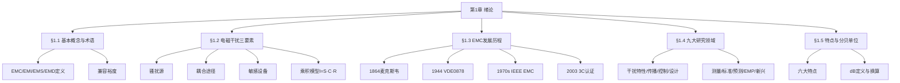

# 第1章 绪论 — 写作大纲

## 一、学习目标与内容覆盖映射表

| 编号 | 学习目标 | 覆盖正文节号 | 对应知识点 |
|------|---------|-------------|-----------|
| LO1 | 掌握EMC、EMD、EMI、EMS的核心定义及其相互关系，能准确辨析EMD与EMI的因果区别 | §1.1, §1.1.2, §1.1.3 | EMC双层面含义；EMI(干扰)与EMS(敏感度)的对偶关系；EMD(骚扰)作为物理现象与EMI(干扰)作为后果的因果链 |
| LO2 | 理解并能够复述电磁干扰三要素（骚扰源、耦合途径、敏感设备）及其缺一不可的逻辑关系，掌握三要素乘积型数学模型 | §1.2, §1.2.1-§1.2.4 | 三要素定义与分类；串联缺一不可逻辑；$I(t)=S(t)\cdot C(t)\cdot R(t)$ 乘积模型 |
| LO3 | 了解EMC学科从麦克斯韦到当代的百年发展历程中的关键里程碑 | §1.3, §1.3.1-§1.3.5 | 麦克斯韦(1864)→希维赛德(1881)→赫兹(1888)→CISPR(1933)→VDE0878(1944)→IEEE EMC(1970s)→数字时代 |
| LO4 | 系统了解EMC学科的九大研究领域，理解各领域与三要素的对应关系 | §1.4, §1.4.1-§1.4.9 | 干扰特性与传播→耦合途径；控制技术、设计方法→骚扰源/耦合；测量、标准→敏感设备；频谱管理、EMP、新兴领域→全要素 |
| LO5 | 识记EMC学科的六个特点，理解分贝（dB）作为EMC常用计量单位的基本定义 | §1.5, §1.5.1-§1.5.3 | 六大特点：电磁场基础、综合交叉、实践性强、无线电术语、dB单位、费效比；dB定义与常用单位换算 |

## 二、章节结构与量化指标

| 节号 | 节标题 | 案例数 | 公式数 | 覆盖LO |
|------|--------|--------|--------|--------|
| §1.1 | 电磁兼容的基本概念与术语 | 2 | 2 | LO1 |
| §1.2 | 电磁干扰三要素及其数学模型 | 3 | 3 | LO2 |
| §1.3 | EMC学科的发展历程 | 2 | 1 | LO3 |
| §1.4 | EMC学科的九大研究领域 | 2 | 1 | LO4 |
| §1.5 | EMC学科的特点与分贝单位 | 2 | 3 | LO5 |
| **合计** | — | **11** | **10** | **全部覆盖** |

> 核心公式推导：§1.2.4 三要素乘积型数学模型推导（≥4步）；§1.5.2 分贝定义推导（≥4步）

## 三、各节详细写作要点

### §1.1 电磁兼容的基本概念与术语（对应LO1）

**内容概要：**
- 电磁干扰与电磁污染的概念引入
- EMC的双层面含义：学科（电磁兼容）vs 性能指标（电磁兼容性）
- 核心术语定义：EMC、EMI（电磁干扰）、EMS（电磁敏感度）、EMD（电磁骚扰）
- EMI与EMD的因果辨析（IEC 60050 区分）
- 兼容裕度概念

**案例（2个）：**
1. **[案例1-1]** 钢铁厂熔融钢水包坠落事故（1970s美国）— 电磁干扰导致天车控制电路失控，造成人员伤亡
2. **[案例1-2]** 广东白云机场寻呼台干扰事件 — 无线电干扰导致航班无法正常起降

**公式（2个）：**
- 公式(1-1): 兼容裕度 $CM = IL - SL$ （干扰限值与敏感度限值之差）
- 公式(1-2): 电磁兼容条件 $EMC \iff P_{EMI} < P_{threshold}$

### §1.2 电磁干扰三要素及其数学模型（对应LO2）

**内容概要：**
- 骚扰源（Source/EMI Source）：自然源与人造源
- 耦合途径（Coupling Path）：传导耦合与辐射耦合
- 敏感设备（Sensitive Device/Receiver）
- 三要素缺一不可的逻辑关系
- 乘积型数学模型的建立与推导

**案例（3个）：**
1. **[案例1-3]** 开关电源的传导骚扰 — 骚扰源（开关管开关动作）→ 耦合途径（电源线传导）→ 敏感设备（同一电网的其他设备）
2. **[案例1-4]** 手机通信系统中的EMC — 基站发射（骚扰源）→ 空间辐射（耦合途径）→ 医疗设备（敏感设备）
3. **[案例1-5]** 汽车点火系统对收音机的干扰 — 火花塞电弧放电（骚扰源）→ 空间电磁波（耦合途径）→ 车载收音机（敏感设备）

**公式（3个）：**
- 公式(1-3): 三要素乘积模型 $I(t) = S(t) \cdot C(t) \cdot R(t)$
- 公式(1-4): 电容性耦合电压 $V_c = V_s \cdot \frac{j\omega C_{12}}{j\omega C_{12} + 1/R_L}$
- 公式(1-5): 电感性耦合电压 $V_m = j\omega M \cdot I_s$

### §1.3 EMC学科的发展历程（对应LO3）

**内容概要：**
- 萌芽期（1864-1930s）：麦克斯韦方程组→希维赛德"论干扰"→赫兹实验
- 形成期（1930s-1960s）：CISPR成立→VDE 0878→JAN-I-225军用规范→EMC概念提出
- 发展期（1970s-1990s）：IEEE EMC会刊→各国标准体系→计算机分析预测
- 当代EMC（21世纪）：3C认证→IEC标准体系→仿真分析→物联网/5G EMC
- 中国EMC发展概况：1980s起步→1987首届全国学术会议→1990北京国际会议→2003 3C认证

**案例（2个）：**
1. **[案例1-6]** 1944年德国VDE 0878规范 — 世界上第一个EMC规范，奠定EMC标准化基础
2. **[案例1-7]** 1996年欧盟EMC指令强制实施 — 全球EMC市场准入制度的里程碑

**公式（1个）：**
- 公式(1-6): 电磁波波长-频率关系 $\lambda = c/f$

### §1.4 EMC学科的九大研究领域（对应LO4）

**内容概要：**
- 九大领域与三要素的映射关系：
  1. **电磁干扰特性与传播机理** → 耦合途径
  2. **电磁危害与电磁频谱管理** → 骚扰源 + 敏感设备
  3. **电磁干扰控制技术（屏蔽/滤波/接地/搭接）** → 耦合途径
  4. **EMC设计与分析方法** → 全要素
  5. **EMC测量与试验技术** → 敏感设备
  6. **EMC标准与工程管理** → 全要素
  7. **EMC分析与预测（计算机仿真）** → 全要素
  8. **电磁脉冲（EMP）及其防护** → 骚扰源
  9. **新兴EMC领域（5G/IoT/汽车电子/生物电磁）** → 全要素

**案例（2个）：**
1. **[案例1-8]** 核电磁脉冲（HEMP）对电力系统的威胁 — 高空核爆EMP可摧毁大范围电子设备
2. **[案例1-9]** 5G基站EMC设计 — 毫米波频段的新耦合特性需要新的屏蔽与滤波方案

**公式（1个）：**
- 公式(1-7): 屏蔽效能 $SE = R + A + B$（反射损耗+吸收损耗+多次反射修正）

### §1.5 EMC学科的特点与分贝单位（对应LO5）

**内容概要：**
- 六大特点：
  1. 以电磁场理论为基础
  2. 综合性边缘交叉学科
  3. 实践性强，依赖工程经验
  4. 大量引用无线电技术概念和术语
  5. 计量单位的特殊性（分贝dB）
  6. 费效比敏感性（越早设计成本越低）
- 分贝（dB）基本定义
- EMC常用分贝单位：dBm、dBμV、dBμA、dBμV/m
- 常见换算关系

**案例（2个）：**
1. **[案例1-10]** 四个等强度泄漏源的诊断 — 说明dB在EMC检测中的对数特性，消除误解
2. **[案例1-11]** 某产品辐射发射超标整改 — 前置设计（成本￥5000）vs 后期整改（成本￥50000），体现费效比特点

**公式（3个）：**
- 公式(1-8): 功率比值的分贝定义 $P_{dB} = 10\lg(P_2/P_1)$
- 公式(1-9): 电压/电流比值的分贝定义 $V_{dB} = 20\lg(V_2/V_1)$
- 公式(1-10): 常用单位换算 $P_{dBm} = P_{dBW} + 30$, $V_{dB\mu V} = V_{dBV} + 120$

## 四、章末板块设计

### 4.1 本章总结

**Mermaid知识图谱：**

**要点表：**

| 知识点 | 核心内容 | 关键公式/定义 |
|--------|---------|--------------|
| EMC/EMI/EMS/EMD | EMC是设备共存能力；EMI是干扰后果；EMS是敏感度；EMD是物理现象 | $CM = IL - SL$ |
| 三要素 | 骚扰源、耦合途径、敏感设备缺一不可 | $I(t) = S(t) \cdot C(t) \cdot R(t)$ |
| 发展历程 | 麦克斯韦(1864)→希维赛德(1881)→赫兹(1888)→CISPR(1933)→VDE0878(1944)→IEEE EMC(1970s) | $\lambda = c/f$ |
| 九大领域 | 干扰特性→传播→控制→设计→测量→标准→预测→EMP→新兴 | $SE = R + A + B$ |
| 六大特点 | 电磁场基础、综合交叉、实践性、无线电术语、dB单位、费效比 | — |
| 分贝单位 | 功率比、电压比的对数表示 | $10\lg(P_2/P_1)$, $20\lg(V_2/V_1)$ |

### 4.2 习题（10题）

**基础题（1-5）：**
1. 简述EMC、EMI、EMS和EMD四个术语的核心定义，并说明EMD与EMI之间的因果区别。
2. 电磁干扰的三要素是什么？为什么说三者"缺一不可"？请用一个实际例子说明。
3. 写出电磁干扰三要素乘积型数学模型的表达式，并解释各符号的物理含义。
4. 列出EMC学科发展的至少5个关键里程碑事件及其年份。
5. EMC学科有哪些特点？为什么在EMC中常用分贝（dB）作为计量单位？

**提高题（6-8）：**
6. 已知某骚扰源的发射电平为 $47\text{dB}\mu\text{V}$，敏感设备的抗扰度电平为 $40\text{dB}\mu\text{V}$，试计算兼容裕度，并判断是否存在电磁兼容问题。
7. 试分析EMC学科的九大研究领域与电磁干扰三要素之间的对应关系，并以表格形式呈现。
8. 将以下功率比值转换为分贝值：(a) 2:1, (b) 10:1, (c) 100:1, (d) 1000000:1。

**综合题（9-10）：**
9. 某医疗电子设备在安装5G基站后出现工作异常。请运用电磁干扰三要素理论分析可能的原因，并提出排查思路。
10. 在产品研发过程中，为什么越早开展EMC设计成本越低？结合EMC学科的特点进行阐述。

### 4.3 参考文献（12篇）

[1] 路宏敏, 赵晓凡, 谭康伯, 等. 工程电磁兼容(第3版)[M]. 西安: 西安电子科技大学出版社, 2019.
[2] 何金良. 电磁兼容概论[M]. 北京: 科学出版社, 2010.
[3] 梁振光. 电磁兼容原理、技术及应用(第2版)[M]. 北京: 机械工业出版社, 2017.
[4] 张亮. 电磁兼容(EMC)技术及应用实例详解[M]. 北京: 电子工业出版社, 2014.
[5] Paul C R. Introduction to Electromagnetic Compatibility (2nd ed.)[M]. Hoboken: Wiley, 2006.
[6] Ott H W. Electromagnetic Compatibility Engineering[M]. Hoboken: Wiley, 2009.
[7] 国家标准 GB/T 4365-1995. 电磁兼容术语[S]. 北京: 中国标准出版社, 1995.
[8] IEC 60050-161. International Electrotechnical Vocabulary - Chapter 161: Electromagnetic Compatibility[S]. Geneva: IEC, 1990.
[9] 全国电磁兼容标准化技术委员会. 电磁兼容标准实施指南[M]. 北京: 中国标准出版社, 1999.
[10] 高攸刚. 电磁兼容总论(第2版)[M]. 北京: 北京邮电大学出版社, 2011.
[11] 白同云, 吕晓德. 电磁兼容设计[M]. 北京: 北京邮电大学出版社, 2001.
[12] Weston D A. Electromagnetic Compatibility: Principles and Applications (2nd ed.)[M]. Boca Raton: CRC Press, 2017.

### 4.4 深入阅读（5本）

1. **Paul C R.** *Introduction to Electromagnetic Compatibility* (2nd ed.)[M]. Hoboken: Wiley, 2006.
   — 国际公认的EMC经典教材，系统阐述了EMC理论与工程实践，适合深入理解全书各章的理论基础。

2. **Ott H W.** *Electromagnetic Compatibility Engineering*[M]. Hoboken: Wiley, 2009.
   — 权威EMC工程参考书，侧重于实际工程问题的解决方案，包含大量设计指南和实例。

3. **Williams T.** *EMC for Product Engineers* (5th ed.)[M]. Oxford: Newnes, 2016.
   — 从产品工程师视角出发，涵盖EMC标准、测试与设计全流程，实践指导性强。

4. **Kodali V P.** *Engineering Electromagnetic Compatibility: Principles, Measurements, Technologies, and Computer Models* (2nd ed.)[M]. New York: IEEE Press, 2001.
   — 兼顾理论与计算模型，适合希望深入EMC仿真分析的读者。

5. **Clayton R. Paul** 著, 闻映红 等译. *电磁兼容导论*[M]. 北京: 机械工业出版社, 2006.
   — Paul教材的中译本，语言通俗易懂，适合中文读者系统学习EMC基础理论。

---

*大纲编制日期: 2026年6月*
*总章节数: 5节 + 4个章末板块*
*案例总数: 11个 | 公式总数: 10个 | 核心推导: 2处（≥4步）*
