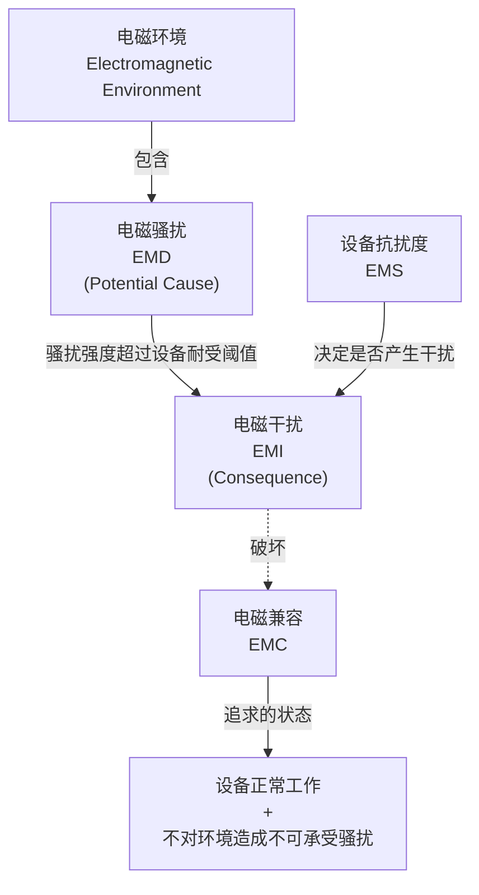
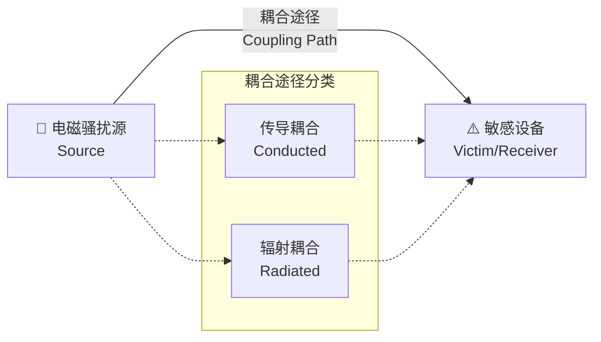
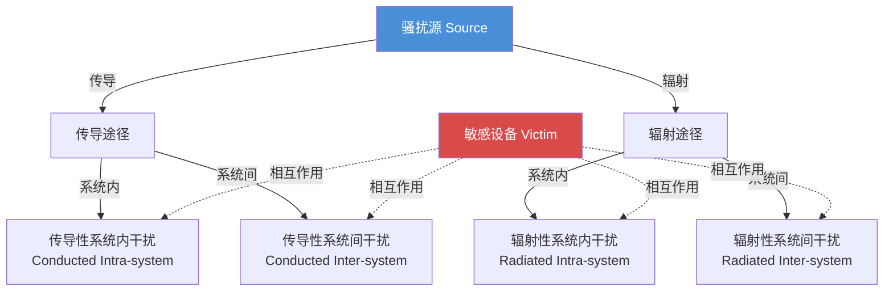
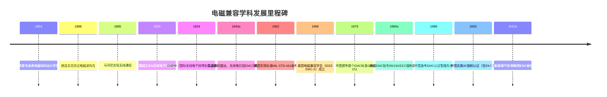
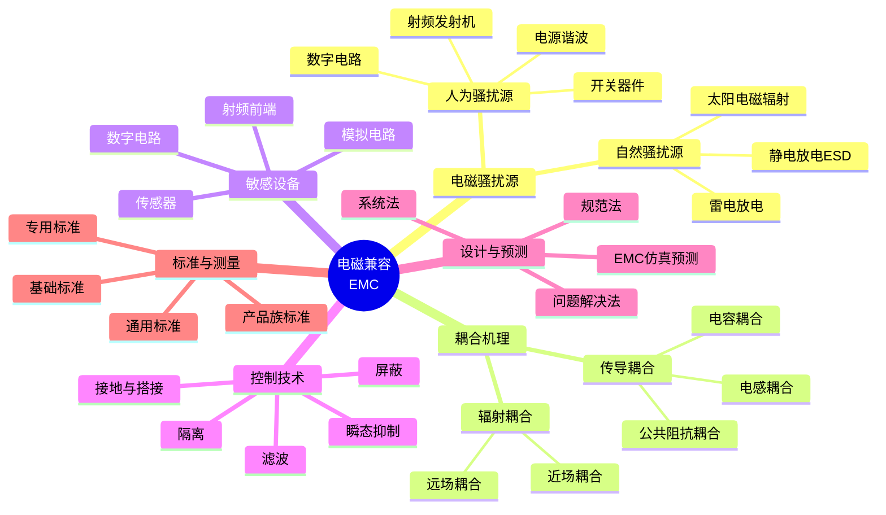
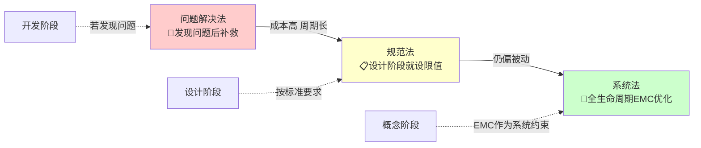
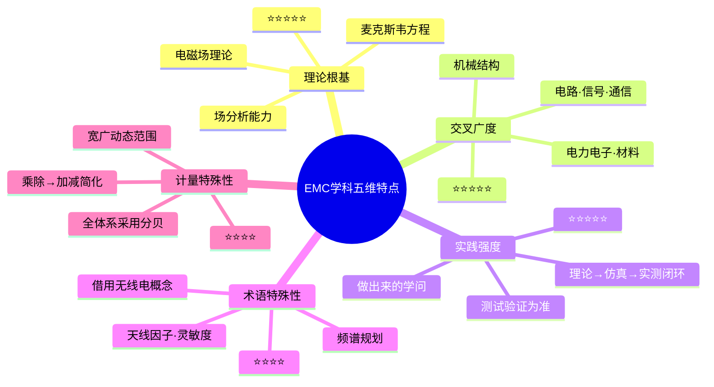

# 第1章 绪论

## 内容提要

现代社会中，电子设备无处不在——从口袋里的智能手机到飞驰的高铁列车，从医院的核磁共振成像仪到太空中的通信卫星。然而，当一部手机靠近音箱时发出的"嘀嘀"噪声、飞机起飞前要求关闭电子设备的广播、医院重症监护室禁止使用手机的规定……这些日常细节背后，都指向同一个关键问题：电磁兼容（Electromagnetic Compatibility，EMC）。

电磁兼容是研究在有限的空间、时间和频谱资源条件下，各种电气电子设备（含系统及生物体）能够共存且互不造成不可承受性能降级的一门学科。它既是电气电子工程师必须掌握的基础知识，也是产品走向市场必须跨越的"隐形门槛"。

本章是全书的总纲与导引。**1.1节**从两个震撼的真实案例出发，建立对电磁干扰危害的感性认识，进而引出并精确定义EMC、EMI、EMS、三要素等核心概念；**1.2节**沿时间维度回顾电磁兼容学科从萌芽到成熟的发展历程，介绍里程碑事件和关键人物；**1.3节**系统梳理电磁兼容的主要研究内容，勾勒学科的知识体系框架；**1.4节**凝练电磁兼容的学科特点，帮助读者理解这门学科的独特性和学习方法。

通过本章学习，读者应达成以下学习目标：

1. 理解电磁兼容的定义内涵，掌握EMC、EMI、EMS的概念及其相互关系，能准确区分"电磁骚扰"与"电磁干扰"两个术语。
2. 了解电磁兼容学科的发展历程，能说出至少5个里程碑事件及其意义。
3. 掌握电磁兼容三要素（骚扰源、耦合途径、敏感设备）的基本概念，了解电磁兼容研究的主要内容和设计方法演进脉络。
4. 理解电磁兼容学科的特点，认识到这门学科与电磁场理论、工程实践、无线电技术和特殊计量单位的紧密关联。

---

## 1.1 电磁兼容定义内涵

### 1.1.1 用真实案例建立问题意识

1969年11月，美国土星V号火箭承载着阿波罗12号飞船发射升空，执行人类第二次登月任务。发射后仅36秒，一道闪电击中了火箭本体——不是一次，而是两次。巨大的电磁脉冲瞬间灌入箭载电子系统，飞船指令舱的遥测信号全部丢失，燃料电池从稳压状态跳变为非稳压状态，导航系统的姿态基准显示为一片混乱。

幸运的是，指挥中心一位经验丰富的工程师——31岁的航天器电力系统专家John Aaron——在数秒内识别出故障模式，通过对遥测数据的快速分析判断出异常来自信号调节器（Signal Conditioner）的电源瞬态跳变。他果断下达指令："S/C to 4-27-0-5"，要求宇航员将信号调节器的备用电源开关拨到一个极少使用的位置。"土星V号的总设计师需要修改开关位置，而宇航员需要立即确认，"事后评论称这一指令"像从纽约打长途电话到洛杉矶要求更换一个保险丝一样难以置信"。宇航员正确执行了指令，飞船恢复供电，任务得以继续。最终阿波罗12号成功着陆月球，带回了月面样本。

这次事件成为人类航天史上最著名的电磁干扰（Electromagnetic Interference，EMI）案例之一。它揭示了一个残酷的事实：即使是经过最严格可靠性测试的航天系统，面对自然界的电磁脉冲时也可能瞬间失效。

13年后，另一个更加惨烈的案例震惊世界。1982年福克兰群岛战争中，英国皇家海军42型驱逐舰"谢菲尔德"号（HMS Sheffield）在雷达警戒海域执行巡逻任务。该舰装备了当时先进的电子战系统和"海标枪"防空导弹，但在阿根廷"超级军旗"战斗机发射的AM-39"飞鱼"反舰导弹面前，舰载电子防御系统的电磁兼容性缺陷被彻底暴露。

调查表明，舰载卫星通信系统与雷达告警接收机之间存在严重的电磁兼容问题：为了保障卫星通信的畅通，舰员不得不关闭了雷达告警接收机，因为同时工作时两者会相互干扰。正是这一人为关闭——实为系统电磁兼容设计缺陷的被迫选择——导致舰艇未能及时发现来袭导弹。"飞鱼"导弹以接近音速的速度击中谢菲尔德号右舷水线以上部位，引发大火，最终这座造价数亿美元的现代化战舰沉入南大西洋，20名舰员丧生。

两个案例以不同的方式阐明了同一个道理：**电磁兼容不是锦上添花，而是攸关成败——乃至生死的关键问题。**

### 1.1.2 日常生活中的电磁兼容现象

或许有人会认为，上述案例涉及的都是航天器、导弹等尖端领域，离日常生活很远。事实上，电磁兼容就在每个人身边。

打开微波炉时，附近的Wi-Fi网络可能会短暂断连；在电台发射塔附近使用手机时，通话中可能听到"滋滋"的背景噪声；把正在充电的智能手机靠近收音机时，收音机会发出有节奏的"哒哒"干扰声——这些都是最基础的电磁兼容现象。

在医院中，问题更加严肃：美国FDA不良事件报告系统（MAUDE）数据显示，2010至2020年间收到超过300起医疗设备受电磁干扰导致异常的报告，涉及输液泵意外停止、呼吸机参数偏移、除颤器误放电等。其中多起事件被追溯到手机信号或无线对讲机对设备造成的电磁干扰。正因如此，医院严格规定重症监护病房（ICU）内禁止使用手机。

这些现象揭示了一个普遍规律：当两个或以上的电子设备在同一电磁环境中工作时，它们之间可能产生**有意的或无意的相互影响**。电磁兼容学科正是研究如何在不可避免的电磁相互作用中保证所有设备均能正常工作的科学。

### 1.1.3 电磁兼容及相关概念的严格定义

在国家标准GB/T 4365（等同采用IEC 60050-161《国际电工词汇——电磁兼容》中，对电磁兼容及相关术语有明确定义。

> **电磁兼容（Electromagnetic Compatibility，EMC）**
> 设备或系统在其电磁环境中能正常工作且不对该环境中任何事物构成不能承受的电磁骚扰的能力。
>
> ——GB/T 4365-2015

这一定义包含两层含义：
- **向上兼容（耐受性）**：设备自身在电磁环境中能正常工作，即具有足够强的电磁抗扰度（Electromagnetic Susceptibility，EMS）；
- **向下兼容（无害性）**：设备不向环境发射超过允许限度的电磁骚扰，即自身的电磁发射（Electromagnetic Emission）受控。

> **电磁干扰（Electromagnetic Interference，EMI）**
> 电磁骚扰引起的设备、传输通道或系统性能的下降。
>
> ——GB/T 4365-2015

这里需要精确区分两个容易混淆的术语——**电磁骚扰**（Electromagnetic Disturbance，EMD）和**电磁干扰**（Electromagnetic Interference，EMI）。根据GB/T 4365的定义：

- **电磁骚扰**是指任何可能引起设备性能降级的电磁现象，它是"原因"——是客观存在的电磁信号或噪声。
- **电磁干扰**是指电磁骚扰造成的实际后果，它是"结果"——是设备性能因骚扰而发生的下降。

用工程语言表达：能够发射电磁能量的现象是骚扰源，如果骚扰源的能量足够强、耦合路径足够有效、而受害设备的敏感度足够高，骚扰就"转化"为干扰。没有性能降级时，只有电磁骚扰的存在，不构成电磁干扰。这一区分在EMC测试中具有实用意义：测试标准中规定的"发射限值"实际限制的是电磁骚扰的强度，而"抗扰度要求"衡量的是设备对骚扰的耐受能力。

> **电磁抗扰度（Electromagnetic Susceptibility，EMS）**
> 在存在电磁骚扰的情况下，设备、装置或系统不降低运行性能的能力。
>
> ——GB/T 4365-2015

三者的逻辑关系可以直观地用图1.1所示的概念图表示。

**图1.1 EMC / EMI / EMD / EMS 逻辑关系概念图**

### 1.1.4 电磁兼容三要素

所有电磁兼容问题可以归结为三个基本要素的组合：

1. **电磁骚扰源（Source）**：产生电磁骚扰的器件、设备或自然现象。
2. **耦合途径（Coupling Path）**：将电磁骚扰从骚扰源传递到敏感设备的通道。
3. **敏感设备（Victim / Susceptible Device）**：受到电磁骚扰作用后性能降级的设备。

这一三分法被称为**电磁兼容三要素模型**，如图1.2所示。

**图1.2 电磁兼容三要素模型**

三要素模型不仅是一个分析框架，更是一个**问题解决框架**。面对任何电磁兼容问题，工程师只需要做三件事：

1. **识别**——找出谁是骚扰源、谁是敏感设备、通过什么途径耦合？
2. **评估**——骚扰强度是否超过设备抗扰度？耦合效率如何？
3. **干预**——在骚扰源处抑制（降低发射）、在耦合路径上阻断（屏蔽/滤波/隔离）、在敏感设备处加固（提高抗扰度）。

三要素模型中消除任意一个要素，电磁干扰问题即不复存在。这一简洁的分析逻辑是贯穿全书所有技术章节的主线，如表1.1所示。

**表1.1 电磁兼容三要素与全书章节对应关系**

| 三要素 | 对应控制策略 | 对应章节 |
|:------|:------------|:---------|
| 电磁骚扰源 | 骚扰源特性认识与抑制 | 第2章 电磁骚扰源 |
| 耦合途径（传导） | 滤波、隔离、接地、搭接 | 第4~7章 |
| 耦合途径（辐射） | 屏蔽、空间隔离 | 第4~5章 |
| 敏感设备 | 抗扰度提升、电路级加固 | 第7章、第9章 |
| 系统层面 | 分层设计、仿真预测、标准符合 | 第8章、第10章 |

### 1.1.5 电磁兼容三要素的扩展：六种干扰途径

在三要素基础上，结合电磁骚扰的传播方式和系统关系，可以进一步分解为六种基本干扰途径。骚扰可以是**传导**方式（通过导线、电缆、公共阻抗传播）或**辐射**方式（通过空间电磁波传播）；干扰可以发生在**系统内部**（同一设备不同模块之间）或**系统之间**（不同设备之间）。两两组合，形成六种途径。

**图1.3 六种干扰途径分析矩阵**

这一扩展模型的工程意义在于：当工程师诊断一个电磁兼容故障时，可以通过"传导vs辐射"和"系统内vs系统间"两个维度的交叉定位，快速缩小排查范围。例如，当两个设备相距很远但出现干扰症状时，辐射耦合的可能性远大于传导耦合——这一判断可以帮助工程师直接跳过对电缆路径的检查，直接进入辐射屏蔽方案设计。

### 1.1.6 电磁兼容性的定量表达

电磁兼容性本质上是一个**统计意义上的概念**。在实际工程中，电磁兼容不是"有"或"无"的二元状态，而是一个概率事件：骚扰源的最大发射电平、耦合途径的传输损耗、敏感设备的最小抗扰电平都存在统计分布。当骚扰源发射电平的峰值与敏感设备抗扰电平的最小值之间存在足够的"安全裕量"时，才可以高概率地认为系统是电磁兼容的。

用数学语言表达：令骚扰源在敏感设备端口处形成的骚扰电平为 $E_s$（单位为dBμV），敏感设备在该端口处的抗扰电平为 $E_i$（单位为dBμV），则可定义**兼容裕量** $M$ 为

$$
M = E_i - E_s
\tag{1-1}
$$

当 $M > 0$ 时，系统兼容；当 $M < 0$ 时，系统不兼容。工程实践中通常要求 $M$ 不小于6 dB的安全裕量，以应对参数漂移和环境变化。兼容裕量是电磁兼容设计的核心定量指标，贯穿本书各章的设计方法之中。

---

### 本节小结

**要点：**
1. 电磁兼容（EMC）是设备在电磁环境中正常工作且不造成不可承受电磁骚扰的能力。
2. 电磁骚扰（EMD）是"原因"，电磁干扰（EMI）是"后果"，两者的区分具有重要的工程意义。
3. 电磁兼容三要素——骚扰源、耦合途径、敏感设备——是所有EMC问题的分析基础。
4. 结合传播方式（传导/辐射）和系统关系（系统内/系统间）可导出六种干扰途径，便于快速定位。
5. 兼容裕量 $M = E_i - E_s$ 是电磁兼容设计的核心定量指标。

**思考题：**
1. 电磁骚扰与电磁干扰有什么区别？请举出一个"有电磁骚扰但不构成电磁干扰"的日常实例。
2. 以手机通话时干扰旁边音箱为例，分析骚扰源、耦合途径、敏感设备分别是什么。
3. 阿波罗12号案例中，如果要在三要素框架下制定整改方案，可以从哪些方向入手？

---

## 1.2 电磁兼容学科发展

电磁兼容学科的发展可以划分为四个主要阶段：**萌芽期（1864—1940年）**、**形成期（1940—1960年）**、**发展期（1960—2000年）** 和**新时代（2000年至今）**。每一阶段都有标志性的理论突破、工程实践或标准化成果，如图1.4所示。

**图1.4 电磁兼容学科发展里程碑**

### 1.2.1 萌芽期（1864—1940年）：从麦克斯韦到无线电通信

1864年，英国物理学家詹姆斯·克拉克·麦克斯韦（James Clerk Maxwell）发表了《电磁场的动力学理论》，以一组简洁的偏微分方程统一了电学、磁学和光学，预言了电磁波的存在。这组方程后来被整理为著名的**麦克斯韦方程组**，成为后世电磁兼容分析的理论基石：

$$
\begin{cases}
\nabla \cdot \boldsymbol{D} = \rho \\[4pt]
\nabla \cdot \boldsymbol{B} = 0 \\[4pt]
\nabla \times \boldsymbol{E} = -\dfrac{\partial \boldsymbol{B}}{\partial t} \\[4pt]
\nabla \times \boldsymbol{H} = \boldsymbol{J} + \dfrac{\partial \boldsymbol{D}}{\partial t}
\end{cases}
\tag{1-2}
$$

1888年，海因里希·赫兹（Heinrich Hertz）在实验室中用火花间隙装置产生了人类历史上第一个可验证的无线电波，证实了麦克斯韦的理论。赫兹的实验装置本身就是一个电磁骚扰源——当他在一间实验室打火花时，数米外另一间实验室的火花间隙也随之跳火——这或许是人类有记录以来第一次"有意的电磁骚扰试验"。

1895年，古列尔莫·马可尼（Guglielmo Marconi）实现了无线电通信，开启了无线信息时代。然而，无线通信的普及也带来了最早的"电磁干扰"问题：不同发射机之间相互干扰，军用无线电与民用广播信号相互串扰。1912年RMS"泰坦尼克"号悲剧发生后，无线电通信的重要性被广泛认知，人们对电磁频谱的管控需求日益迫切。

1925年，英国标准协会（BSI）成立了世界上第一个无线电干扰委员会。1934年，国际电工委员会（IEC）联合多个国际组织成立了**国际无线电干扰特别委员会（CISPR）**，宗旨是促进无线电频谱的国际贸易中无线电设备的干扰问题达成一致意见。CISPR的成立标志着电磁兼容从零散的科学现象认知走向有组织的标准化工作。

### 1.2.2 形成期（1940—1960年）：战争驱动下的系统化探索

第二次世界大战是电磁兼容学科从"现象认知"走向"系统研究"的催化剂。雷达、无线电引信、敌我识别（IFF）系统、无线电通信设备等大量装备同时集成在军舰、飞机等有限平台上，电磁兼容问题变得空前严重。

一个著名的早期案例是美国海军"普林斯顿"号轻型航母（USS Princeton，1944年莱特湾海战）和"福莱斯特"号航母（CV-59，1967年）等事故中，舰载雷达电磁辐射引发弹药爆炸的风险受到了前所未有的重视。尽管这些事故的详细原因各不相同，但舰载电子设备的电磁干扰问题已成为军事系统设计的核心关切。

1950年代，美国空军启动了"电磁兼容性分析"专项研究，开发了最早的EMC预测与分析方法。1958年，德国颁布了VDE 0878标准，成为世界上第一个有关射频电磁干扰的正式标准。这一时期，电磁兼容开始作为"可预测"、"可设计"的工程技术，而非仅仅"被动应对"的质量问题。

### 1.2.3 发展期（1960—2000年）：标准体系与学科体系成型

1962年，美国国防部发布了MIL-STD-461《电磁发射和敏感度要求》和MIL-STD-462《电磁干扰特性测量方法》，这是世界上第一个系统的军事EMC标准体系。此后，美国三军和国防部陆续发布了上百份EMC相关标准、手册和技术报告，形成了全球最完整的军用EMC标准体系。

1968年，IEEE成立了**电磁兼容学会（IEEE EMC Society）**，标志着电磁兼容作为一门独立学科获得了学术界的正式认可。此后，该学会每年主办国际电磁兼容研讨会（IEEE International Symposium on EMC），成为全球EMC领域最重要的学术交流平台。

同一时期，各主要工业发达国家纷纷建立本国的EMC标准化和认证体系。1979年，中国国防科工委发布GJB 151《军用设备和分系统电磁发射和敏感度要求》，这是中国的第一个军用EMC标准。1996年，欧盟率先实施EMC指令（89/336/EEC），规定所有在欧盟市场销售的电子电气产品必须通过EMC测试并加贴CE标志，否则禁止销售。这一指令极大地推动了全球EMC标准化进程——任何希望进入欧洲市场的产品，都必须通过EMC门槛。

1999年，中国国家质量技术监督局颁布了《电磁兼容认证管理办法》，2002年正式实施**中国强制性产品认证（CCC认证，简称3C认证）**，将EMC列入强制检测项目。至此，EMC从"可做可不做"的技术选项，变为产品上市前必须跨越的"法定义务"。

### 1.2.4 新时代（2000年至今）：前沿挑战与中国贡献

进入21世纪，电子技术的快速迭代为电磁兼容学科注入了新的动力，也带来了前所未有的挑战。

**（1）高速数字电路的信号完整性与电源完整性**

随着集成电路特征尺寸从微米级进入纳米级，数字信号速率从MHz跨越到GHz级别，信号完整性（Signal Integrity，SI）和电源完整性（Power Integrity，PI）与电磁兼容的界限日益模糊。大算力芯片（如GPU、AI加速器）的工作电流可达数百安培，瞬态电流变化率（$dI/dt$）极高，电源分布网络（PDN）设计中的电磁兼容问题已成为芯片级设计的关键瓶颈。

**（2）新能源汽车的电磁兼容挑战**

新能源汽车（NEV）的电驱动系统以数百伏的高压母线驱动大功率电机，DC/DC变换器、逆变器等功率电子器件工作在高达数十千赫兹至兆赫兹的开关频率下，产生大量的传导和辐射电磁骚扰。一台典型的纯电动汽车包含超过100个电子控制单元（ECU），系统级电磁兼容设计复杂度远超传统燃油车。2021年，某国产新能源汽车因EMC设计缺陷导致电子助力转向系统在特定工况下受到车载充电机骚扰干扰，引发大规模召回，涉及超过12万辆车辆。

**（3）5G/6G通信与物联网海量终端**

5G基站采用大规模MIMO天线阵列（多达64~256个天线单元），天面电磁环境高度复杂，天线间的耦合与互调干扰成为新的研究课题。物联网（IoT）预计将接入数百亿台低成本终端设备，这些设备往往采用简化设计、降低成本的策略，使得电磁兼容控制更加困难。

**（4）电磁兼容与信息安全的交叉**

近年来，电磁侧信道（Side-Channel）攻击成为信息安全领域的新威胁——通过测量设备运行时的电磁辐射，可以反向分析出加密密钥、程序执行路径等敏感信息。这类攻击将电磁兼容的"发射控制"问题与信息安全的"信息泄漏防护"问题联系在一起，催生了"电磁信息安全"这一交叉方向。

**（5）中国的自主创新贡献**

- **高铁EMC**：中国自主开发的CTCS-3级列车控制系统在时速350 km/h运行时须确保车地无线通信不受牵引系统强电磁骚扰的影响。中国高铁系统在全球率先通过IEC 62236系列EMC标准的严苛测试，其EMC解决方案已成为国际高速铁路领域的参考模板。
- **5G基站EMC**：华为5G基站设备通过了包括美国FCC、欧盟CE、日本TELEC在内的全球主要市场EMC认证，其在天线间解耦、功率放大器谐波抑制等EMC关键技术上的创新，体现了中国通信企业的国际竞争力。
- **北斗导航EMC**：北斗三号卫星导航系统的用户终端必须满足北斗导航标准中严格的电磁发射和抗扰度要求，这些标准由中国主导制定，在联合国全球卫星导航系统国际委员会（ICG）框架下获得了国际认可。

**表1.2 电磁兼容发展历程中的重要事件年表（与图1.4时间线互补）**

| 年份 | 事件 | 意义 |
|:---:|:----|:-----|
| 1864 | 麦克斯韦发表电磁场理论 | 奠定电磁兼容的理论基础 |
| 1888 | 赫兹验证电磁波存在 | 首次人类可控的电磁发射实验 |
| 1895 | 马可尼实现无线通信 | 开启电磁频谱利用时代 |
| 1925 | BSI成立无线电干扰委员会 | 首个EMC专业组织 |
| 1934 | CISPR成立 | 国际EMC标准化的开端 |
| 1940s | 二战中的雷达/引信EMC问题 | 战争加速EMC技术发展 |
| 1958 | 德国VDE 0878标准 | 世界首个正式EMC标准 |
| 1962 | 美国MIL-STD-461发布 | 首个系统化军用EMC标准体系 |
| 1968 | IEEE EMC学会成立 | EMC学科获得学术界正式认可 |
| 1979 | 中国GJB 151发布 | 中国军用EMC标准起步 |
| 1996 | 欧盟EMC指令强制实施 | 全球EMC法规化的里程碑 |
| 2002 | 中国市场准入制度 | EMC纳入中国CCC认证 |
| 2010s | 5G/NEV/IoT/AI芯片EMC | 新时代EMC挑战全面涌现 |
| 2020s | 电磁信息安全/卫星EMC | EMC与多学科交叉融合新阶段 |

---

### 本节小结

**要点：**
1. 电磁兼容学科经历了萌芽期（理论奠基）→形成期（战争驱动）→发展期（标准固化）→新时代（前沿挑战）四个发展阶段。
2. 麦克斯韦方程组是全部EMC分析的理论基础，CISPR和MIL-STD-461是EMC标准化进程中的标志性成果。
3. 中国的EMC事业从1979年GJB 151起步，至今日在高铁、5G、北斗等领域已取得国际领先水平。
4. 5G/新能源汽车/物联网/AI芯片为EMC学科带来了全新挑战，电磁信息安全正在成为新兴交叉方向。
5. 欧盟EMC指令的强制实施（1996年）是全球EMC认证制度化的分水岭事件。

**思考题：**
1. 为什么说第二次世界大战是电磁兼容学科形成的"催化剂"？请从技术需求角度分析。
2. 查阅资料，了解中国CCC认证（3C认证）中的EMC检测流程，讨论"强制认证"对企业研发周期的影响。
3. *拓展题：选择一个新兴领域（如新能源汽车或5G通信），通过网络搜索补充该领域近5年发生的一起EMC相关事件，并在下节课分享。

---

## 1.3 电磁兼容研究内容

电磁兼容的研究内容可以围绕"是什么→为什么→怎么办"的逻辑链条展开。这一链条与三要素模型紧密呼应，也反映了EMC设计方法从被动到主动的演进过程。

### 1.3.1 研究总览与知识体系全景

**图1.5 EMC知识体系全景概念图**

### 1.3.2 电磁骚扰源研究

电磁骚扰源的研究旨在回答"为什么会有骚扰"这个问题。骚扰源可以分为两大类：

**（1）自然骚扰源**

- **雷电放电**：一次典型的云地闪电可释放数十千安培的电流脉冲，上升时间仅数微秒，产生覆盖从直流到数百兆赫兹的宽带电磁脉冲（LEMP）。雷击不仅可以直接破坏电子设备，更重要的是其产生的感应电压和电流会通过电力线、信号线传导进入设备，造成永久性损坏。
- **静电放电（ESD）**：人体与化纤衣物摩擦可产生数万伏的静电荷，当带电体接触电子设备时，瞬态放电电流的上升时间可短至1 ns以下，峰值电流可达数十安培，足以击穿MOS器件的栅氧化层。
- **太阳电磁辐射**：太阳活动引发的日冕物质抛射可产生强烈的射频噪声，对卫星通信和地基雷达系统造成干扰。

**（2）人为骚扰源**

- **工频谐波**：电力电子设备（整流器、逆变器、开关电源）的非线性特性，使电网电流波形偏离正弦波，包含大量谐波分量。这些谐波通过公共电网耦合到其他设备，引发电能质量问题和EMC故障。
- **开关瞬态**：功率半导体器件（IGBT、MOSFET）在开关动作时产生极高的电压变化率（$dV/dt$）和电流变化率（$dI/dt$），这些快速变化的波形通过杂散电容和互感耦合到邻近电路。
- **数字电路噪声**：高速数字信号的方波频谱涵盖广泛的频率范围。时钟频率越高，谐波含量越丰富，辐射发射越严重。例如，一个1 GHz时钟信号的第3次谐波（3 GHz）属于C波段，可能干扰卫星通信接收机。
- **有意发射的射频信号**：广播、电视、通信基站、雷达等有意发射设备本身设计的射频信号，如果频率规划不当或谐波抑制不充分，也会对其他设备构成干扰。

电磁骚扰源的详细特性、建模方法和抑制策略将在**第2章**中展开。

### 1.3.3 耦合途径与传输机理

耦合途径的研究回答"骚扰如何传播"这个问题。所有EMC问题中，骚扰从源到受害设备必须经过一条耦合路径。根据传播物理机制，耦合途径可分为两大类：

**（1）传导耦合（Conducted Coupling）**

传导耦合通过金属导体（导线、电缆、PCB走线、公共接地回路）来传递电磁能量。常见的传导耦合方式包括：

- **公共阻抗耦合**：多个电路共享同一个接地回路或电源馈线时，一个电路的电流在公共阻抗上产生的电压降成为另一个电路的骚扰信号。
- **电容耦合**：两个导体之间存在杂散电容，一个导体上的电压变化会在另一个导体上感应出骚扰电流。
- **电感耦合**：一个回路中的电流变化产生交变磁场，在另一个回路中感应出骚扰电动势。

传导耦合的分析方法可回顾电路分析课程中的公共阻抗概念、互感模型以及分布参数电路理论。

**（2）辐射耦合（Radiated Coupling）**

辐射耦合通过电磁场在空间中传播电磁能量。根据场区划分：

- **近场耦合**：当源与受害设备的距离 $r$ 满足 $r \ll \lambda/2\pi$（$\lambda$ 为波长）时，电场和磁场的比例关系取决于源的类型（高电压小电流源以电场为主，低电压大电流源以磁场为主），需分别分析。
- **远场耦合**：当 $r \gg \lambda/2\pi$ 时，电磁波呈现为平面波，电场和磁场的比值固定为自由空间波阻抗 $Z_0 = 377\, \Omega$。

辐射耦合问题的分析依赖电磁场理论，尤其是电偶极子和磁偶极子的近远场特性以及传输线模型。这部分内容将在**第3章**中系统展开。

### 1.3.4 敏感设备与抗扰度

敏感设备研究的核心问题是"哪些设备容易受干扰"以及"如何提高它们的抗扰度"。

不同类型的电路对电磁骚扰的敏感度差异巨大：

| 电路类型 | 典型敏感电平 | 典型EMC问题 |
|:---------|:------------|:------------|
| 低电平模拟电路 | 微伏（μV）级 | 传感器信号失真、音频噪声 |
| 高速数字电路 | 毫伏（mV）级 | 信号抖动、误码、逻辑翻转 |
| 射频前端 | 纳瓦（nW）级 | 接收灵敏度下降、阻塞 |
| 功率电子电路 | 伏（V）级 | 控制信号误触、保护误动作 |
| 微控制器/处理器 | 毫伏（mV）级 | 程序跑飞、死机、数据损坏 |

设备级的抗扰度设计方法（PCB布局、去耦电容、I/O保护、敏感信号隔离等）将分布在**第4章至第7章**以及**第9章**中介绍。

### 1.3.5 电磁兼容控制技术概览

EMC控制技术是"怎么办"的答案。常用控制技术按照作用对象分类如下：

**表1.4 电磁兼容控制技术分类**

| 技术名称 | 作用对象 | 一句话描述 | 对应章节 |
|:---------|:---------|:----------|:---------|
| 屏蔽（Shielding） | 辐射耦合 | 用导电或导磁材料阻断电磁场传播路径 | 第4章 |
| 滤波（Filtering） | 传导耦合 | 用LC网络衰减特定频率的骚扰信号 | 第6章 |
| 接地（Grounding） | 传导耦合 / 公共阻抗 | 建立低阻抗参考平面，减少骚扰电压 | 第5章 |
| 搭接（Bonding） | 公共阻抗 | 用低阻抗连接确保金属结构间的等电位 | 第5章 |
| 隔离（Isolation） | 传导耦合 | 用光耦、变压器切断地环路 | 第7章 |
| 瞬态抑制（Transient Suppression） | 传导耦合 | 用TVS/MOV/气体放电管钳制过压脉冲 | 第7章 |
| 分层设计（Layout） | 所有途径 | 从PCB布线开始减少寄生耦合 | 第9章 |

### 1.3.6 设计方法的演进

EMC设计方法的发展遵循"从被动到主动"的轨迹，大致可分为三个阶段：

**第一阶段：问题解决法（The Fix-it Approach）**。在产品样机或批量生产阶段才发现EMC不达标，于是采取"打补丁"式的整改——哪里超标就在哪里加屏蔽、套磁环、换滤波器。这种方法成本高、周期长、效果不可控，但至今仍在很多中小型企业中使用。柯金良（2010）的数据表明，到产品生产阶段才进行EMC整改，成本是设计前期同等效果的10~20倍。

**第二阶段：规范法（The Specification Approach）**。在设计开始时就按照相关标准（如GB/T 17626系列、CISPR标准等）制定EMC指标，并在设计过程中分阶段验证。规范法比问题解决法前移了EMC控制关口，但仍是一种"限值达标"思维，缺乏对系统整体性能的最优规划。

**第三阶段：系统法（The System Approach）**。从系统概念阶段就将EMC作为与功能、性能、成本、可靠性并列的设计约束条件，运用仿真分析与预测工具，在设计全过程进行EMC权衡。系统法是当前最先进的设计理念，也是本书努力贯彻的编写思路。

**图1.6 EMC设计方法的三个阶段演进**

EMC设计的费效比差异显著——越早介入，成本越低，如表1.5所示。

**表1.5 EMC设计各阶段费效比对比**

| 设计阶段 | 相对成本倍数 | 可调整空间 |
|:---------|:-----------:|:---------:|
| 概念设计阶段 | 1× | 极大（可自由选择架构） |
| 详细设计阶段 | 10× | 大（可调整布局和回路） |
| 样机测试阶段 | 100× | 有限（只能加敷设措施） |
| 批量生产阶段 | 1000×以上 | 极小（改版代价高昂） |

### 1.3.7 EMC标准与测量

EMC标准体系是EMC研究和工程实践的"共同语言"。按层次划分，EMC标准可分为四个层级：

1. **基础标准**：给出术语定义、测试仪器规格、通用测试方法和场地要求，如GB/T 4365、CISPR 16系列。
2. **通用标准**：按设备使用环境分类（居住/商业/轻工业/工业），给出通用发射限值和抗扰度要求，如IEC 61000-6系列。
3. **产品族标准**：针对特定产品类别制定更为具体和严格的EMC要求，如CISPR 22（信息技术设备）、CISPR 25（车载电子设备）。
4. **专用标准**：针对特定产品单独制定的EMC要求，如MIL-STD-461（军用电子设备）、DO-160（航空电子设备）。

EMC测量是实现EMC标准要求的技术手段，包含辐射发射测量、传导发射测量、辐射抗扰度测试、传导抗扰度测试等。测试场地、仪器和测量方法是专门的工程领域，将在**第8章**中详述。

### 1.3.8 EMC分析与预测

EMC分析与预测是EMC设计的数学基础。通过建立骚扰源、耦合途径和敏感设备的数学模型，可以在设计阶段预测系统的EMC性能，从而避免"造出来再试"的高成本路径。常用的分析预测方法包括：

- **数值电磁场计算**：有限元法（FEM）、矩量法（MoM）、时域有限差分法（FDTD）等，用于精确求解结构电磁场分布。
- **等效电路建模仿真**：将电磁场问题转化为电路问题，利用SPICE等电路仿真工具快速评估。
- **统计方法与风险评估**：考虑参数容差和环境影响，用统计方法评估系统兼容概率。
- **人工智能辅助预测**：近期兴起的基于机器学习的方法，利用大量EMC测试数据训练预测模型，实现智能化的EMC快速评估。

EMC分析与仿真将在**第10章**中作为专门内容展开。

---

### 本节小结

**要点：**
1. EMC研究内容围绕"骚扰源—耦合途径—敏感设备"三要素展开，形成"是什么→为什么→怎么办"的闭环。
2. 骚扰源分为自然骚扰源和人为骚扰源两大类，电磁兼容控制须从识别骚扰源入手。
3. 耦合途径包括传导和辐射两种基本传播方式，对应不同的分析模型和抑制技术。
4. EMC设计方法经历了"问题解决法→规范法→系统法"三阶段演进，越早介入成本越低（费效比可达1:1000）。
5. EMC标准体系分为四个层次（基础→通用→产品族→专用），测量技术是实现标准要求的手段。

**思考题：**
1. 某电子设备在样机EMC测试时出现辐射发射超标，试分析属于设计方法演进中的哪一阶段，并估算可能产生的额外成本。
2. 列举一个传导耦合和辐射耦合共存的实际EMC案例，说明两种耦合各自的贡献。
3. 查阅CISPR 22和CISPR 25的应用范围差异，思考为什么不同产品族需要不同的标准限值。

---

## 1.4 电磁兼容学科特点

电磁兼容在电气信息类学科群中是一个特殊的存在。它既不完全属于"电磁场"的纯理论分支，也不完全属于"电子电路"的工程技术分支——它具有自己鲜明的学科个性。理解这些特点，有助于读者建立正确的学习方法论。

### 1.4.1 特点一：以电磁场理论为根基

电磁兼容的所有核心问题——耦合机理、屏蔽效能、天线效应——都植根于麦克斯韦方程组。EMC工程师需要深刻理解电磁波的传播、反射、折射、绕射和衰减过程；需要掌握近场与远场的区分；需要熟悉波阻抗、传输线模型、谐振腔理论等电磁场概念。

**与读者已有知识的关联**：你在《电磁场与电磁波》课程中学到的"静电场的镜像法"是分析屏蔽体开槽泄漏的数学工具；"传输线方程"是预测PCB走线串扰的基础模型；"天线基本参数"是理解辐射发射测量中"天线因子"概念的先导知识。

然而，EMC对电磁场理论的要求与电磁场课程本身有所不同。EMC更强调**定量工程应用**而非纯理论推导——例如，EMC工程师不需要从第一性原理求解麦克斯韦方程，但需要能准确使用屏蔽效能公式估算不同材料的屏蔽效果、能理解传输线模型在电缆耦合分析中的意义。

### 1.4.2 特点二：综合性交叉边缘学科

EMC不依赖单一的学科基础，而是多个学科领域的交汇地带。它涉及电磁场理论、电路分析、信号与系统、通信原理、电力电子、材料科学、机械结构等。在解决一个实际的EMC问题时，工程师往往需要同时运用来自多个领域的知识。

例如，分析一个开关电源的传导发射问题时：
- **电路分析**：建立开关管的电流波形模型，计算谐波含量；
- **电磁场理论**：分析功率回路的磁场耦合路径；
- **信号处理**：理解频谱分析仪的测量原理和分辨率带宽设置；
- **材料科学**：选择铁氧体磁芯或共模扼流圈的磁性材料；
- **结构设计**：考虑屏蔽盒的通风散热与屏蔽效能的权衡。

**与读者已有知识的关联**：你在《电路分析》中学到的"叠加定理"和"频率响应"是EMC骚扰源特征分析的基础；在《信号与系统》中学到的"傅里叶变换"是理解骚扰信号频谱分布的关键工具；在《通信原理》中学到的"调制方式"是判断有意发射设备干扰射频接收器机理的前提。每个前修课程都为EMC学习提供了某个维度的理论支撑。

### 1.4.3 特点三：工程实践性强

EMC不是一门"算出来"的学问，而是一门"做出来"的学问。理论分析可以给出趋势和方向，但最终结果需要通过测试来验证。这是因为：

- 实际系统高度复杂，理论模型的简化假设往往偏离真实情况；
- 高频时寄生参数（杂散电容、引线电感）的影响不可忽略，而这些寄生参数在理论建模中常被忽略；
- 材料特性在高频段退化（如磁芯损耗增加、导电率下降），理论设计需由实测修正。

因此，EMC领域有一种公认的说法：**"没有经过测试验证的EMC设计，只是推测。"**

本书注重理论与实践的结合。每章的理论内容后，会安排工程案例分析、仿真练习或实验指导，帮助读者建立"理论→仿真→测试→整改"的闭环思维。

### 1.4.4 特点四：大量引用无线电技术概念

电磁兼容的许多基本概念源于无线电通信技术。例如：

- **分频段表述**：EMC标准中常见的频率范围（30 MHz~1 GHz、1~18 GHz等）直接继承自无线电频谱划分；
- **天线因子**：EMC辐射发射测量中将电场强度（dBμV/m）与接收天线端电压（dBμV）关联的转换参数；
- **灵敏度和噪声系数**：接收机的EMC性能指标；
- **频谱占用**：不同无线业务（广播、航空、移动通信、卫星等）的频率分配直接决定了EMC的干扰规避条件。

**与读者已有知识的关联**：如果你已经学过《通信原理》或《无线通信基础》，那么你对"载波""边带""噪声系数"等概念已有基础认识。在EMC学习中，这些概念被赋予"干扰"的视角——不是关注如何让信号传得更远，而是关注如何防止不需要的信号进入接收机。

### 1.4.5 特点五：计量单位——分贝（dB）的特殊性

电磁兼容中几乎所有的限值、测量结果和设计指标都以**分贝（dB）** 为计量单位。这是EMC领域区别于其他电气工程分支的一个显著特点。分贝带来的不仅是单位上的差异，更重要的是对数据理解方式的改变。

$$
A_{dB} = 10 \lg \left( \frac{P_2}{P_1} \right) = 20 \lg \left( \frac{V_2}{V_1} \right)
\tag{1-3}
$$

EMC中常见的分贝单位包括：

| 单位 | 含义 | 典型应用场景 |
|:----|:----|:------------|
| dBμV | 以1 μV为基准的对数电压值 | 传导发射限值 |
| dBμV/m | 以1 μV/m为基准的对数电场强度值 | 辐射发射限值 |
| dBm | 以1 mW为基准的对数功率值 | 射频功率测量 |
| dBμA | 以1 μA为基准的对数电流值 | 磁场发射测量 |
| dB(S/m) | 以1 S/m为基准的对数电导率值 | 屏蔽材料参数 |
| dB(μV/V) | 耦合衰减的对数表示 | 不对称电压测量 |

使用分贝的理由可以从两个维度理解：

1. **压缩量程范围**：EMC测试中信号幅度的动态范围极大——从接近本底噪声的1 μV级发射，到数十伏的高电平骚扰脉冲，跨度高达10^7倍。分贝表示法可以在一张图上直观显示全部数据。
2. **简化乘除运算**：系统级EMC分析中，发射电平、路径损耗、设备抗扰度三个环节的"乘积"关系，取对数后转化为"加减"运算，使链路预算分析变得清晰简洁。

学习建议：初学EMC时，应尽快建立"dB直觉"——能在头脑中快速完成0~120 dBμV对应的实际电压幅度（1 μV~1 V）的映射。熟练掌握10 dB对应10倍功率或约3.16倍电压、20 dB对应100倍功率或10倍电压等基本换算关系，才能在阅读EMC测试报告时准确判断问题的严重程度。

### 1.4.6 学科特点雷达图

为便于直观理解，EMC学科的五维特点如图1.7所示。

**图1.7 EMC学科五维特点雷达图（星级表示每个维度在该学科内的相对强度）**

### 1.4.7 EMC学习路径建议

基于上述学科特点，初学者在学习EMC时可参考以下路径：

1. **夯实电磁场基础**：复习麦克斯韦方程、时变场的波动性、电磁波的极化与传播，尤其关注"近场vs远场"概念。
2. **建立三要素思维**：遇到任何EMC问题，先问"骚扰源是什么？耦合途径是什么？敏感设备是什么？"
3. **掌握分贝语言**：熟记dBμV、dBm、dBμV/m之间的换算关系，做到"见到dB就精神"。
4. **实践验证理论**：结合实验室条件，完成一项从理论分析到测试验证的闭环任务（如计算并测量一条PCB走线的远场辐射）。*扩展学习：可在教材配套的实验指导书中寻找适合的实验项目。
5. **关注标准文本**：学会查阅GB/T、CISPR、IEC等标准文本，这是EMC工程师的基本功。

---

### 本节小结

**要点：**
1. 电磁兼容以电磁场理论为根基，大量概念源自无线电技术，计量单位体系独特（全分贝化）。
2. 作为综合性交叉学科，EMC的工程实践性极强，体现了"理论与验证相结合"的学科本质。
3. EMC特有的分贝（dB）计量体系压缩了宽广的动态范围，简化了链路预算分析中的乘除运算。
4. 初学者遵循"夯实理论基础→建立三要素思维→掌握分贝语言→实践验证→关注标准文本"的五步学习路径。
5. *拓展：EMC工程师需具备骚扰源分析、耦合诊断、标准合规和测试整改四个维度的核心能力。

**思考题：**
1. 为什么说EMC是"做出来的学问"？请用一个具体的EMC问题说明"理论推测"与"测试验证"之间的差距。
2. 将以下实际电压幅度转换为dBμV值：1 μV、10 μV、100 μV、1 mV、10 mV、100 mV、1 V。（此练习将帮助你建立dB直觉。）
3. *拓展题：选择一个你感兴趣的电子产品（如笔记本电脑、智能手机、电动汽车），通过网络搜索了解其在研发过程中需要满足的EMC标准和测试项目。

---

## 综合思考题

**基础题**
1. 用自己的语言，向一名中学水平的同学解释"什么是电磁兼容（EMC）"。（100字以内）
2. 比较电磁骚扰（EMD）和电磁干扰（EMI）的区别，以"正在运行的微波炉影响附近Wi-Fi设备"为例说明。
3. 列出并简述电磁兼容三要素，并说明如何在三要素框架下解决"电子打火灶干扰电视机画面"的问题。

**分析题**
4. 回顾阿波罗12号雷击事件和谢菲尔德号导弹驱逐舰事件，分析两个案例中电磁兼容三要素分别是什么。为什么说谢菲尔德号事件中的EMC问题本质上是"系统级设计缺陷"而非"单点故障"？
5. 以一个你熟悉的电子系统（如手机、电脑、平板电视等）为例，分析它可能面对的电磁兼容挑战。它既是自己系统中的骚扰源（需要控制其自身的电磁发射），又是其他系统骚扰的敏感设备（需要提升抗扰度），这种双向角色意味着什么？
6. 在1.3节中介绍了"问题解决法→规范法→系统法"的设计方法演进。请分析，如果一个初创公司在开发一款物联网智能终端时同时缺少EMC人员、EMC测试设备和EMC设计经验，它最可能落入哪一种设计方法？可能产生什么后果？请提出一个"小步快跑"的改进建议。

**拓展题**
7. *上网查询我国CCC认证（3C认证）中涉及电磁兼容（EMC）检测的内容，说明3C认证中的EMC要求涵盖哪些测试项目，以及为什么这些测试项目被列入强制性认证目录。
8. *选择一个感兴趣的电磁兼容前沿领域（新能源汽车、5G通信、医疗电子、自动驾驶雷达等），查阅资料后撰写一篇不少于500字的短评，介绍该领域最新EMC研究动态或重大工程挑战。

---

## 本章参考文献

[1] 路宏敏, 赵晓凡, 谭康伯等. 工程电磁兼容（第3版）[M]. 西安: 西安电子科技大学出版社, 2019.
[2] 张亮. 电磁兼容（EMC）技术及应用实例详解[M]. 北京: 电子工业出版社, 2014.
[3] 何金良. 电磁兼容概论[M]. 北京: 科学出版社, 2010.
[4] 梁振光. 电磁兼容原理、技术及应用（第2版）[M]. 北京: 机械工业出版社, 2017.
[5] GB/T 4365-2015, 电磁兼容 术语[S]. 北京: 中国标准出版社, 2015.
[6] IEC 60050-161, International Electrotechnical Vocabulary — Chapter 161: Electromagnetic Compatibility[S]. Geneva: IEC, 1990.
[7] Paul, C. R. Introduction to Electromagnetic Compatibility (2nd ed.)[M]. Hoboken: Wiley-Interscience, 2006.
[8] NASA. Apollo 12 Mission Report (MSC-01855)[R]. Houston: Manned Spacecraft Center, 1970.
[9] King, C. J. The Use of Electromagnetic Compatibility in the Design of the Type 42 Destroyer[J]. Journal of Naval Engineering, 1985, 31(2): 145-158.
[10] 工业和信息化部. GB/T 17626系列 电磁兼容 试验和测量技术[S]. 北京: 中国标准出版社, 2008-2020.
