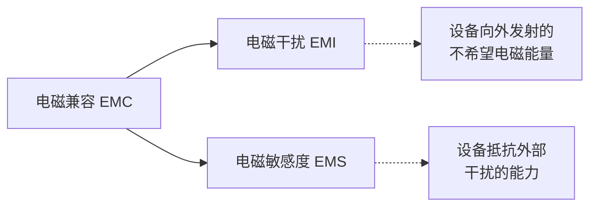
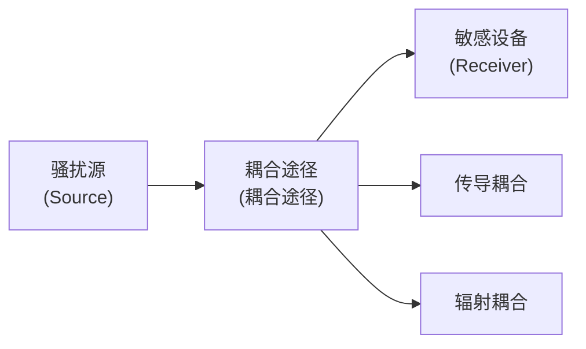
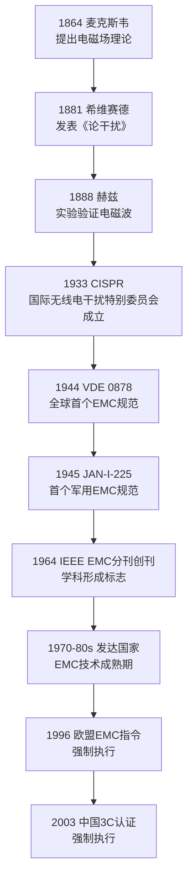
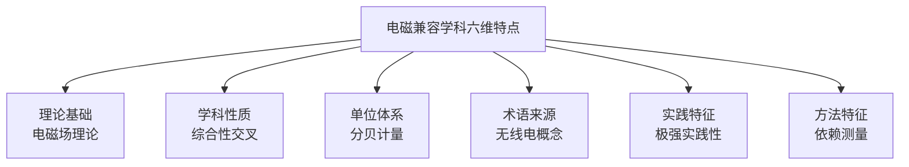

# 第1章 绪论

## 内容提要

本章是全书的总纲与导引。首先，从日常生活中常见的电磁干扰现象出发，引出电磁兼容的定义与核心概念体系，辨析电磁骚扰与电磁干扰的因果关系，建立电磁干扰三要素的理论框架。然后，沿着历史的脉络回顾电磁兼容学科从萌芽走向成熟的百年历程，展现国际与中国EMC事业发展的全景图。接着，以三要素为逻辑主线系统介绍电磁兼容学科的研究内容，从骚扰源特性、耦合机理、控制技术到设计方法、标准测量与分析预测。最后，归纳电磁兼容学科的六个鲜明特征，为读者指明学习路径。

通过本章学习，读者应达成以下学习目标：

1. 掌握电磁兼容（EMC）、电磁骚扰（EMD）、电磁干扰（EMI）、电磁敏感度（EMS）的核心定义及其相互关系，能准确辨析EMD与EMI的因果区别。
2. 理解并能够复述电磁干扰三要素（骚扰源、耦合途径、敏感设备）及其缺一不可的逻辑关系，掌握三要素乘积型数学模型。
3. 了解EMC学科从麦克斯韦到当代的百年发展历程中的关键里程碑，识记CISPR成立、VDE 0878、IEEE EMC分刊创刊等重要事件。
4. 系统了解EMC学科的九大研究领域，理解各领域与三要素的对应关系。
5. 识记EMC学科的六个特点，理解分贝（dB）作为EMC常用计量单位的基本定义。

---

## 1.1 电磁兼容定义内涵

### 1.1.1 从日常现象到电磁干扰

您是否注意过这样的场景：看电视时，身旁的手机突然来电，电视屏幕上顿时出现游走的条纹和噪点；用吹风机吹干头发时，旁边的收音机里传来刺啦刺啦的杂音；电脑机箱旁放置音箱，没等放音乐，音箱里已经嗡嗡作响。

这些都是每一个人在日常生活中都曾遇到过的小"麻烦"，但它们背后指向的其实是同一个工程问题——电磁干扰。

严格地说，只要将两个以上的电气或电子元件置于同一电磁环境中，就可能产生电磁干扰。随着电子设备的小型化、数字化和高速化发展，电磁干扰问题已从"小麻烦"升级为威胁系统安全、人身健康乃至国防安全的重大挑战。

### 1.1.2 电磁干扰的危害——震撼案例

**案例一：土星V-阿波罗12号雷击事件（1969年）**

1969年11月14日，美国土星V火箭搭载着阿波罗12号飞船从肯尼迪航天中心升空。发射时天气条件基本符合要求——地面无雷电，细雨绵绵。然而，当火箭飞行至第36.5秒、高度约1920米时，两道平行的闪电从云层直劈而下，击中了这个一百多米高的"导体"。此后第52秒，飞船再次遭到雷击。雷击瞬间破坏了飞船的电源系统，导航系统失效，飞行平台失控，地面控制中心的遥测信号完全消失。幸而飞船上装有备用电源，宇航员及时修复了受损设备，才避免了灾难性后果。事后研究表明，火箭及其200多米长的导电火焰在云层与地面之间人为地诱发了雷电——这便是著名的"诱发雷电"事故。

**案例二：英国"谢菲尔德"号驱逐舰沉没（1982年）**

1982年5月4日，马岛战争期间，英国皇家海军最先进的42型导弹驱逐舰"谢菲尔德"号在马尔维纳斯群岛以南海域执行警戒任务。阿根廷空军两架"超级军旗"攻击机从46公里外发射了两枚"飞鱼"AM39反舰导弹。导弹以掠海飞行的方式逼近，直至距舰仅5公里时才被目视发现。舰长急令启动"密集阵"防御系统，但该系统因计算机故障竟无法启动。导弹击穿舰舷后，在舰体内爆炸并引发大火，这艘造价1.5亿美元的现代化战舰最终沉没于南大西洋。

深入分析发现，导致"谢菲尔德"号悲剧的重要因素之一是其舰载雷达警戒系统与卫星通信系统存在严重的电磁兼容缺陷——两者不能同时工作。当该舰与英国本土进行卫星通信时，雷达警戒系统被迫关闭，导致导弹来袭时未能被提前发现。这是系统级电磁兼容设计缺陷导致军事装备失效的典型案例。

上述案例表明，电磁骚扰可能造成从设备降级到系统毁灭的严重后果。那么，我们该如何准确描述这些现象？在电磁兼容学科中，两个核心术语——"电磁骚扰"和"电磁干扰"——有着严格的区分。

### 1.1.3 电磁骚扰与电磁干扰的辨析

长期以来，人们习惯将"干扰"作为一个笼统的概念使用。直到1990年国际电工委员会（IEC）发布IEC 60050（161）《电磁兼容术语》后，才明确引入了"骚扰"（disturbance）这一术语，与"干扰"（interference）严格区分。

根据国家标准GB/T 4365—1995《电磁兼容术语》：

- **电磁骚扰（Electromagnetic Disturbance, EMD）**：任何可能引起装置、设备或系统性能降低，或对有生命或无生命物质产生损害作用的电磁现象。电磁骚扰可能是电磁噪声、无用信号或传播媒介自身的变化。

- **电磁干扰（Electromagnetic Interference, EMI）**：由电磁骚扰引起的设备、传输通道或系统性能的下降。

简而言之，**EMD是原因，EMI是后果**。电磁骚扰是一种客观存在的电磁物理现象，它可能引起降级或损害，但不一定已经形成后果；而电磁干扰则是电磁骚扰已经作用于敏感设备后实际产生的结果。

表1-1从多个维度对二者的区别进行对比。

**表1-1：电磁骚扰（EMD）与电磁干扰（EMI）的多维度对比**

| 对比维度 | 电磁骚扰（EMD） | 电磁干扰（EMI） |
|:---------|:---------------|:---------------|
| 本质属性 | 物理现象（原因） | 后果（结果） |
| 因果关系 | 因——客观存在的电磁能量 | 果——能量作用于设备后的实际影响 |
| 消除方式 | 可被削弱但难以完全消除 | 消除EMD或切断途径即可避免 |
| 存在条件 | 只要有电磁能量发射即存在 | 必须有EMD、耦合途径、敏感设备三者同时存在 |
| 物理量描述 | 用电平、场强等描述 | 用性能降级程度、误码率等描述 |
| 标准术语来源 | IEC 60050（161）自1990年正式引入 | 传统用语，现专指后果 |
| 典型实例 | 电机电刷火花、开关电弧 | 火花导致无线电接收机噪声 |
| 范畴大小 | 范畴更大，包括噪声、无用信号、传播媒介变化等 | 范畴较小，专指实际造成的性能下降 |

除了EMD和EMI，电磁兼容领域还有两个重要的相关概念。**电磁噪声（Electromagnetic Noise）** 是一种明显不传送信息的时变电磁现象，电磁噪声通常是脉动的或随机的。**无用信号（Unwanted Signal）** 是指可能损害有用信号接收的信号。它们都是电磁骚扰的子集。

### 1.1.4 电磁兼容的定义

什么是电磁兼容？从不同的角度有不同的理解。

根据国家标准GB/T 4365—1995的定义，**电磁兼容性（Electromagnetic Compatibility, EMC）** 是指"设备或系统在其电磁环境中能正常工作且不对该环境中任何事物构成不能承受的电磁骚扰的能力"。

这一精确定义包含了三层含义：
- 设备或系统自身应能抵抗一定程度的电磁骚扰，在预期的电磁环境中正常工作；
- 设备或系统对外产生的电磁骚扰不能超过规定限值，以免影响同一环境中其他设备；
- 这种"兼容"不仅是设备与设备之间的，还包括设备与环境中任何事物（包括生物体）之间的关系。

国际电工委员会（IEC）的定义更侧重于设备的能力：电磁兼容是设备的一种能力，使其在电磁环境中能完成其功能，而不至于在其环境中产生不允许的干扰。美国电气电子工程师学会（IEEE）的定义则强调装置能在所处电磁环境中满意地工作，同时不向该环境排放超过允许范围的电磁扰动。

三种定义表述不同，但都指向同一个核心思想——**"不受干扰，也不干扰他人"**。这正是电磁兼容追求的理想状态。

图1-1以维恩图展示了EMC、EMI和EMS三者之间的关系。

从上面的辨析可以看出，EMI是EMD通过某种途径作用于敏感设备的结果。由此引出了电磁兼容分析中最核心、最基本的框架——电磁干扰三要素。

### 1.1.5 电磁干扰三要素

在任何系统中，要形成电磁干扰必须具备三个基本条件：

1. **骚扰源（Source）**：产生电磁骚扰的源头，如雷电、开关电源、数字时钟、电机电刷等。
2. **耦合途径（Coupling Path）**：将骚扰能量从骚扰源传递到敏感设备的通道，分为传导耦合和辐射耦合两大类。
3. **敏感设备（Receiver/Victim）**：对电磁骚扰敏感、可能因此而性能降级的设备或系统。

这三个条件被称为**电磁干扰三要素**，缺一不可。换言之，只要消除其中任何一个要素，电磁干扰就不会发生。

为了更直观地理解三要素之间的关系，可以用图1-2所示的框架图来表示。

**案例：手机干扰音箱——三要素分析**

日常生活中手机干扰音箱的现象完美印证了三要素框架。在这里，手机工作时发射的射频信号构成了**骚扰源**；空间中的电磁波传播构成了**耦合途径**（辐射耦合）；音箱内部的音频放大电路在没有良好屏蔽的情况下成为**敏感设备**，接收到了射频信号并将其解调为噪声。

那么，电磁干扰的大小如何定量描述呢？这就需要一个数学化的分析框架。

### 1.1.6 三要素的数学化模型

电磁干扰的严重程度可以表示为骚扰源特性、耦合特性和敏感设备特性的函数：

$$
E_{\text{int}}(f) = S(f) \cdot C(f) \cdot R(f)
\tag{1-1}
$$

式中，$E_{\text{int}}(f)$ 是频率 $f$ 处被干扰设备实际受到的干扰电平；$S(f)$ 是骚扰源在频率 $f$ 处的发射电平；$C(f)$ 是耦合途径在频率 $f$ 处的传输函数（耦合因子）；$R(f)$ 是敏感设备在频率 $f$ 处的响应函数（敏感度因子）。

该模型的工程意义在于：三要素中任意一个因子趋近于零，则最终的干扰电平 $E_{\text{int}}(f)$ 也趋近于零。这就为EMC设计提供了三个明确的入手方向——抑制骚扰源的发射强度、降低耦合途径的传输效率、提高敏感设备的抗干扰能力。

沿用前述手机干扰音箱的例子：更换一台发射功率更低的手机（减小 $S(f)$），或将音箱换成金属屏蔽外壳的型号（减小 $C(f)$），或在音箱输入端加装EMI滤波器（减小 $R(f)$），任何一种措施都可以减轻或消除干扰现象。

### 1.1.7 三类EMC设计策略

既然三要素缺一不可，那么消除电磁干扰也就有了三条基本路径——从三要素的每一个环节入手。

| 设计策略 | 针对要素 | 典型措施 | 后续相关章节 |
|:---------|:---------|:---------|:-------------|
| 抑制骚扰源 | 骚扰源（$S$） | 增加软开关、使用缓冲电路、选用低辐射器件 | 第2章、第3章 |
| 切断耦合途径 | 耦合途径（$C$） | 屏蔽、滤波、接地、搭接、合理布局 | 第3~7章 |
| 提高抗扰度 | 敏感设备（$R$） | 增加去耦电容、选用高抗扰度器件、优化PCB布线 | 第9章、第11章 |

六种经典的EMC控制技术——屏蔽、滤波、接地、搭接、布局隔离等——将在后续各章中逐一展开。三要素中的每一环都有更深入的理论内涵和定量分析方法，将在第2章详细讨论。

### 1.1.8 分贝（dB）基本概念

在进入后续章节之前，有必要先了解电磁兼容领域最常用的度量单位——分贝（dB）。EMC问题涉及的信号幅度范围极为宽广（从微伏级到千伏级），用线性单位表述极不方便。分贝用对数坐标压缩了这一跨度，使人们可以在一个较小的数值范围内描述从纳瓦到兆瓦的功率变化。

功率比值的分贝定义为：

$$
\text{分贝数} = 10 \lg \frac{P_2}{P_1} \; \text{dB}
\tag{1-2}
$$

如果两个功率是在相同阻抗上测量的，则功率与电压的平方成正比，由此导出电压比值的分贝定义：

$$
\text{电压分贝数} = 20 \lg \frac{U_2}{U_1} \; \text{dB}
\tag{1-3}
$$

在EMC测量中，还经常使用以固定参考量为基准的绝对分贝单位。表1-2列出了一些常用参考单位及其换算关系。

**表1-2：EMC常用分贝参考单位换算表**

| 单位 | 定义式 | 常见使用场景 |
|:----|:------|:------------|
| dBm（毫瓦分贝） | $10\lg(P/1\,\text{mW})$ | 射频信号功率 |
| dBW（瓦分贝） | $10\lg(P/1\,\text{W})$ | 发射机功率 |
| dB$\mu$V（微伏分贝） | $20\lg(U/1\,\mu\text{V})$ | 电磁发射测量 |
| dBV（伏分贝） | $20\lg(U/1\,\text{V})$ | 电源线骚扰电压 |
| dB$\mu$A（微安分贝） | $20\lg(I/1\,\mu\text{A})$ | 电流探头测量 |

在50 $\Omega$ 标准系统中，dBm与dB$\mu$V之间的常用换算关系为：

$$
U_{\text{dB}\mu\text{V}} = P_{\text{dBm}} + 107
\tag{1-4}
$$

分贝概念的详细推演、六步推导方法和各种单位之间的互换将在第2章深入展开。

---

## 1.2 电磁兼容学科发展

以上定义和术语构成了EMC学科的概念基石。但这一学科并非凭空产生，它有着超过一个世纪的发展历程。

### 1.2.1 萌芽期（1864—1940年）

电磁兼容的根源可以追溯到1864年，那一年英国物理学家麦克斯韦（James Clerk Maxwell）总结出了著名的麦克斯韦方程组，预言了电磁波的存在，为后世认识和研究电磁干扰现象奠定了理论基础。

1881年，英国科学家希维赛德（Oliver Heaviside）发表了题为"论干扰"的学术文章，被公认为研究电磁干扰问题的开端。1888年，赫兹（Heinrich Hertz）通过实验成功产生并接收了电磁波，不仅验证了麦克斯韦的理论，也自此开启了电磁干扰的实验研究。1889年，英国邮电部门开始研究通信线路中的干扰问题，标志着干扰研究从理论走进了工程实际。

20世纪初，随着无线电广播和通信的蓬勃发展，电磁干扰问题日益突出。1933年，国际电工委员会（IEC）在巴黎成立了**国际无线电干扰特别委员会（CISPR）**，开始在世界范围内有组织地对无线电干扰问题进行研究和标准化工作。CISPR的成立被公认为EMC领域第一个重要的国际组织事件。

这一时期的特点是以"发现问题、被动应对"为主，研究范围主要局限于无线电通信领域的干扰问题。

### 1.2.2 形成期（1940—1960年）

第二次世界大战极大地推动了电子技术的发展，同时也使电磁干扰问题空前严峻——军用雷达、通信设备、导航系统必须在同一平台上共存工作。

1944年，德国电气工程师协会制定了世界上第一个电磁兼容规范——**VDE 0878**，提出了无线电干扰的限值要求。1945年，美国颁布了最早的军用EMC规范——**JAN-I-225**，对军用电子的电磁兼容性提出了系统要求。

这一时期，"电磁兼容性"的概念被正式提出。人们开始意识到，单纯的事后修补已经无法满足复杂系统的需求，必须从设计阶段就考虑兼容性问题。EMC从"被动排除干扰"开始走向"主动设计兼容"。

### 1.2.3 发展期（1960—2000年）

1964年，IEEE（美国电气电子工程师协会）的权威刊物**Transactions on Electromagnetic Compatibility**（EMC分册）创刊，这被公认为电磁兼容学科正式形成的标志性事件。这一创刊的背景是：20世纪50年代至60年代，随着晶体管电路的迅速普及和航天、航空电子系统复杂度的急剧提升，电磁干扰问题已从单纯的无线电通信困扰演变为涵盖所有电子设备的基础性工程挑战。在此之前，EMC相关的研究论文散见于无线电工程、电力系统和航空电子等不同领域的期刊中，未能形成统一的学术共同体。IEEE EMC分刊的创立，使得分散在各领域的EMC研究者有了专属的学术交流平台，标志着EMC作为一门独立学科获得了学术界的正式认可。此后半个多世纪中，该期刊持续发表了大量的奠基性研究成果，至今仍是EMC领域最权威的国际学术期刊之一。

进入20世纪70年代，EMC研究进入空前活跃期。国际性EMC学术会议每年召开，美国学者B.E.凯瑟撰写了《电磁兼容原理》专著，美国国防部编辑出版了各种电磁兼容性手册。到20世纪80年代，美国、德国、日本、前苏联等发达国家已建立了完善的EMC技术体系，包括高精度自动测试系统、预测分析软件和新型抑制材料与工艺。电磁兼容已从"事后检测"发展为"预先分析评估"。

1996年1月1日，欧盟正式强制执行**EMC指令（89/336/EEC）**，规定所有在欧盟市场销售的电子电气产品必须通过EMC认证。这一法规的出台产生了全球性的连锁反应，成为EMC行业发展的转折点——EMC从技术指标上升为市场准入的硬性门槛。

与此同时，EMC设计方法也在不断演进。其发展路径清晰地经历了三个阶段：

- **问题解决法（20世纪50年代前）**：先研制设备，再解决调试中出现的干扰问题。这是一种被动且冒险的方法，往往造成大量返工和成本浪费。
- **规范法（20世纪60—80年代）**：按颁布的EMC标准和规范进行设计，在一定程度上预防了干扰问题。但通用标准未必针对具体设备，往往留有过大裕度，导致成本增加。
- **系统法（20世纪90年代至今）**：从设计伊始就利用计算机仿真技术进行EMC分析和预测，在设计过程中不断迭代优化，直至满足要求。这是当前EMC设计的主流方向。

### 1.2.4 中国EMC发展概况

在国际上EMC研究蓬勃发展的同时，中国的电磁兼容事业起步较晚但发展迅速。

20世纪60年代，中国开始制定电磁兼容相关的行业标准。1966年发布了第一个部标JB-854-66，1981年发布了航空工业标准HB5662-81。1984年，中国在上海召开了**第一届全国电磁兼容学术会议**，标志着中国EMC学术界开始形成组织力量。1990年，北京成功举办了**第一届国际电磁兼容学术会议**，表明中国EMC开始融入国际交流。

进入21世纪，中国的EMC事业迎来了快速发展期。1999年，中国正式发布电磁兼容认证管理办法，开始实施**中国强制认证（China Compulsory Certification，即3C认证）**，将EMC认证与安全认证合并。2003年8月1日，3C认证进入强制执行阶段，所有列入目录的产品必须通过EMC测试方可上市销售。这一制度极大地推动了国内企业EMC设计能力的提升。

**案例：京沪高铁CTCS-3列控系统的EMC工程**

2011年6月30日，京沪高速铁路正式开通运营。这条全长1318公里、设计时速380公里的铁路，是世界上一次建成线路最长、标准最高的高速铁路。支撑高铁安全运行的核心——CTCS-3级列车运行控制系统（简称C3列控系统），本身就是一个大规模复杂的EMC工程案例。该系统通过铁路专用GSM-R无线通信网络实现车地之间的连续信息传输。以时速300公里运行、制动距离约4公里的高速列车为例，无线通信的可靠性直接关系到行车安全——任何通信中断或误码都可能导致紧急制动甚至追尾事故。

京沪高铁沿线部署了数百座GSM-R基站（工作于885~889 MHz上行/930~934 MHz下行），轨道两侧密集分布着牵引供电系统（27.5 kV接触网）、信号电缆、电力电缆等电磁设备。当列车通过时，受电弓与接触网之间的滑动电接触产生强烈的电弧脉冲骚扰，其宽频带的电磁辐射恰好覆盖GSM-R的工作频段。如果EMC设计不当，牵引电弧的电磁辐射可能导致GSM-R通信中断，后果不堪设想。工程团队采取了系统级EMC策略：在骚扰源方面，优化受电弓材料和接触网的滑动接触性能，降低电弧强度和脉冲持续时间；在耦合途径方面，全线采用屏蔽信号电缆并实施全程接地，GSM-R基站天线与接触网保持大于10 m的安全距离（实测表明该距离可使耦合降低至可接受水平）；在敏感设备方面，GSM-R接收机采用分集接收和纠错编码技术提高抗突发干扰能力。经过全面的EMC测试和联调联试，京沪高铁C3列控系统在复杂电磁环境下实现了长期稳定运行，被国际铁路联盟（UIC）收录为高速铁路EMC设计的参考范例。

### 1.2.5 EMC发展里程碑时间线

图1-3归纳了EMC学科发展的关键里程碑事件。

从萌芽到成熟的百年历程中，EMC的研究领域不断扩展。那么，今天的电磁兼容学科到底在研究什么？

### 1.2.6 新时代的挑战与机遇

进入21世纪以来，新技术的涌现为EMC带来了新的挑战。5G大规模MIMO天线系统的密集部署使电磁环境更加复杂，数百个天线单元在同一设备内的互耦问题成为新的研究热点；新能源汽车的电驱动系统（电机控制器、DC-DC变换器、车载充电机）在数百伏高压和数十千赫兹开关频率下工作，产生的传导和辐射骚扰远超传统燃油车；AI大算力芯片的功耗密度激增，芯片供电网络中的瞬态电流变化率（di/dt）可达数十亿安培每秒，导致严重的电源完整性和电磁干扰问题。物联网设备的广泛部署意味着更多的无线模块在同一频段共存，干扰概率显著增加。这些新兴领域的EMC问题正在推动着学科的前沿发展。

理解这些挑战，首先需要掌握电磁波最基本的参数关系——波长与频率：

$$
\lambda = \frac{c}{f}
\tag{1-5}
$$

式中，$c = 3 \times 10^8$ m/s为真空中的光速，$f$为频率（Hz），$\lambda$为波长（m）。这一关系在EMC学科中具有基础性意义：波长决定了电磁波与电路物理尺寸之间的相对关系，进而决定了干扰问题的性质。例如，5G毫米波频段（24~40 GHz）对应的波长仅为7.5~12.5 mm，此时印刷电路板上毫米级的走线即可成为高效辐射天线；而新能源汽车电力电子系统的工作频率（数十至数百kHz）对应的波长在数千米量级，骚扰主要通过导线传导而非空间辐射传播。波长与频率的关系将在本书后续各章中反复使用。

---

## 1.3 电磁兼容研究内容

了解了EMC的百年发展脉络后，一个自然的问题是：电磁兼容学科究竟研究哪些内容？

电磁兼容研究的根本目的，是消除或降低自然的和人为的电磁干扰，提高设备或系统的抗电磁干扰能力，保证设备或系统的电磁兼容性。本节以电磁干扰三要素为逻辑主线，系统介绍EMC学科的主要研究领域。

### 1.3.1 电磁干扰特性及其传播机理

这是EMC学科最基本的任务。要解决电磁干扰问题，首先必须了解干扰的特性和它如何传播。

骚扰源的特性分析包括时域特性（波形、周期、占空比）和频域特性（频谱分布、带宽）。例如，一个重复频率为1 MHz的方波时钟信号，其频谱理论上可延伸到数十乃至数百MHz的高次谐波。不同性质的骚扰源采用的抑制策略也截然不同。

传播机理的研究聚焦于两类耦合途径：**传导耦合**（通过导线、电缆、公共阻抗等传导路径传播）和**辐射耦合**（通过空间电磁场传播）。传导耦合又包括电路性耦合（公共阻抗耦合）、电容性耦合（电场耦合）和电感性耦合（磁场耦合）。辐射耦合则涉及近场和远场的不同规律。

**案例：5G C波段干扰航空无线电高度计**

2021年底至2022年初，美国联邦通信委员会（FCC）将3.7~3.98 GHz的C波段频谱分配给5G通信使用，但该频段的上边缘与航空无线电高度计的工作频段（4.2~4.4 GHz）仅相距约220 MHz。美国联邦航空局（FAA）和航空业界发出严重警告：5G基站发射的带外杂散发射和阻塞干扰可能导致无线电高度计接收机前端饱和，在低能见度条件下获得错误的高度读数，危及飞机自动着陆和近地告警系统的正常运行。FAA评估认为，全美约65%的商用飞机（含波音737、空客A320等主力机型）的高度计可能因此受到影响。这一冲突的焦点在于相邻频段之间的邻道选择性——高度计接收机前端滤波器的滚降特性决定了其对C波段信号的选择性抑制能力。最终FAA与FCC达成妥协：5G基站在机场周围2英里范围内降低发射功率并调整天线倾角，航空运营商在期限内完成高度计接收机的滤波器改造。这一事件是全球频谱资源日益紧缺背景下EMC矛盾的典型缩影，也凸显了耦合途径分析中辐射耦合建模的重要性。

在辐射耦合的分析中，区分近场与远场是首要步骤。两者以如下分界距离划分：

$$
r = \frac{\lambda}{2\pi}
\tag{1-6}
$$

当观测点与辐射源的距离 $r \ll \lambda/(2\pi)$ 时为近场区，电场与磁场的比例关系不确定，需分别测量；当 $r \gg \lambda/(2\pi)$ 时为远场区，电磁波近似为均匀平面波，电场与磁场之比固定为自由空间波阻抗（约377 Ω）。这一分界在EMC测量中具有实际意义——同一骚扰源在近场和远场中的发射特性可能截然不同。

传导耦合与辐射耦合的具体机理和数学模型将在第3章深入分析。

### 1.3.2 电磁兼容性控制技术

控制技术是EMC学科最活跃的领域，主要包括五大经典措施：

- **屏蔽（Shielding）**：用导电或导磁材料将骚扰源或敏感设备包围起来，阻断空间电磁场的传播。屏蔽效果的定量描述用屏蔽效能（Shielding Effectiveness, SE）来度量，其定义为无屏蔽体与有屏蔽体时电场强度（或磁场强度）之比的对数：

$$
SE = 20 \lg \frac{E_0}{E_1} \quad (\text{dB})
\tag{1-7}
$$

式中，$E_0$为无屏蔽体时某点的电场强度，$E_1$为加装屏蔽体后同一点的电场强度。屏蔽效能也可用磁场强度或功率密度定义。理论上，屏蔽体的总屏蔽效能可表示为吸收损耗$A$、反射损耗$R$和多次反射修正项$B$之和：$SE = A + R + B$。屏蔽的详细设计方法将在第4章阐述。
- **滤波（Filtering）**：在导线上安装EMI滤波器，对特定频段的骚扰信号进行衰减。详见第5章。
- **接地（Grounding）**：为电路提供一个稳定的参考电位，同时为骚扰电流提供低阻抗泄放路径。详见第6章。
- **搭接（Bonding）**：在两个金属构件之间建立低阻抗电气连接，确保屏蔽连续性和接地有效性。详见第7章。
- **布局与隔离（Layout & Isolation）**：合理布置电路板、线缆和设备，增大骚扰源与敏感设备之间的距离，或采用光耦、隔离变压器等实现电气隔离。

### 1.3.3 电磁兼容性设计理论与方法

掌握了这些技术措施后，如何系统性地在产品设计中应用它们？这涉及到EMC设计的核心方法论。

EMC设计必须考虑**费效比**。在产品开发的不同阶段解决EMC问题，成本差异极大。图1-4展示了这一关系。

这一费效比数据来源于大量工程统计：在设计初期进行EMC分析并采取预防措施，可能只需增加少量成本（如增加一个滤波电容）；而如果产品上市后才发现EMC问题，则可能需要重新设计PCB、更换结构件、甚至召回产品，成本呈指数级增长。因此，好的EMC设计强调"源头治理"，把兼容性作为系统工程的有机组成部分，从方案阶段就开始考虑。

### 1.3.4 电磁兼容性测量和试验技术

正如国际EMC专家Clayton Paul所言："没有任何工程领域像电磁兼容那样强烈地依赖于测量。"测量是产品EMC性能的最终考核手段，贯穿于产品开发、试制和生产的全生命周期。

EMC测量可分为**电磁发射测量**（检测设备对外发射的骚扰电平是否超标）和**电磁抗扰度测量**（检验设备在承受规定骚扰时的功能保持能力）。测量需在特定场地（如开阔测试场、电波暗室、屏蔽室）中使用专用设备（如EMC测量接收机、天线、近场探头）按标准规定的程序进行。EMC标准的体系结构和具体的测量方法将在第8章详细介绍。

### 1.3.5 EMC标准、规范与工程管理

EMC标准是设计和试验的依据。从层次上可分为基础标准（定义术语和基本方法）、通用标准（适用于大类产品）、产品族标准（适用于某类特定产品）和专用产品标准（适用于单个产品类型）。国际层面的主要制定机构是IEC/CISPR和IEC/TC77。

在产品层面，EMC管理的基本职能是计划、组织、监督、控制和指导，从工程管理的高层开始，贯穿产品的需求分析、方案设计、详细设计、试制、测试和生产全过程。在我国，3C认证制度使EMC管理从企业自主行为上升为强制性要求。

### 1.3.6 电磁兼容性分析和预测

数字仿真技术在EMC领域的应用日益广泛。通过建立骚扰源、耦合途径和敏感设备的数学模型，可以在产品制造之前预测其电磁兼容性能。目前常用的电磁场数值方法包括矩量法（MoM）、有限元法（FEM）、时域有限差分法（FDTD）等。

预测方法通常采用分级筛选策略：从幅度筛选和频率筛选入手，将大量弱干扰快速排除，仅对少数强干扰进行详细的电磁场建模与分析，从而在保证精度的同时控制计算量。数字仿真、预测建模等前沿方法将在第9章深入探讨。

### 1.3.7 电磁危害及电磁频谱管理

电磁辐射被列为继水污染、空气污染、噪声污染和固体废弃物污染之后的**第五种公害**。它对人体健康的影响已引起广泛关注——长时间暴露在强电磁场中可能导致神经系统和心血管系统的功能紊乱。同时，电磁频谱作为有限的环境资源，需要由专门的机构（在国际上为国际电信联盟ITU，在中国为无线电管理委员会）进行分配和管理。合理的频谱管理是电磁兼容的重要前提。

**案例：波音787锂电池热失控事件中的EMC因素**

2013年1月，日本航空一架波音787客机在波士顿洛根机场停靠期间，辅助动力装置（APU）的锂离子电池组发生热失控，电池箱内冒出浓烟，火势蔓延至机身蒙皮。一周后，另一架波音787在空中因同样故障紧急迫降。美国联邦航空管理局（FAA）随即宣布停飞所有波音787，全球航空业为之震动。事故调查发现了一个此前被忽视的EMC因素：波音787大规模采用了碳纤维复合材料机身（替代传统铝合金），而碳纤维复合材料的电导率仅为铝合金的约千分之一，其在高频段的屏蔽效能比金属机身低20~40 dB。电池监控系统的传感器信号线缆穿过复合材料结构区域时，暴露在更强的外部电磁环境中，增加了信号失真的风险。与此同时，787的电力系统采用了更大功率的变频驱动器和电控单元，这些设备产生的传导和辐射骚扰可能通过电源分配网络耦合到电池管理系统（BMS）的敏感电路，导致电池状态监测数据错误。调查委员会最终建议加强复合材料机身的电气连续性设计和搭接，改善电池管理系统电路的EMC防护措施。这一案例深刻地揭示了EMC问题在新材料、新架构应用中的系统级影响——复合材料在减重和燃油经济性方面具有显著优势，但若忽视其EMC特性，可能在其他方面埋下安全隐患。

### 1.3.8 系统内与系统间电磁兼容性

从空间尺度上，EMC问题可分为两类：

**表1-3：系统内与系统间EMC对比**

| 对比维度 | 系统内EMC | 系统间EMC |
|:---------|:----------|:----------|
| 空间尺度 | 同一系统内部各设备/部件之间 | 不同系统之间的电磁干扰 |
| 控制能力 | 设计者可以全面控制 | 只能控制本系统，对外部系统无控制权 |
| 设计自由度 | 较高，可通过布局、屏蔽等内部优化 | 有限，主要依靠标准限值和频谱管理等 |
| 解决方法 | 系统级EMC设计、内部布局优化 | 遵循EMC标准、频谱规划、选址隔离 |
| 工程实例 | 计算机内部CPU与内存之间的EMI | 雷达站与附近通信基站的EMI |

一个典型的系统内EMC案例是无线电接收机内部各电路之间的干扰：本振信号通过空间辐射或电源线耦合进入中放电路，形成自混频干扰。而系统间EMC的典型案例则是"谢菲尔德"号——雷达警戒系统与卫星通信系统这两个子系统之间未能实现兼容。

### 1.3.9 TEMPEST信息泄漏防护

TEMPEST（Transient Electromagnetic Pulse Emanation Surveillance Technology）是研究信息设备电磁泄漏发射的领域。任何电子设备在工作时都会通过电源线、信号线和空间辐射泄漏携带信息的电磁信号。如果这些泄漏信号被截获并还原，就可能造成敏感信息的泄露。TEMPEST技术研究如何降低和评估这种泄漏风险，在信息安全领域具有重要的战略意义。

以上研究领域的广泛性已经暗示了EMC学科的几个鲜明特征。接下来我们系统总结这些特征。

---

## 1.4 电磁兼容学科特点

上述研究内容的广泛性和复杂性已经透露了EMC学科的几个鲜明特征。总结这些特点，有助于初学者找到正确的学习方法。

### 1.4.1 以电磁场理论为基础

电磁兼容的核心仍然是电磁场与电磁波。无论是骚扰源的辐射特性分析、耦合途径中电磁波的传播机理，还是屏蔽效能的定量计算，都离不开电磁场理论的基本方法和结论。例如，屏蔽体对平面波的屏蔽效能计算，就是以电磁场中传输线理论和波的反射、透射理论为基础的。读者在学习EMC之前，应当先打好电磁场理论的基础（可回顾《电磁场与电磁波》中的麦克斯韦方程组、电磁波传播、近远场区分等核心内容）。

在电磁兼容分析中，一个贯穿始终的基本概念是**电尺寸**（Electrical Size）。它描述的是导体的物理长度与电磁波波长之间的相对关系：

$$
k = \frac{2\pi l}{\lambda}
\tag{1-8}
$$

式中，$l$为导体的物理长度（m），$\lambda$为工作频率所对应的波长（m），$k$为无量纲的电尺寸参数（以弧度表示的电长度）。当 $k \ll 1$ 时，导体在电磁意义上为\"电小尺寸\"，其电磁行为可用集总参数电路理论描述；当 $k \gg 1$ 时，导体的电磁行为必须用分布参数或电磁场理论处理。例如，一条长度为1 cm的PCB走线在1 kHz时 $k \approx 2 \times 10^{-7}$，可在电路中视为理想导线；而在1 GHz时 $k \approx 0.2$，该走线已接近分布参数传输线的尺度，成为潜在的辐射天线。电尺寸的概念将在第2章及相关章节中反复出现，它是连接电路理论与电磁场理论的桥梁概念。

### 1.4.2 综合性交叉学科

电磁兼容学科涵盖的领域极为广泛，几乎涉及所有的现代工业——电力、通信、交通、航空航天、医疗、消费电子、军工等。它需要的知识基础包括数学、电磁场理论、电路分析、信号与系统、通信原理、天线理论、材料科学，甚至生物医学。这种多学科的交叉融合使EMC既充满挑战，也富有魅力——解决一个EMC问题往往需要多个领域的知识交叉运用。

### 1.4.3 计量单位的特殊性

电磁兼容领域最常用的度量单位是分贝（dB）。在常规电工技术中，功率用瓦（W）、电压用伏（V）、电流用安（A）表示，而EMC中却大量使用dBm、dB$\mu$V、dB$\mu$A等对数单位。初学者往往对此感到生疏。然而，分贝的使用绝非人为地制造复杂，而是因为EMC问题涉及的信号幅度范围实在太宽——从微伏级的敏感设备阈值到千伏级的浪涌干扰，线性坐标无法有效表示如此宽广的动态范围。分贝的引入使得这一跨度压缩到了便于读图的数值范围（通常为-100到+100 dB）。

下面对分贝换算进行完整推导，从最基本的功率定义出发，历经六个步骤，直至导出50 Ω标准系统中dBm与dB$\mu$V之间的快捷换算公式。这一推导过程有助于读者深入理解分贝单位的物理含义和换算逻辑，而不仅仅是记忆最终结果。

---

**六步推导：从功率定义到50 Ω系统快捷换算公式**

**第一步：从功率定义出发（焦耳定律）**

根据焦耳定律，功率 $P$、电压 $U$ 与阻抗 $R$ 之间的关系为：

$$
P = \frac{U^2}{R}
\tag{1-9}
$$

在EMC测量中，绝大多数射频设备（如频谱分析仪、信号发生器、EMC测量接收机）的输入/输出阻抗均已标准化为50 Ω。因此，在50 Ω系统中式(1-9)具体化为：

$$
P = \frac{U^2}{50}
\tag{1-10}
$$

*推导逻辑：从最基本的物理定律出发，明确功率、电压与阻抗之间的平方关系，为后续对数换算奠定基础。*

**第二步：代入dBm的定义**

dBm是以1 mW（毫瓦）为参考功率的分贝绝对单位，其定义为：

$$
P_{\text{dBm}} = 10\lg\frac{P}{1\;\text{mW}}
\tag{1-11}
$$

将式(1-10)代入上式，并以瓦特为单位表达1 mW（即 $10^{-3}\;\text{W}$）：

$$
P_{\text{dBm}} = 10\lg\frac{U^2/50}{10^{-3}} = 10\lg\frac{U^2}{50 \times 10^{-3}}
\tag{1-12}
$$

*推导逻辑：用功率定义替换dBm定义式中的功率项，将电压 $U$ 引入换算表达式。*

**第三步：运用对数运算性质展开**

利用对数恒等式 $\lg(ab) = \lg a + \lg b$、$\lg(a/b) = \lg a - \lg b$ 和 $\lg(a^n) = n\lg a$，将式(1-11)逐项展开：

$$
\begin{aligned}
P_{\text{dBm}} &= 10\lg U^2 - 10\lg(50 \times 10^{-3}) \\
&= 20\lg U - 10\lg 50 + 10\lg 10^3 \\
&= 20\lg U - 10\lg 50 + 30
\end{aligned}
\tag{1-13}
$$

式中，第三项 $+30$ 来源于 $10\lg 10^3 = 30$，即从毫瓦到瓦的千倍换算所引入的常数偏移量。

*推导逻辑：利用对数的三条基本运算性质，将包含除法、乘法和乘方的复杂表达式展开为关于 $\lg U$ 和 $\lg 50$ 的线性组合，分离出常数项。*

**第四步：将 $\lg U$ 转换为 dB$\mu$V 表示**

dB$\mu$V是以1 $\mu$V（微伏）为参考电压的分贝绝对单位，其定义为：

$$
U_{\text{dB}\mu\text{V}} = 20\lg\frac{U}{1\;\mu\text{V}} = 20\lg U - 20\lg 10^{-6} = 20\lg U + 120
\tag{1-14}
$$

由此解出 $20\lg U$ 关于 $U_{\text{dB}\mu\text{V}}$ 的表达式：

$$
20\lg U = U_{\text{dB}\mu\text{V}} - 120
\tag{1-15}
$$

*推导逻辑：dB$\mu$V定义式中的 $+120$ 来源于 $\mu$（$10^{-6}$）到1的对数换算。将 $20\lg U$ 表示为 $U_{\text{dB}\mu\text{V}} - 120$，为下一步代入式(1-12)做好准备。*

**第五步：计算 $\lg 50$ 的数值**

$$
\lg 50 = \lg(5 \times 10) = \lg 5 + \lg 10 \approx 0.699 + 1 = 1.699
\tag{1-16}
$$

因此：

$$
10\lg 50 \approx 17
\tag{1-17}
$$

*推导逻辑：将50分解为 $5 \times 10$，利用常用对数的已知数值（$\lg 5 \approx 0.699$）计算出 $10\lg 50 \approx 17$。该数值是50 Ω系统快捷换算公式中的关键常数。*

**第六步：整理得到最终公式**

将式(1-13)和式(1-14)代入式(1-12)：

$$
\begin{aligned}
P_{\text{dBm}} &= (U_{\text{dB}\mu\text{V}} - 120) - 17 + 30 \\
&= U_{\text{dB}\mu\text{V}} - 107
\end{aligned}
\tag{1-18}
$$

移项即得EMC工程中最常用的快捷换算公式：

$$
U_{\text{dB}\mu\text{V}} = P_{\text{dBm}} + 107
\tag{1-19}
$$

*推导逻辑：将 $\lg U$ 和 $\lg 50$ 的数值结果代回展开式，通过代数整理得到dB$\mu$V与dBm之间的线性关系。常数107来源于三个数字的复合：120（$\mu$V参考的倒数）、17（$10\lg 50$）和30（mW到W的换算），即 $107 = 120 - 17 + 30$。*

---

此式与式(1-4)给出的关系完全一致。它在工程中极为常用——在50 Ω系统中，dB$\mu$V的数值恒等于dBm的数值加上107。例如，$-30\;\text{dBm}$ 的信号电平对应 $77\;\text{dB}\mu\text{V}$（约7 mV）。这一快捷换算关系使得EMC工程师可以在功率单位与电压单位之间迅速转换，而无需每次都重新推导。

### 1.4.4 大量引用无线电技术概念和术语

电磁兼容起源于无线电抗干扰技术，其理论体系大量沿用了无线电领域的概念和术语。例如，"串扰"是指导线之间的相互耦合，"敏感"是指设备对骚扰信号的响应特性，"发射"在EMC中不仅包括辐射发射，还包括传导发射。这些术语对于电气工程或其他非通信专业的学生可能比较生疏，需要理解其物理本质而非仅看字面含义。

### 1.4.5 极强的实践性

电磁兼容是一门实践性极强的应用学科。干扰源的确切定位、抑制技术的最优选择、电路参数的合理取值，在很大程度上有赖于设计者的工程经验和现场调试。例如，同等规格的塑料机箱与金属机箱在30 MHz以上频段的屏蔽效能可能相差40 dB以上——这一差异很难仅靠理论计算精确预测，往往需要实际测量或基于经验的判断。

集成电路的微型化进一步加剧了EMC的实践挑战。柯金良《电磁兼容概论》表1.2.1的数据显示，CMOS逻辑门电路的能量损坏阈值仅为 $3\times10^{-9}$ J，而电子管则为1 J——两者相差八个数量级。微电子化程度的提高使设备的抗毁能力急剧下降，EMC问题的解决越来越依赖精细的工程实践。

### 1.4.6 强烈依赖于测量

正如前述，电磁兼容研究对测量有极高的依赖性。这是因为电磁干扰的传播路径复杂、影响因素众多，理论模型在工程实际中往往只能提供趋势判断，最终的合格与否必须由标准测量来裁决。EMC测量的频率范围极宽（从直流到数十GHz），近场与远场并存，传导发射与辐射发射并存，这对测量设备、场地和方法都提出了很高的要求。图1-5以雷达图的形式展示了EMC学科的六大特点。

了解了EMC的定义、发展历程、研究内容和学科特点，我们对电磁兼容有了一个全景式的认识。接下来各章将逐一深入这些领域——第2章展开EMC的基本原理和术语体系，第3章分析耦合与传输理论，第4~7章介绍屏蔽、滤波、接地、搭接等控制技术，第8章介绍标准与测量，第9章介绍仿真与设计。每一章的知识最终都将服务于工程实践——这正是EMC学科的终极目标。

---

## 思考题

1. 请用自己的话解释电磁骚扰（EMD）与电磁干扰（EMI）的区别，并各举一个生活中的例子。
2. 简述电磁干扰三要素，并分析"谢菲尔德"号驱逐舰沉没事件中三要素的具体表现。
3. 三要素乘积模型 $E_{\text{int}}(f) = S(f) \cdot C(f) \cdot R(f)$ 中每个参数的工程含义是什么？当 $C(f) \to 0$ 时，$E_{\text{int}}(f)$ 会如何变化？
4. 查阅资料，列举出你身边可能存在的三个电磁骚扰源，并分别指出其可能的耦合途径。
5. 如果你是一名产品设计师，在设计阶段就考虑EMC问题会带来哪些好处？请结合费效比数据说明。
6. 将下列比值换算为分贝：功率比 10:1，电压比 2:1，功率比 1000:1，电压比 10:1。
7. EMC学科有哪六个特点？请用一句话概括每个特点对学习EMC的启示。
8. 为什么说EMC不是一个可以"后期补救"的问题？从设计方法的三阶段演进中你能得到什么启示？

---

## 本章核心术语速查表

**表1-4：本章核心术语速查表**

| 术语 | 英文 | 定义要点 |
|:----|:-----|:---------|
| 电磁兼容 | EMC | 设备在电磁环境中正常工作且不产生不能承受的骚扰 |
| 电磁骚扰 | EMD | 可能引起性能降低的电磁现象（原因） |
| 电磁干扰 | EMI | 电磁骚扰引起的性能下降（后果） |
| 电磁敏感度 | EMS | 设备不能避免性能降低的能力 |
| 骚扰源 | Source | 产生电磁骚扰的源头 |
| 耦合途径 | Coupling Path | 骚扰能量传递的通道 |
| 敏感设备 | Receiver | 受电磁骚扰影响的设备 |
| 分贝 | dB | 功率比值的对数单位，EMC基础计量工具 |
