# 第1章 绪论

## 内容提要

本章是电磁兼容（EMC）学科的导引。首先介绍电磁兼容的基本概念与核心术语（EMC、EMI、EMS、EMD），辨析EMD与EMI的因果区别；然后系统阐述电磁干扰三要素（骚扰源、耦合途径、敏感设备）及三要素乘积型数学模型；接着回顾EMC学科从麦克斯韦到当代的百年发展历程，介绍关键里程碑事件；随后以三要素为逻辑主线介绍EMC学科的九大研究领域及其与三要素的对应关系；最后归纳EMC学科的六个鲜明特点，并详解分贝（dB）计量单位的定义与换算。

通过本章学习，读者应达成以下学习目标：

1. 掌握电磁兼容（EMC）、电磁骚扰（EMD）、电磁干扰（EMI）、电磁敏感度（EMS）的核心定义及其相互关系，能准确辨析EMD与EMI的因果区别。
2. 理解并能够复述电磁干扰三要素（骚扰源、耦合途径、敏感设备）及其缺一不可的逻辑关系，掌握三要素乘积型数学模型。
3. 了解EMC学科从麦克斯韦到当代的百年发展历程中的关键里程碑，识记CISPR成立、VDE 0878、IEEE EMC分刊创刊等重要事件。
4. 系统了解EMC学科的九大研究领域，理解各领域与三要素的对应关系。
5. 识记EMC学科的六个特点，理解分贝（dB）作为EMC常用计量单位的基本定义。

---

## 1.1 电磁兼容的基本概念与术语

随着电气化和信息化的快速发展，人类活动的电磁环境日趋复杂。电气和电子设备在工作时不可避免地产生有用或无用的电磁能量，这些能量可能影响其他设备的正常运行，形成所谓的"电磁干扰"。当电磁干扰严重到一定程度时，不仅会导致设备性能下降或损坏，还可能对人身安全造成威胁。电磁兼容（Electromagnetic Compatibility, EMC）正是为解决这一问题而发展起来的新兴学科。

### 1.1.1 电磁干扰与电磁污染

电磁干扰（Electromagnetic Interference, EMI）并不是一个新问题。早在19世纪末无线电通信诞生之初，人们就发现了干扰现象。20世纪以来，随着电力网络、广播通信、电子设备的普及，电磁干扰问题日益严重。据统计，由电磁干扰引起的电气、电子设备事故约占总事故的90%左右。

**[案例1-1] 钢铁厂熔融钢水包坠落事故（1970s，美国）**

20世纪70年代，美国某钢铁厂发生了一起严重的工业安全事故：一辆起吊熔融钢水包的天车，其控制电路受到附近大功率电磁设备的干扰，导致控制系统完全失控，一包炽热的钢水被倾倒在车间地面上，造成了严重的人员伤亡和财产损失。这一事故后来成为EMC领域著名的反面教材，深刻揭示了电磁干扰对工业控制系统安全的巨大威胁。事故调查表明，天车的遥控控制电路未采取充分的电磁屏蔽和滤波措施，工业现场的强电磁环境通过空间辐射耦合进入控制电路，导致误动作。

**[案例1-2] 广东白云机场寻呼台干扰事件**

20世纪90年代末至21世纪初，我国广州白云机场附近一度出现大量寻呼台基站。这些寻呼台发射的射频信号对机场导航和通信系统产生了严重的电磁干扰，曾多次导致客机无法正常起飞和降落，严重威胁民航飞行安全。这一事件促使我国加强了对机场周边电磁环境的管理，也推动了无线电频谱规划法规的完善。

电磁干扰的累积效应形成了所谓的"电磁污染"。电磁污染被公认为继水污染、空气污染、噪声污染和固体废物污染之后的第五大环境污染。其来源包括电力线、广播发射塔、雷达系统、通信基站、工业射频设备以及各类家用电器等。电磁污染不仅影响电子设备的正常工作，还可能对人体健康造成不良影响，如微波辐射可能导致头痛、失眠、神经衰弱等症状，工频电磁场也与某些健康问题存在关联。

### 1.1.2 EMC、EMI、EMS、EMD的核心定义

准确理解EMC领域的核心术语是掌握本学科的第一步。以下定义主要参照国家标准GB/T 4365（等同采用IEC 60050-161）。

**1. 电磁兼容（EMC / Electromagnetic Compatibility）**

EMC一词具有双重含义：
- **作为一门学科**：指研究在有限的空间、有限的时间、有限的频谱资源条件下，各种用电设备（包括分系统、系统，广义上还包括生物体）可以共存并不致引起性能降级的一门科学。
- **作为设备或系统的性能指标**：指设备或系统在其电磁环境中能正常工作且不对该环境中任何事物构成不能承受的电磁骚扰的能力。

用数学语言描述，EMC条件可以表示为：

**公式(1-1) 电磁兼容条件**
$$
EMC \iff P_{EMI} < P_{threshold}
\tag{1-1}
$$

其中，$P_{EMI}$为感应到的电磁干扰电平，$P_{threshold}$为敏感设备的性能降级阈值。当且仅当实际干扰电平始终低于性能降级阈值时，设备或系统才满足EMC要求。

**2. 电磁干扰（EMI / Electromagnetic Interference）**

电磁干扰是指电磁骚扰引起的设备、传输通道或系统性能的下降。EMI是**后果**——是电磁骚扰实际作用于设备后产生的负面结果。其表现为性能降级、误动作、信息丢失，严重时会出现设备损坏。

**3. 电磁敏感度（EMS / Electromagnetic Susceptibility）**

电磁敏感度是指设备在存在电磁骚扰的情况下不能避免性能降低的程度。敏感度高意味着抗扰度低。EMS反映设备对电磁干扰的"脆弱性"。军用标准体系常用"敏感性"一词，而民用标准体系惯用"抗扰度（Immunity）"。两者的关系是：

$$
\text{抗扰度} \uparrow \iff \text{敏感度} \downarrow
\tag{1-2}
$$

**4. 电磁骚扰（EMD / Electromagnetic Disturbance）**

电磁骚扰是指任何可能引起装置、设备或系统性能降低，或对有生命/无生命物质产生损害作用的电磁现象。EMD是**物理现象**——它客观存在，但不一定已经造成后果。EMD可以是电磁噪声、无用信号，或传播媒介自身的变化。

### 1.1.3 EMD与EMI的因果辨析

在IEC 60050-161于1990年发布之前，国际上对"干扰"和"骚扰"两个术语并未严格区分。IEC标准引入"disturbance（骚扰）"这一术语后，两者有了明确的因果划分：

> **EMD（电磁骚扰）→ 原因 → 物理现象**
> **EMI（电磁干扰）→ 结果 → 性能降级**

举例来说，一台开关电源在运行时产生的高频谐波电流通过电源线向外传播，这是一种EMD（电磁骚扰）现象。如果这些谐波电流恰好耦合到附近一台精密测量仪器的输入端，导致其测量误差超出允许范围，则发生了EMI（电磁干扰）。同理，雷电是一种强烈的自然EMD，但只有当雷电电磁脉冲耦合到电子设备并导致其损坏时，才构成EMI。

两者的关系还可以从**兼容裕度（Compatibility Margin, CM）**的角度来理解。兼容裕度定义为敏感设备的抗扰度电平与骚扰源的发射电平之差：

**公式(1-2) 兼容裕度**
$$
CM = IL - SL
\tag{1-3}
$$

其中，$IL$是抗扰度限值（Immunity Level），$SL$是骚扰发射电平（Susceptibility Level）。当$CM > 0$时，系统兼容；当$CM < 0$时，系统不兼容，即发生了EMI。EMC设计的核心目标就是确保在各种工况下$CM > 0$，并保留适当的安全裕量。

### 1.1.4 电磁兼容的兼容电平体系

在EMC工程中，骚扰源的发射电平、敏感设备的抗扰度电平与兼容电平之间形成了完整的三级体系。兼容电平（Compatibility Level）是预期加在工作于指定条件的设备上规定的最大电磁骚扰电平。发射限值、抗扰度限值均以兼容电平为基准来确定。三者之间的关系可用图1-1所示的兼容性金字塔来表示（此处以文字描述替代图示）。

---

## 1.2 电磁干扰三要素及其数学模型

电磁干扰的产生必须具备三个基本条件，称为**电磁干扰三要素**：骚扰源、耦合途径和敏感设备。三者缺一不可——只要消除其中任何一个要素，电磁干扰就不会发生。这一逻辑是EMC分析和设计的根本出发点。

### 1.2.1 骚扰源（Source）

骚扰源是指产生电磁骚扰的任何物体或现象。按来源可分为两大类：

**自然骚扰源**：包括雷电放电、静电放电、太阳射电噪声、银河系噪声等。其中雷电是地球上最强烈的自然电磁骚扰源，一次闪电释放的能量可达数十亿焦耳，产生的电磁脉冲频谱覆盖从极低频到甚高频的极宽范围。

**人为骚扰源**：包括各种电气和电子设备在工作时产生的无用电磁能量。常见的人为骚扰源有：
- 开关电源和逆变器（功率开关管的通断产生大量谐波）
- 数字电路和时钟电路（高频方波含丰富的谐波分量）
- 电机的电刷火花和换向器噪声
- 汽车点火系统（火花塞电弧放电）
- 无线发射设备（除有用信号外的杂散发射）
- 工业射频设备（感应加热炉、电弧焊机等）

### 1.2.2 耦合途径（Coupling Path）

耦合途径是电磁骚扰从骚扰源传输到敏感设备的通道。耦合途径分为两大类：

**传导耦合**：骚扰通过导体（导线、电缆、PCB走线、接地回路等）传播。传导耦合又可分为：
- **电路性耦合**：通过公共阻抗（公共电源内阻、公共地阻抗等）实现
- **电容性耦合（电场耦合）**：通过寄生电容实现
- **电感性耦合（磁场耦合）**：通过互感实现

**辐射耦合**：骚扰以电磁波的形式在空间中传播。当骚扰源的频率较高或传输距离较远时，辐射耦合成为主要途径。辐射耦合可进一步分为天线耦合（导线充当发射/接收天线）、孔缝耦合等。

**[案例1-3] 开关电源的传导骚扰**

开关电源因其高效率而广泛应用于各类电子设备中。然而，开关管（MOSFET或IGBT）在高频开关过程中会产生电压和电流的急剧变化（dυ/dt和di/dt可达数千V/μs和数A/μs），形成宽频带电磁骚扰。这些骚扰通过电源线以共模和差模两种形式传导至电网，进而影响同一供电网络中的其他设备（如精密仪器、医疗设备等）。本案例中：**骚扰源**=开关电源的功率开关管，**耦合途径**=电源线传导，**敏感设备**=同电网的其他电子设备。

**[案例1-4] 汽车点火系统对收音机的干扰**

传统汽车发动机依靠火花塞跳火点燃混合气。火花塞放电时产生强烈的电弧，其di/dt极高，产生从数十kHz到数百MHz的宽频谱电磁辐射。这些辐射通过车体缝隙和线缆耦合到车载收音机的天线端，表现为收音机中持续的"噼啪"噪声。本案例中：**骚扰源**=火花塞电弧放电，**耦合途径**=空间辐射耦合，**敏感设备**=车载收音机。

### 1.2.3 敏感设备（Sensitive Device / Victim）

敏感设备是指受到电磁骚扰影响而导致性能降级的设备。不同设备对电磁骚扰的敏感程度差异很大。一般来说：
- 数字电路的抗扰度高于模拟电路（数字电路有噪声容限）
- 低电平信号电路（传感器接口、微弱信号放大器）最为敏感
- 高频电路比低频电路更容易受到干扰
- 集成电路比分立器件更脆弱（集成电路的能量损坏阈值约为晶体管的千分之一）

### 1.2.4 三要素乘积型数学模型

电磁干扰三要素之间并非孤立的，它们通过乘积关系构成了电磁干扰的定量模型。下面通过四个步骤建立这一模型。

**步骤1：定义干扰函数**

设电磁干扰的强度为 $I$（Interference level），它是三个要素的函数：
$$
I = f(S, C, R)
\tag{1-4}
$$
其中：
- $S$ 表示骚扰源的发射强度（Source emission level）
- $C$ 表示耦合途径的传输系数（Coupling transfer coefficient）
- $R$ 表示敏感设备的响应系数（Receiver susceptibility coefficient）

**步骤2：假设线性时不变系统**

在工程实际中，当骚扰电平较小且系统工作在线性区域时，可以认为三要素之间近似满足线性关系。此时干扰函数可简化为三个独立变量的乘积形式：
$$
I(t) = S(t) \cdot C(t) \cdot R(t)
\tag{1-5}
$$

**步骤3：各参数的物理含义**

- $S(t)$：骚扰源在时刻$t$的发射电平，单位为相应物理量（如电压V、场强V/m等）
- $C(t)$：耦合途径的传输函数，无量纲（取值0~1，1表示完全耦合，0表示完全隔离）
- $R(t)$：敏感设备的响应系数，无量纲（取值0~1，1表示完全响应，0表示完全不响应）

**步骤4：工程应用形式**

在EMC预测和工程计算中，通常将上述乘积模型转换为对数形式（分贝形式），以便于处理跨越多个数量级的变化范围：
$$
I_{dB} = S_{dB} + C_{dB} + R_{dB}
\tag{1-6}
$$

其中各量均以分贝（dB）表示。此时，电磁兼容条件转变为：
$$
S_{dB} + C_{dB} + R_{dB} < \text{阈值}_{dB}
\tag{1-7}
$$

**公式(1-3) 三要素乘积型数学模型**
$$
\boxed{I(t) = S(t) \cdot C(t) \cdot R(t)}
\tag{1-8}
$$

由该模型可以得出一个重要结论：只要三个要素中任意一个为零（或足够小），电磁干扰就不会发生。这正是EMC设计中"消除三要素之一"策略的理论依据——例如：
- 降低发射电平$S$：采用软开关技术、滤波、屏蔽骚扰源
- 切断耦合途径$C$：增加距离、使用屏蔽电缆、合理布线
- 提高抗扰度$R$：加固敏感电路、增加去耦电容、采用差分传输

**公式(1-4) 电容性耦合（电场耦合）模型**
$$
V_c = V_s \cdot \frac{j\omega C_{12}}{j\omega C_{12} + 1/R_L}
\tag{1-9}
$$

其中$C_{12}$为两导体间的寄生电容，$R_L$为受扰电路的负载电阻，$V_s$为骚扰源电压。当频率$\omega$很高时，$V_c \approx V_s$，即骚扰几乎完全耦合到受扰电路。

**公式(1-5) 电感性耦合（磁场耦合）模型**
$$
V_m = j\omega M \cdot I_s
\tag{1-10}
$$

其中$M$为两回路间的互感系数，$I_s$为骚扰源回路的电流。该式表明：磁场耦合强度随频率升高和互感增大而增强。

**[案例1-5] 手机通信系统中的EMC问题**

在手机通信系统中，基站发射的高功率射频信号（骚扰源）通过空间辐射（耦合途径）可能耦合到附近的医疗电子设备（敏感设备）。为此，医院通常规定在ICU、手术室等区域禁止使用手机。本案例完美体现了三要素模型：当$S$（基站发射功率）不变时，通过增加距离$d$来减小耦合系数$C$（$C \propto 1/d^2$），或者提高医疗设备的抗扰度$R$，均可达到EMC目标。

---

## 1.3 EMC学科的发展历程

电磁兼容学科的百年发展经历了从无意识到有意识、从零散研究到系统工程的演进过程。以下按五个阶段予以阐述。

### 1.3.1 萌芽期（1864—1930年代）

**1864年**，英国物理学家詹姆斯·克拉克·麦克斯韦（James Clerk Maxwell）系统地总结了电磁场理论，提出了著名的麦克斯韦方程组，从理论上预言了电磁波的存在。这一理论为后来认识和研究电磁干扰现象奠定了最根本的理论基础。

**1881年**，英国科学家奥利弗·希维赛德（Oliver Heaviside）发表了题为"论干扰"（On Interference）的论文，这被认为是人类历史上第一篇专门讨论电磁干扰问题的学术文献，标志着干扰问题研究的开端。

**1888年**，德国物理学家海因里希·赫兹（Heinrich Hertz）通过实验成功产生了并接收到了电磁波，用实验验证了麦克斯韦的电磁场理论。赫兹的实验装置本身就是一个早期的电磁骚扰源，他的实验工作也开启了电磁干扰的实验研究。

**1889年**，英国邮电部门开始专门研究通信线路中的电磁干扰问题，使干扰研究从纯科学领域进入了工程实用领域。

### 1.3.2 形成期（1930年代—1960年代）

20世纪以来，随着无线电广播和通信技术的蓬勃发展，电磁干扰问题日益突出，各国开始有组织地进行干扰控制。

**1933年**，国际电工委员会（IEC）在巴黎召开了国际无线电干扰特别委员会（CISPR）的首次会议。CISPR的成立标志着电磁干扰问题进入了国际标准化和协作研究的全新阶段。CISPR此后陆续制定了一系列无线电干扰测量方法和限值标准，这些标准至今仍是EMC标准体系的核心组成部分。

**1944年**，德国电气工程师协会（VDE）制定了世界上第一个正式的电磁兼容性规范——VDE 0878，它对无线电干扰的测量方法和限值做出了系统规定。

**1945年**，美国颁布了最早的军用电磁兼容规范JAN-I-225（后发展为MIL-STD系列），这一规范成为世界各国军用EMC标准的范本。

**1940年代**，人们正式提出了"电磁兼容性"（Electromagnetic Compatibility）这一概念，标志着EMC从零散的"抗干扰"措施走向系统化的学科体系。

**[案例1-6] 1944年德国VDE 0878规范的里程碑意义**

VDE 0878是世界上第一部系统性的EMC规范，它的颁布具有三个里程碑意义：①首次明确了无线电干扰的测量方法和限值标准；②建立了"发射-测量-限值"的技术框架，这一框架沿用至今；③为后续其他国家的EMC标准（如美国MIL-STD、日本JIS标准）提供了范本。

### 1.3.3 发展期（1970年代—1990年代）

**1970年代**，电磁兼容学科进入了高速发展期。IEEE（美国电气电子工程师协会）在权威学术期刊中专门设立了EMC分册（IEEE Transactions on EMC），国际性的EMC学术会议（如IEEE International Symposium on EMC）每年定期召开。美国学者B. E. Keiser撰写了《电磁兼容原理》这一里程碑式的专著。美国国防部编辑出版了多种电磁兼容性设计手册（如MIL-HDBK-235、MIL-HDBK-237等），广泛应用于工程实践。

**1980年代**，美国、德国、日本、英国、法国等发达国家在EMC领域达到了很高的水平，具体体现在：
- 建立了完善的EMC标准和规范体系
- 研制出高精度的电磁发射及电磁敏感度自动测试系统
- 开发出多种系统内和系统间的EMC分析和预测软件
- 开发出多种抑制EMI的新材料（吸波材料、导电橡胶等）和新工艺

**1990年代**，EMC发生了两个重要转变：
- 由事后检测发展到事前分析与预防——产品在方案设计阶段就进行EMC预测评估
- EMC标准认证由单个国家发展到地区或贸易联盟层面（欧盟率先实施EMC指令）

### 1.3.4 当代EMC（21世纪）

进入21世纪，EMC学科面临新的挑战与机遇。

**2003年8月1日**，中国开始实施强制性产品认证（3C认证），其中明确包含电磁兼容性要求。这意味着所有在中国市场销售的电子电气产品必须通过EMC检测。

**[案例1-7] 1996年欧盟EMC指令与全球市场准入**

1996年1月1日，欧盟（EU）正式实施EMC指令（89/336/EEC），规定所有在欧盟市场上销售的电子电气设备必须符合相应的EMC标准，否则禁止进入市场流通。这一指令在全球范围内产生了巨大的示范效应，推动了各国EMC标准化和强制认证制度的建立。此后，产品EMC合规性从一个技术问题上升为市场准入门槛，极大地促进了EMC技术的发展和普及。

当前，EMC技术正面临以下新趋势：
- **高速数字电路**：信号速率已达GHz量级，信号完整性和EMC高度耦合
- **5G/6G通信**：毫米波频段（24-100GHz）的EMC问题呈现全新特征
- **物联网（IoT）**：大量低功耗无线设备共存，EMC管理更加复杂
- **新能源汽车**：大功率电力驱动系统与敏感电子控制系统的EMC挑战
- **电磁兼容仿真**：基于全波数值分析（FDTD、FEM、MoM等）的EMC仿真已成为主流

### 1.3.5 中国EMC发展概况

我国EMC研究起步较晚，但发展迅速：
- **1980年代**：开始研究并制定国家级和行业级EMC标准和规范
- **1987年**：在重庆召开第一届全国电磁兼容性学术会议
- **1990年**：在北京成功举办国际电磁兼容学术会议，标志着中国EMC走向世界
- **1999年**：颁布《电磁兼容性认证管理办法》
- **2003年**：正式实施3C认证（含EMC要求）
- **2010年代至今**：EMC实验室建设快速发展，高校EMC课程全面普及，EMC仿真分析技术广泛应用

---

## 1.4 EMC学科的九大研究领域

EMC学科涵盖的研究范围十分广泛。以下归纳为九大研究领域，并阐明各领域与电磁干扰三要素的对应关系。

### 1.4.1 电磁干扰特性与传播机理

**对应三要素**：耦合途径

本领域研究电磁骚扰的基本特性（时域/频域特征、幅度分布、频谱宽度等）以及在各种媒介中的传播与耦合机制，包括传导耦合（电路性、电容性、电感性）和辐射耦合（近场、远场、天线模式耦合等）。这是EMC学科最基础的研究方向，为其他所有领域提供理论支撑。

### 1.4.2 电磁危害与电磁频谱管理

**对应三要素**：骚扰源 + 敏感设备

本领域研究电磁辐射对设备安全的威胁、对人身健康的危害（生物电磁学效应），以及电磁频谱这一有限自然资源的规划、分配和管理。频谱管理由国际电信联盟（ITU）和中国无线电管理委员会负责，是防止电磁环境拥挤和频谱污染的必要措施。

### 1.4.3 电磁干扰控制技术

**对应三要素**：耦合途径

本领域是EMC学科的核心工程应用方向，包含四大传统技术：
- **屏蔽**：利用导电或导磁材料阻断电磁场的传播
- **滤波**：利用滤波电路衰减特定频率的骚扰信号
- **接地**：建立低阻抗参考电位面，抑制地回路干扰
- **搭接**：确保金属部件之间的低阻抗电气连接

此外还包括布局优化、线缆设计、瞬态抑制等技术。

**[案例1-8] 核电磁脉冲（HEMP）的威胁与防护**

高空核爆炸产生的电磁脉冲（HEMP）是极其严重的电磁骚扰源。其电场强度可达50kV/m，频谱覆盖从极低频到数百MHz，作用半径可达数千公里。HEMP可以通过天线、电力线、通信电缆等耦合进入电子设备，造成大规模损坏。为此，关键基础设施（如电网控制中心、通信枢纽、军事指挥系统）必须采取专门的EMP防护措施，包括多层次屏蔽、浪涌保护器和冗余设计等。

### 1.4.4 EMC设计与分析方法

**对应三要素**：全要素

本领域研究如何系统地进行EMC设计，包括问题解决法、规范法和系统法三种方法论的演进。系统法采用计算机仿真技术，在产品设计阶段即对电磁兼容性进行预测分析，是现代EMC设计的最高阶段。

### 1.4.5 EMC测量与试验技术

**对应三要素**：敏感设备

本领域研究EMC测试设备（如EMI接收机、频谱分析仪、天线、LISN等）、测试场地（开阔场、电波暗室、TEM小室等）和测试方法（辐射发射、传导发射、辐射抗扰度、传导抗扰度等）。EMC测试是验证产品EMC合规性的最终手段。

### 1.4.6 EMC标准与工程管理

**对应三要素**：全要素

本领域研究EMC标准的制定、实施和管理。EMC标准体系分为基础标准、通用标准、产品族标准和专用产品标准四个层次。以CISPR和IEC TC77制定的国际标准为核心，各国在此基础上制定本国标准。EMC管理则涵盖产品从设计到认证的全生命周期。

### 1.4.7 EMC分析与预测

**对应三要素**：全要素

本领域利用计算机数值仿真技术（FDTD、FEM、MoM、PEEC等）对电磁干扰进行定量预测。预测方法包括幅度筛选、频率筛选、详细预测和性能分析四个层次。建立准确的骚扰源模型、耦合路径模型和敏感设备模型是预测的核心。

### 1.4.8 电磁脉冲（EMP）及其防护

**对应三要素**：骚扰源

电磁脉冲分为核电磁脉冲（NEMP/HEMP）、雷电电磁脉冲（LEMP）和系统电磁脉冲（SGEMP）。EMP的特点是频谱极宽、能量极大、作用范围广。EMP防护涉及屏蔽体设计、滤波保护、浪涌抑制器、系统加固等多方面技术。

### 1.4.9 新兴EMC领域

**对应三要素**：全要素

随着技术进步，EMC领域不断涌现新的研究方向：
- **5G/6G毫米波EMC**：高频段、大带宽带来的新耦合特性
- **新能源汽车EMC**：大功率电力驱动系统（上百kW）与敏感电子控制系统的共存
- **医疗电子EMC**：植入式医疗设备（心脏起搏器等）对外界电磁场的敏感度
- **生物电磁学**：电磁场对人体健康的长期影响
- **电磁兼容仿真与AI**：利用人工智能加速EMC预测和优化设计

**[案例1-9] 5G基站EMC设计的新挑战**

5G基站采用大规模MIMO天线阵列和毫米波频段，其EMC设计面临以下新挑战：①毫米波在空气中的衰减大，但方向性强，对特定方向的电磁暴露需要精确评估；②天线阵列的辐射方向图复杂，传统的远场测试方法在某些场景下不再适用；③高频段对PCB布局和屏蔽设计提出了更高要求，微小的寄生参数即可能造成显著的EMC问题。

---

## 1.5 EMC学科的特点与分贝单位

### 1.5.1 EMC学科的六大特点

EMC作为一门新兴的综合性交叉学科，具有以下六个显著特点：

**特点一：以电磁场理论为基础**

电磁兼容研究电磁干扰的规律及其抑制措施，而电磁干扰的本质是"电磁场"的相互作用。无论是近场耦合还是远场辐射，其分析方法都直接建立在麦克斯韦方程组之上。因此，扎实的电磁场理论基础是学好EMC的前提。

**特点二：综合性边缘交叉学科**

EMC学科涵盖几乎所有的现代工业领域——电力、能源、通信、交通、金融、计算机、航空、军工、医疗等。它涉及多学科知识：数学、电磁场理论、天线与电波传播、电路理论、信号分析、通信理论、材料科学及生物医学等。这种广泛的交叉性既是EMC的魅力所在，也是学习EMC的难点所在。

**特点三：实践性强，依赖工程经验**

EMC是一门实践性很强的应用学科。干扰的确定、抑制技术的选择、参数取值的确定，在很大程度上依赖于设计者的工程经验和实验积累。许多EMC问题的解决最终需要通过"分析—试验—修改"的迭代过程。因此，理论学习必须与实验操作和工程实践相结合。

**特点四：大量引用无线电技术的概念和术语**

EMC起源于无线电抗干扰技术，因此大量沿用了无线电技术的概念和术语。例如"发射"（emission）在EMC中既包含传导发射也包括辐射发射，与通信中的"发射"含义不同；"敏感"（susceptibility）源于无线电接收机的概念。这些术语对于非无线电专业的学生可能比较生疏。

**特点五：计量单位的特殊性——分贝（dB）**

在EMC工程中，最常用的度量单位是分贝（dB），而不是传统的W、V、A。这是因为电磁干扰的幅度范围和频率范围都非常宽，使用分贝可以用较小的坐标尺度描述很宽的变化范围。dB的详细定义见§1.5.2。

**特点六：费效比敏感性**

产品的EMC设计需要充分考虑费效比（成本效益比）。在产品设计初期（方案阶段）解决EMC问题的成本最低、措施最易实现；而到了产品试制或量产阶段再去弥补EMC缺陷，成本将呈指数级增长。这一特点决定了EMC设计必须贯穿于产品研发的全生命周期。

**[案例1-10] 费效比：前置设计vs后期整改**

某通信设备在研发前期未充分考虑EMC设计，在样机测试阶段发现辐射发射超标。后续整改措施包括：更换屏蔽机箱（+￥8,000）、增加电源滤波器（+￥500）、重新布线PCB（+￥15,000）、增加导电衬垫（+￥300）等，总计额外成本超过￥23,800，且项目延期2个月。相比之下，如果在方案阶段就进行EMC仿真分析并优化布局（设计费用增加约￥5,000），完全可以避免上述问题。这一案例清晰说明：EMC设计越早介入，综合成本越低。

### 1.5.2 分贝（dB）的基本定义与推导

分贝（decibel, dB）是两个同量纲物理量的比值取以10为底的对数再乘以10（功率比）或20（电压/电流比）。下面通过四个步骤建立其完整定义。

**步骤1：功率比的分贝定义**

分贝最初用于描述功率的比值。设两个功率分别为$P_2$和$P_1$，则功率增益（或损耗）的分贝数为：

**公式(1-6) 功率比的分贝定义**
$$
\text{dB} = 10 \lg \frac{P_2}{P_1}
\tag{1-11}
$$

当$P_2 > P_1$时，dB值为正，表示功率增益；当$P_2 < P_1$时，dB值为负，表示功率衰减。

**步骤2：电压和电流比的分贝定义**

由于功率与电压的平方成正比（$P \propto V^2$）、与电流的平方成正比（$P \propto I^2$），因此电压和电流的比值用分贝表示时定义如下：

**公式(1-7) 电压比的分贝定义**
$$
\text{dB} = 10 \lg \frac{V_2^2}{V_1^2} = 20 \lg \frac{V_2}{V_1}
\tag{1-12}
$$

**公式(1-8) 电流比的分贝定义**
$$
\text{dB} = 10 \lg \frac{I_2^2}{I_1^2} = 20 \lg \frac{I_2}{I_1}
\tag{1-13}
$$

**步骤3：分贝的好处**

使用分贝有两个突出的优点：
- **压缩动态范围**：从1到10,000,000的功率比值，用分贝表示仅60dB（$10\lg 10^7 = 70$，实际$10\lg 10^6 = 60$）。这使得EMC工程师可以用简单的数字描述跨越多个数量级的电磁现象。
- **化乘除为加减**：将多级系统的功率增益/衰减的乘法运算转化为加法运算。例如，发射功率$S$经过耦合路径衰减$C$后到达接收端的电平为$S_{dB} + C_{dB}$。

**步骤4：EMC中的绝对分贝单位**

在EMC工程中，分贝常用于表示物理量的绝对数值，此时需指定参考值：

**公式(1-9) 常用绝对分贝单位**
$$
\begin{aligned}
P_{\text{dBm}} &= 10\lg\frac{P}{1\ \text{mW}} \\
V_{\text{dB}\mu\text{V}} &= 20\lg\frac{V}{1\ \mu\text{V}} \\
I_{\text{dB}\mu\text{A}} &= 20\lg\frac{I}{1\ \mu\text{A}} \\
E_{\text{dB}\mu\text{V/m}} &= 20\lg\frac{E}{1\ \mu\text{V/m}}
\end{aligned}
\tag{1-14}
$$

常见数值举例：
- $1\ \text{mW} = 0\ \text{dBm}$
- $2\ \text{mW} = 3\ \text{dBm}$
- $1\ \mu\text{V} = 0\ \text{dB}\mu\text{V}$
- $10\ \mu\text{V} = 20\ \text{dB}\mu\text{V}$
- $100\ \mu\text{V} = 40\ \text{dB}\mu\text{V}$

**[案例1-11] 四个等强度泄漏源的dB诊断**

在EMC检测中，常常遇到这样的情况：设备的辐射发射超标，但检查发现有多个可能的泄漏源。假设四个泄漏源的泄漏强度相同，则：
- 未处理时：总发射电平（4个源叠加）为$20\lg4 \approx 12\ \text{dB}$（相对单个源）
- 处理一个源后：剩余3个源，总电平$20\lg3 \approx 9.5\ \text{dB}$，改善仅2.5dB
- 处理两个源后：剩余2个源，总电平$20\lg2 \approx 6.0\ \text{dB}$，累计改善6dB
- 处理三个源后：剩余1个源，总电平$20\lg1 = 0\ \text{dB}$，累计改善12dB
- 处理全部源后：改善趋于∞（实际为大幅改善）

这个例子说明：当多个泄漏源强度相同时，仅处理其中一两个源，dB改善不明显。正确的诊断方法是逐步处理不拆除，直到找到所有关键泄漏点。理解dB的对数特性是正确分析EMC测试数据的前提。

### 1.5.3 分贝单位之间的换算

在EMC工程中，经常需要在不同分贝单位之间进行换算。以下是一些常用的换算关系（假设阻抗$Z = 50\ \Omega$）：

$$
\begin{aligned}
P_{\text{dBm}} &= P_{\text{dBW}} + 30 \\
V_{\text{dB}\mu\text{V}} &= V_{\text{dBV}} + 120 \\
V_{\text{dB}\mu\text{V}} &= P_{\text{dBm}} + 107 \quad (\text{当 } Z = 50\ \Omega)
\end{aligned}
\tag{1-15}
$$

这些换算关系在EMC测试和设计中频繁使用，读者应熟练掌握。

---

## 本章总结

### 知识图谱（Mermaid）

```mermaid
graph TD
    A[第1章 绪论] --> B[§1.1 基本概念与术语]
    A --> C[§1.2 电磁干扰三要素]
    A --> D[§1.3 EMC发展历程]
    A --> E[§1.4 九大研究领域]
    A --> F[§1.5 特点与分贝单位]
    
    B --> B1[EMC: 学科vs性能]
    B --> B2[EMI: 干扰后果]
    B --> B3[EMS: 敏感度]
    B --> B4[EMD: 骚扰现象]
    B --> B5[因果链: EMD→EMI]
    
    C --> C1[骚扰源 Source S]
    C --> C2[耦合途径 Coupling C]
    C --> C3[敏感设备 Receiver R]
    C --> C4[乘积模型 I=S·C·R]
    
    D --> D1[1864 麦克斯韦方程组]
    D --> D2[1881 希维赛德论干扰]
    D --> D3[1933 CISPR成立]
    D --> D4[1944 VDE0878规范]
    D --> D5[1970s IEEE EMC会刊]
    D --> D6[2003 中国3C认证]
    
    E --> E1[干扰特性与传播]
    E --> E2[电磁危害与频谱]
    E --> E3[控制技术]
    E --> E4[设计方法]
    E --> E5[测量试验]
    E --> E6[标准管理]
    E --> E7[分析预测]
    E --> E8[EMP防护]
    E --> E9[新兴领域]
    
    F --> F1[六大特点]
    F --> F2[dB定义]
    F --> F3[常用单位换算]
```

### 本章要点表

| 知识点 | 核心内容 | 关键公式或定义 |
|--------|---------|--------------|
| **EMC定义** | 设备在电磁环境中正常工作且不构成骚扰的能力 | $EMC \iff P_{EMI} < P_{threshold}$ |
| **EMD vs EMI** | EMD是物理现象（原因），EMI是性能降级（后果） | $EMD \rightarrow EMI$ |
| **兼容裕度** | 抗扰度限值与发射限值之差 | $CM = IL - SL$ |
| **三要素** | 骚扰源(S)、耦合途径(C)、敏感设备(R)缺一不可 | $I(t) = S(t) \cdot C(t) \cdot R(t)$ |
| **耦合方式** | 传导耦合（电路性/电容性/电感性）和辐射耦合 | $V_c = V_s \cdot \frac{j\omega C_{12}}{j\omega C_{12}+1/R_L}$ |
| **发展里程碑** | 麦克斯韦(1864)→希维赛德(1881)→赫兹(1888)→CISPR(1933)→VDE0878(1944)→IEEE EMC(1970s)→3C(2003) | $\lambda = c/f$ |
| **九大领域** | 干扰特性→传播→控制→设计→测量→标准→预测→EMP→新兴 | 各领域对应三要素不同环节 |
| **六大特点** | 电磁场基础、综合交叉、实践性强、无线电术语、dB单位、费效比 | — |
| **分贝定义** | 功率比$10\lg$，电压/电流比$20\lg$ | $P_{\text{dBm}} = 10\lg\frac{P}{1\text{mW}}$ |
| **常用单位** | dBm, dBμV, dBμA, dBμV/m | $V_{\text{dBμV}} = P_{\text{dBm}} + 107$ |

---

## 习题

### 基础题（1~5）

1. 请分别写出EMC、EMI、EMS和EMD四个术语的完整英文名称和中文名称，并简述EMD与EMI之间的因果区别。

2. 电磁干扰的三要素是什么？请用你自己的语言解释为什么三者"缺一不可"。选择一个你日常生活中的设备（如微波炉、手机充电器等），分析其可能产生的电磁干扰三要素。

3. 写出电磁干扰三要素乘积型数学模型的表达式 $I(t) = S(t) \cdot C(t) \cdot R(t)$，并分别解释$S(t)$、$C(t)$、$R(t)$的物理含义和量纲。

4. 请列出EMC学科百年发展历程中至少6个关键里程碑事件及其年份，按时间顺序排列。

5. EMC学科具有哪六大特点？请用一句话概括每个特点的核心内涵。

### 提高题（6~8）

6. **兼容裕度计算**：某开关电源的传导发射电平为 $56\ \text{dB}\mu\text{V}$，同一供电网络上的精密仪器在对应频段的抗扰度限值为 $48\ \text{dB}\mu\text{V}$。试计算兼容裕度CM，并判断是否存在电磁兼容问题。若存在，请提出至少两种改进方案。

7. **九大领域映射分析**：请将EMC学科的九大研究领域填入下表中的对应三要素环节（一个领域可能对应多个环节）：

| 研究领域 | 骚扰源 | 耦合途径 | 敏感设备 |
|---------|:------:|:--------:|:--------:|
| 干扰特性与传播 | | | |
| 电磁危害与频谱 | | | |
| 控制技术 | | | |
| 设计方法 | | | |
| 测量试验 | | | |
| 标准管理 | | | |
| 分析预测 | | | |
| EMP防护 | | | |
| 新兴领域 | | | |

8. **分贝换算**：
   (a) 将下列功率比值转换为dB值：2:1, 10:1, 100:1, 1000:1, 1000000:1
   (b) 将下列电压比值转换为dB值：2:1, 10:1, 100:1, 1000:1
   (c) 将 $3\ \mu\text{V}$、$50\ \text{mV}$、$2\ \text{V}$ 分别转换为 $\text{dB}\mu\text{V}$ 单位

### 综合题（9~10）

9. **实际问题分析**：某医院ICU病房的一台心电监护仪在附近新安装了一台高频电刀后出现基线漂移和误报警。请运用电磁干扰三要素理论，分析该问题的可能原因，并提出系统化的排查和解决思路。要求从$S$、$C$、$R$三个方向分别给出至少一种措施。

10. **EMC设计经济性**：一家电子公司正在开发一款新的智能家居控制器，需要在6个月内完成研发并推向市场。研发团队面临两种方案：
    - **方案A**：前期不进行专门的EMC设计，测试阶段发现问题再整改
    - **方案B**：前期投入EMC仿真分析和优化设计（增加20%设计成本）
    
    请结合EMC学科的特点（尤其是费效比特点），分析两种方案的优劣，并给出你的推荐方案及理由。

---

## 参考文献

[1] 路宏敏, 赵晓凡, 谭康伯, 等. 工程电磁兼容(第3版)[M]. 西安: 西安电子科技大学出版社, 2019.

[2] 何金良. 电磁兼容概论[M]. 北京: 科学出版社, 2010.

[3] 梁振光. 电磁兼容原理、技术及应用(第2版)[M]. 北京: 机械工业出版社, 2017.

[4] 张亮. 电磁兼容(EMC)技术及应用实例详解[M]. 北京: 电子工业出版社, 2014.

[5] Paul C R. Introduction to Electromagnetic Compatibility (2nd ed.)[M]. Hoboken: Wiley, 2006.

[6] Ott H W. Electromagnetic Compatibility Engineering[M]. Hoboken: Wiley, 2009.

[7] 国家标准 GB/T 4365-1995. 电磁兼容术语[S]. 北京: 中国标准出版社, 1995.

[8] IEC 60050-161. International Electrotechnical Vocabulary - Chapter 161: Electromagnetic Compatibility[S]. Geneva: IEC, 1990.

[9] 全国电磁兼容标准化技术委员会. 电磁兼容标准实施指南[M]. 北京: 中国标准出版社, 1999.

[10] 高攸刚. 电磁兼容总论(第2版)[M]. 北京: 北京邮电大学出版社, 2011.

[11] 白同云, 吕晓德. 电磁兼容设计[M]. 北京: 北京邮电大学出版社, 2001.

[12] Weston D A. Electromagnetic Compatibility: Principles and Applications (2nd ed.)[M]. Boca Raton: CRC Press, 2017.

---

## 深入阅读

1. **Paul C R.** *Introduction to Electromagnetic Compatibility* (2nd ed.)[M]. Hoboken: Wiley, 2006.
   ——国际公认的EMC经典教材，对全书各章的理论基础均有系统深入的阐述。适合希望建立扎实EMC理论体系的读者。

2. **Ott H W.** *Electromagnetic Compatibility Engineering*[M]. Hoboken: Wiley, 2009.
   ——权威EMC工程参考书，侧重于实际工程问题的分析与解决。书中包含大量实用的设计指南、经验公式和案例分析，尤其适合从事EMC设计工作的工程师。

3. **Williams T.** *EMC for Product Engineers* (5th ed.)[M]. Oxford: Newnes, 2016.
   ——从产品工程师视角出发，内容涵盖EMC标准、测试和设计全流程。语言通俗易懂，实践指导性强，适合初学者和产品开发人员阅读。

4. **Kodali V P.** *Engineering Electromagnetic Compatibility: Principles, Measurements, Technologies, and Computer Models* (2nd ed.)[M]. New York: IEEE Press, 2001.
   ——兼顾EMC理论与计算机建模技术，对EMC仿真分析（传输线法、矩量法、FDTD等）有详细介绍，适合希望深入了解EMC预测方法的读者。

5. **Clayton R. Paul** 著, 闻映红 等译. *电磁兼容导论*[M]. 北京: 机械工业出版社, 2006.
   ——Paul经典教材的中译本，语言表达更符合中文读者的习惯。内容全面、案例丰富，是国内高校EMC课程的常用参考教材。

---

*本章共计：5节 | 11个案例 | 10个公式（含2处≥4步核心推导）| 10道习题 | 12篇参考文献 | 5本深入阅读书目*
