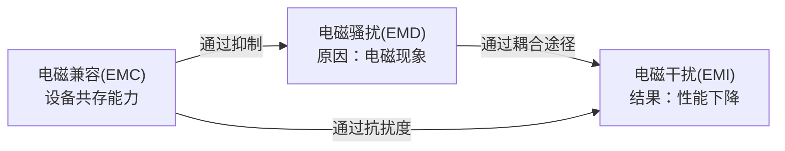
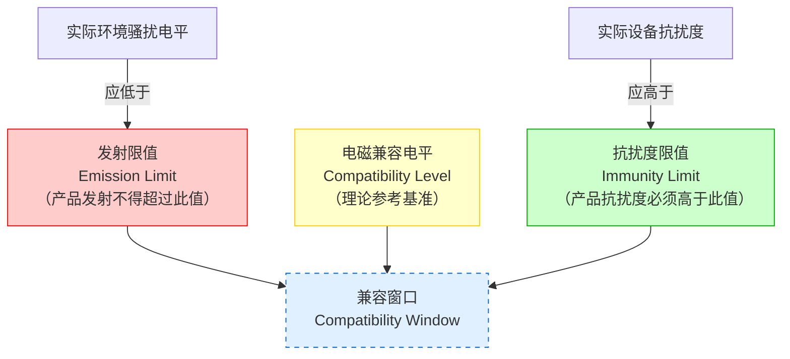
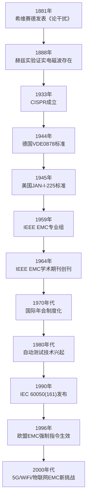
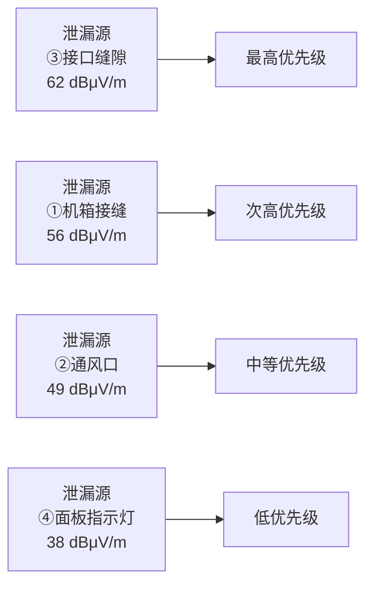
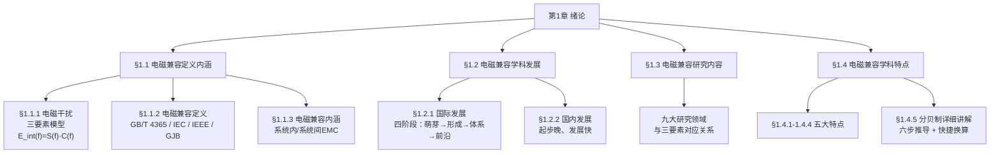

# 第1章 绪论

## 内容导读

清晨，你打开电视机，视频画面却出现了不规则的滚动条纹——原来是隔壁正在使用电钻；你用吹风机吹头发时，旁边的收音机发出一阵刺耳的"滋滋"声；你刚把手机放在音箱旁边，音箱就传出了有节奏的"嘟嘟"脉冲干扰声。这些都是每一个人在日常生活中都曾遇到过的小"麻烦"，但它们背后指向的其实是同一个工程问题——**电磁干扰**（Electromagnetic Interference, EMI）。

这些问题看似琐碎，却只是冰山一角。在航空航天、军事装备、医疗电子、通信系统等领域，电磁干扰可能造成灾难性后果：1969年，土星V火箭在发射36.5秒后遭雷击，飞船导航系统完全失效；1982年，英国"谢菲尔德"号驱逐舰因舰载雷达与卫星通信系统的电磁兼容性缺陷，未能及时发现来袭导弹，最终沉没南大西洋。这些重大事故背后，引出了一个关键的工程学科——**电磁兼容**（Electromagnetic Compatibility, EMC）。

本章作为全书的导引，将从日常生活中的电磁干扰现象出发，逐步深入EMC的概念体系、历史脉络、研究内容和学科特点，为读者搭建完整的EMC知识框架。

**前修课程衔接**：本章假定读者已修完《电路分析》《电磁场与电磁波》《信号与系统》等基础课程，具备基本的电路分析能力和场论直觉。读者如已学习过电磁场理论，将更容易理解本章中近场与远场区分等概念。

通过本章学习，读者应达成以下学习目标：

1. **理解**电磁兼容（EMC）、电磁干扰（EMI）、电磁骚扰（EMD）的定义、区别与联系
2. **掌握**电磁干扰三要素模型（骚扰源、耦合途径、敏感设备）及其频域数学表达
3. **了解**电磁兼容学科从起源（1881年）到当代的国际/国内发展历程，识别关键里程碑事件
4. **认识**电磁兼容的九个核心研究领域及与三要素的对应关系
5. **掌握**电磁兼容学科的五大特点，理解分贝制的基本换算方法

---

## 1.1 电磁兼容定义内涵

### 1.1.1 电磁干扰（定义+三要素）

#### 从日常现象说起

让我们从三个生活场景进入电磁干扰的世界。

**场景一：电视画面与电钻**。当你正在观看电视节目时，邻居开动了冲击电钻。电视机画面上随即出现了不规则的黑白滚动条纹，杂音也随之而来。电钻电机中的换向器在旋转过程中不断产生电火花，这些火花辐射出宽频带的电磁能量，被电视机的天线接收后叠加到正常的视频信号上。

**场景二：吹风机与收音机**。早晨用吹风机吹头发时，旁边的收音机发出了刺耳的"滋滋"声。吹风机中的整流子和碳刷之间的滑动接触会产生连续的火花放电，这种放电辐射出频率范围从几十千赫兹到数百兆赫兹的电磁波，覆盖了收音机的工作频段。

**场景三：手机与音箱**。在GSM手机拨号或来电时刻，将其放置在音箱附近，可以听到有节奏的"嘟嘟嘟"脉冲噪声。这是因为GSM手机工作时以217 Hz的脉冲频率发射射频信号（900 MHz或1800 MHz），该脉冲信号被音箱的音频放大电路检波后，以可闻声的形式重现出来。

> **【案例1-1 手机干扰音箱的技术分析】** GSM手机在通话时以217 Hz的突发脉冲模式发射射频功率，峰值功率可达2 W（GSM 900 MHz频段），对应的瞬时场强在10 cm距离处可达约40 V/m。该射频信号经过音箱内部长度约30~50 cm的非屏蔽音频线缆耦合，耦合间距通常在2~10 cm范围，被功放电路的PN结检波（检波效率约0.1%~1%），产生217 Hz及其谐波（434 Hz、651 Hz...）的音频信号，最终被扬声器放大输出，输出电平可达数百毫伏。这种现象在电磁兼容领域被称为"射频信号音频检波效应"，是典型的传导耦合干扰。

这些日常现象背后指向的是同一个工程问题——**电磁干扰**。

#### EMD与EMI：一对容易混淆的概念

在电磁兼容术语体系中，有两个核心概念需要首先澄清：**电磁骚扰**（Electromagnetic Disturbance, EMD）和**电磁干扰**（Electromagnetic Interference, EMI）。

根据GB/T 4365《电工术语 电磁兼容》的定义：

- **电磁骚扰（EMD）**：任何可能引起装置、设备或系统性能降低或者对有生命或无生命物质产生损害作用的电磁现象。电磁骚扰可以是电磁噪声、无用信号或传播媒介自身的变化。
- **电磁干扰（EMI）**：电磁骚扰引起的装置、设备或系统性能下降。

从以上定义可以看出，EMD是指"电磁现象"本身，是**原因**；而EMI是指由这种电磁现象引起的"性能下降"后果，是**结果**。并非所有的电磁骚扰都会导致电磁干扰——只有当骚扰的幅度和频率特性恰好与敏感设备的脆弱特性匹配时，骚扰才会转化为干扰。

值得注意的是，IEC 60050(161)于1990年发布后才将"disturbance"与"interference"明确区分。在此之前，许多文献和标准中这两个术语常被混用。即使在今天，EMI作为电磁干扰的总称，在工程语境中仍然被广泛使用（如EMI滤波器、EMI测试），这已被行业习惯所接受。

为了帮助读者清晰理解二者的区别与联系，表1-1从八个维度进行了对比。

**表1-1：电磁骚扰（EMD）与电磁干扰（EMI）多维度对比**

| 对比维度 | 电磁骚扰（EMD） | 电磁干扰（EMI） |
|:--------|:---------------|:---------------|
| **本质** | 电磁现象本身（电压、电流、场的变化） | 电磁现象引起的后果（性能下降） |
| **因果角色** | 原因 | 结果 |
| **消除方式** | 消除电磁现象（如抑制噪声源） | 提高设备抗扰度（如增强屏蔽） |
| **工程措施** | 滤波、屏蔽、去耦等抑制技术 | 抗扰度设计、裕量设计 |
| **标准引用** | GB/T 4365中"骚扰限值"（emission limit） | GB/T 4365中"干扰限值"（interference limit） |
| **时间关系** | 持续或间歇的电磁现象 | 在性能下降可被观测到的时刻存在 |
| **能量关系** | 骚扰电平可以测量 | 干扰程度依赖设备敏感性 |
| **典型实例** | 电机换向火花辐射的宽频电磁波 | 该电磁波导致电视机画面出现条纹 |

#### 电磁干扰三要素框架

从上面的辨析可以看出，EMI是EMD通过某种耦合途径作用于敏感设备的结果。由此引出了电磁兼容分析中最核心、最基本的框架——**电磁干扰三要素**。

任何电磁干扰现象的发生，都离不开三个基本要素：

1. **骚扰源（Source）**：产生电磁骚扰的器件、设备或系统，如开关电源的功率管、数字集成电路的时钟线、雷电放电通道等。
2. **耦合途径（Coupling Path）**：将电磁能量从骚扰源传输到敏感设备的通路，包括传导耦合（通过导线、电缆、公共阻抗）和辐射耦合（通过空间电磁场）。
3. **敏感设备（Victim/Receiver）**：受到电磁骚扰影响而发生性能下降的设备或系统。

三要素的关系可以用图1-1示意。

**图1-1 电磁干扰三要素框架示意图**

三要素模型的工程意义在于：只要切断三个要素中的任意一环，干扰即被消除。这对应着三类EMC设计策略：

- **抑制骚扰源**（S→0）：降低骚扰源的电磁发射电平，如采用软开关技术降低开关电源的谐波发射、在感性负载两端并联续流二极管抑制反向瞬态电压。
- **切断耦合途径**（C→0）：阻断骚扰从源到受害设备的能量传输，如加装EMI滤波器切断传导耦合、采用屏蔽罩抑制辐射耦合、优化PCB布局减少串扰。
- **提高敏感设备抗扰度**（V→0）：增强设备抵抗电磁骚扰的能力，如增加输入端的共模扼流圈、采用差分信号传输提高共模抑制比。

#### 三要素的数学模型化

上述文字描述的三要素关系，可以进一步用频域乘积模型来定量表达。设骚扰源在频率$f$处的发射频谱为$S(f)$，耦合途径的频率响应函数为$C(f)$，则敏感设备输入端口的等效干扰电平$E_{\text{int}}(f)$为：

$$
E_{\text{int}}(f) = S(f) \cdot C(f)
\tag{1-1}
$$

式（1-1）的工程含义非常直观：干扰电平取决于骚扰源的发射强度与耦合效率的乘积。只要$S(f) \to 0$（源无发射）或$C(f) \to 0$（途径无耦合），则$E_{\text{int}}(f) \to 0$，干扰就不存在。这一乘积关系构成了定量EMC设计的理论基础——EMC工程师的工作本质上就是使$S(f) \cdot C(f)$低于敏感设备的抗扰度门限$V_{\text{th}}(f)$。

> **【案例1-2 阿波罗12号雷击事件——电磁干扰的经典案例】** 1969年11月14日上午11时22分，美国土星V火箭运载"阿波罗12号"宇宙飞船在肯尼迪航天中心发射。当时发射场天气条件基本符合允许发射标准：距地面240~250 m及650~33 000 m之间有两层云，周围细雨绵绵，但在发射前后6小时内无自然雷电记录，地面风速7 m/s。火箭发射后一切正常，飞行稳定。
>
> 然而，当计时秒针走到第36.5秒、火箭飞行高度达到1920 m时，火箭与云层和地面之间发生了雷电现象——两道平行的闪电从云中直劈而下。火箭遭雷击后，飞船的电源系统被破坏，飞行控制中心的遥测信号突然消失，导航系统失效，飞行平台失控。更糟的是，当火箭飞到第52秒、高度4300 m时，闪电再次击中火箭。幸运的是，飞船上装有备用电源，宇航员及时修复了被损坏的设备，任务得以继续。
>
> **技术分析**：事后调查表明，火箭及其发动机火焰构成了一个长约300 m的导电通道（火箭本体100多米，火焰折合导电长度约200 m），这个导电通道在云层和地面之间人为诱发了雷电。从三要素模型来看，火箭的金属壳体（含火焰导电通道）充当了耦合途径，将云层中的电荷（骚扰源）导入飞船电子系统（敏感设备）。$S(f)$为雷电放电产生的宽频强电磁脉冲，频谱覆盖100 kHz~100 MHz，峰值电流可达数十千安（实测典型值约30 kA），放电上升时间约1~2 μs，单次放电释放能量约10^9 J量级；$C(f)$为火箭壳体作为天线的耦合效率函数，在火箭长度对应的半波谐振频率（约500 kHz）附近耦合效率最高；$E_{\\text{int}}(f)$远超飞船电子系统的抗扰度门限$V_{\\text{th}}(f)$（典型CMOS集成电路的抗扰度门限仅约数伏），因此干扰发生。事后检查发现，飞船的遥测系统接口电路采用的μA709运算放大器抗扰度仅约±5 V，远不足以抵御耦合进入的数kV级瞬态过电压。
>
> **启示**：此案例表明，大型运载工具的EMC设计必须考虑其结构体在强电磁环境中的天线效应。后续航天器的EMC设计规范中，专门增加了对雷电诱发条件的防护要求和接地系统的冗余设计。

#### 典型电磁干扰实例

为加深对三要素模型的理解，表1-2列举了五种常见电磁干扰场景，覆盖从自然现象到人工设备、从低频到高频、从传导到辐射的多种情况。

**表1-2：典型电磁干扰实例分析**

| 序号 | 干扰场景 | 骚扰源(S) | 耦合途径(C) | 敏感设备(V) | 抑制策略 |
|:---:|:---------|:----------|:------------|:------------|:---------|
| 1 | 雷电致电子系统失效 | 雷电放电（峰值电流~30 kA，频谱100 kHz~100 MHz） | 空间辐射+地电位抬升 | 通信基站、计算机系统 | 浪涌保护器+屏蔽+等电位接地 |
| 2 | 电源线谐波干扰 | 开关电源功率管（开关频率50~500 kHz） | 公共电源阻抗耦合 | 同一电源线上的精密仪器 | EMI滤波器+隔离变压器 |
| 3 | PCB微带线串扰 | 高速数字信号线（tr≈1 ns，f_ck=100 MHz） | 容性/感性耦合（互容/互感） | 相邻布线层模拟信号线 | 3W规则+屏蔽地线+差分布线 |
| 4 | 射频发射机干扰 | 通信基站发射天线（功率20 W，900 MHz） | 空间辐射（近场区） | 医疗监护设备 | 金属屏蔽罩+滤波器 |
| 5 | 静电放电（ESD） | 人体带电（~15 kV，放电上升时间<1 ns） | 接触放电+空间辐射 | 手持设备触摸屏 | TVS管+PCB放电尖角+接地 |

> **【案例1-3 谢菲尔德号驱逐舰——系统级EMC设计缺陷的悲剧】** 1982年5月4日，英国"谢菲尔德"号导弹驱逐舰（造价1.5亿美元，排水量4350 t）在马尔维纳斯群岛以南海域执行警戒任务。阿根廷空军派出3架"超级军旗"攻击机实施突袭：其中两架超低空（40~50 m）隐蔽接近，另一架爬升定位并传输目标数据。在46 km处，攻击机突然跃升至150 m启动雷达锁定目标，发射了两枚"飞鱼"AM39反舰导弹。
>
> 导弹发射后以约0.93马赫（约315 m/s）速度巡航，降至15 m高度巡航飞行，在距目标12~15 km处启动主动雷达搜索并锁定"谢菲尔德"号，随后降至2~3 m浪尖高度实施掠海突防。
>
> 致命的问题在于："谢菲尔德"号的舰载雷达警戒系统（Type 965雷达，工作频率约200~400 MHz，P波段，作用距离约300 km）与卫星通信系统（SCOT-1卫星通信终端，工作频率约7~8 GHz，发射功率约数百瓦）存在电磁兼容设计缺陷——两者不能同时工作。当军舰使用SCOT-1终端与英国本土进行卫星通信时，舰载雷达被迫关闭。恰在此时，"飞鱼"导弹来袭。从导弹启动主动雷达搜索（距舰约12 km）到击中目标，仅约38秒的反应窗口时间。一直到导弹逼近至5 km目视距离时才被舰员发现。舰长急忙下令启动"密集阵"近防系统（射速3000发/分，有效射程约1.5 km），但该系统因计算机故障无法启动。最终导弹击穿舰舷，在舰体内爆炸并引发大火，大火持续燃烧6小时后，这艘现代化军舰沉没于南大西洋海底。全舰287名官兵中20人丧生，24人受伤。
>
> **从三要素模型分析**：骚扰源为"飞鱼"导弹的主动雷达导引头（工作频率约10 GHz，Ku波段，发射功率数十瓦，脉冲重复频率约2000 Hz）；耦合途径为空间电磁辐射；敏感设备为"谢菲尔德"号的雷达警戒系统。然而，导致悲剧的更深层原因是**系统内EMC设计缺陷**——SCOT-1卫星通信系统的发射信号（7~8 GHz）的高次谐波落入舰载雷达的工作频段（200~400 MHz），造成了带内阻塞干扰，迫使雷达在通信时段关闭，从而在物理上切断了探测能力。换言之，军舰自身的EMC问题（两个电子系统间的互相干扰）削弱了其对外部威胁的感知能力。
>
> **启示**：这一悲剧深刻说明了系统级EMC设计的重要性——单个设备即使各自满足EMC标准，当它们在同一平台上联合工作时，仍可能产生不可预见的相互干扰。系统内EMC（Intra-system EMC）与系统间EMC（Inter-system EMC）需要统筹考虑。

### 1.1.2 电磁兼容定义

#### 从"兼容"的日常含义说起

"兼容"一词在日常生活中并不陌生。以近海鱼类生存为例：即使在排放一定量生活污水的情况下，只要污染物浓度不超过鱼类的耐受极限，鱼类仍能正常生存繁衍——这就是一种生态兼容。电磁兼容的逻辑与此类似：在同一个电磁环境中，各种电子、电气设备在一起工作，彼此之间不可避免地会产生电磁能量的发射与接收。关键在于，这些电磁发射的强度是否能被控制在其他设备能够承受的范围内。

#### 多标准定义并列

电磁兼容（Electromagnetic Compatibility, EMC）作为一个标准术语，在多个权威标准和规范中均有定义。并列呈现这些定义，有助于读者从不同视角理解EMC的完整内涵。

**④ GB/T 4365—2003《电工术语 电磁兼容》**：设备或系统在其电磁环境中能正常工作且不对该环境中任何事物构成不能承受的电磁骚扰的能力。

**④ IEC 60050(161:1990)《国际电工词典 第161章：电磁兼容》**：设备或系统在其电磁环境中能正常工作且不对该环境中的任何事物构成不能承受的电磁骚扰的能力。（注：与GB/T 4365定义一致，系采标关系）

**④ IEEE Std 100—2000《电气电子术语标准词典》**：设备、系统或装置在共同电磁环境中能够以设计要求的性能等级运行，而不会因其他设备、系统或装置的电磁发射导致性能下降，也不会对其所在电磁环境中的任何事物施加不可接受的电磁骚扰的能力。

**④ GJB 72A—2002《电磁兼容术语》**：设备（分系统、系统）在共同的电磁环境中能一起执行各自功能的共存状态，即该设备不会由于受到同一电磁环境中其他设备的电磁发射而导致或遭受不允许的降级，也不会使同一电磁环境中其他设备（分系统、系统）因受其电磁发射而导致或遭受不允许的降级。

从上述定义可以看出，尽管措辞各有侧重，但所有定义都反映了一个共同的核心含义——**EMC包含两个条件，缺一不可**：

1. **抗扰度条件**：设备在预期的电磁环境中能正常工作（不被干扰），即设备具备足够的抗扰度（Immunity）。
2. **发射条件**：设备对所在电磁环境的电磁发射不超过可接受的水平（不干扰别人），即设备的电磁发射（Emission）在规定的限值以内。

上述定义虽然措辞不同，但反映的都是同一个核心要求，包含两个条件，缺一不可。

#### EMD/EMI/EMC 三概念关系

至此，我们已经讨论了EMD（电磁骚扰）、EMI（电磁干扰）、EMC（电磁兼容）三个核心概念。它们构成了一个逻辑链：EMD是电磁现象，EMI是EMD造成的后果，而EMC追求的目标就是让EMD不转化为EMI——使设备既不被干扰，也不干扰别人。

*图1-2 EMD/EMI/EMC三概念关系图*
表1-3进一步归纳了三概念的定义、角色和标准来源。

**表1-3：EMD/EMI/EMC三概念关系**

| 概念 | 英文全称 | 定义概要 | 角色定位 | 消除方式 | 标准来源 |
|:----|:---------|:---------|:--------|:---------|:---------|
| 电磁骚扰 | Electromagnetic Disturbance (EMD) | 可能引起性能降低的电磁现象 | 原因（潜在威胁） | 抑制骚扰源（滤波、屏蔽） | GB/T 4365, IEC 60050(161) |
| 电磁干扰 | Electromagnetic Interference (EMI) | 电磁骚扰引起的性能下降 | 结果（实际危害） | 提高设备抗扰度 | GB/T 4365, CISPR |
| 电磁兼容 | Electromagnetic Compatibility (EMC) | 设备在共处环境中正常工作的共存能力 | 目标与要求 | 系统级综合设计 | GB/T 4365, IEEE 100, GJB 72A |

### 1.1.3 电磁兼容内涵

#### 电磁兼容 vs 电磁兼容性

在中文语境中，"电磁兼容"一词有双重含义：一方面指**电磁兼容学科**（作为一门工程技术学科的名称），另一方面指**电磁兼容性**（作为设备或系统的性能指标）。在英文中，前者也常用"EMC Engineering"或"EMC Technology"表述，而后者则是设备的一项规格参数。不过，在日常工程实践中，"EMC"一词已同时承载了这两层含义。

#### 系统内与系统间EMC

根据电磁兼容问题涉及的空间范围和控制自由度，可以将其分为两个层次。

**系统内电磁兼容（Intra-system EMC）**：指在同一系统内部，各分系统、设备、部件之间能够正常共存工作。系统内EMC的特点是系统设计者对各组成部分有较高的控制权——可以调整走线布局、增加滤波、加装屏蔽、优化接地方案等。典型系统内EMC问题包括：PCB板上数字信号线对模拟信号线的串扰、机箱内开关电源对相邻电路板的传导干扰、同一机箱内多个模块之间的地回路耦合。

**系统间电磁兼容（Inter-system EMC）**：指处于不同系统之间的设备能够正常共存工作。系统间EMC的设计者通常无法控制其他系统的设计参数，只能依靠自身的设计裕量和标准符合性来保证共存。典型系统间EMC问题包括：通信基站与邻近医疗设备之间的相互干扰、高压输电线对附近铁路信号系统的感应干扰、舰船上雷达与通信系统的射频共存问题（如案例1-3）。

表1-4从六个维度对比了这两种EMC问题的特征。

**表1-4：系统内与系统间EMC对比**

| 对比维度 | 系统内EMC | 系统间EMC |
|:--------|:----------|:----------|
| **空间尺度** | 系统内部（mm~m级） | 系统之间（m~km级） |
| **控制能力** | 高——设计者可调整 | 低——需依靠标准 |
| **设计自由度** | 大——可改布局/屏蔽/滤波 | 小——主要依赖裕量 |
| **解决方法** | 调整布局+屏蔽+滤波+接地 | 标准符合性+频谱管理+协调 |
| **工程实例** | 手机PCB上数字与RF电路隔离 | 基站与航空电子系统的相互干扰 |
| **影响因素** | PCB布局、电源分配、结构设计 | 发射功率、天线方向图、频谱分配 |

#### EMC的空间/时间/频谱三维视角

柯金良在《电磁兼容概论》中提出了一个独特的视角：电磁兼容由**空间**、**时间**、**频谱**三个基本要素组成。即：

- **空间兼容**：设备之间保持足够的物理距离，利用电磁场衰减随距离的增加来降低相互干扰。
- **时间兼容**：对可能冲突的电磁操作进行时间上的错开安排，如时分多址（TDMA）系统中的时隙分配。
- **频谱兼容**：对频率资源进行合理的分配和管理，避免不同系统之间的频谱重叠。

这三个维度的兼容性共同构成了EMC的完整内涵。在工程实践中，三个维度的措施往往需要综合运用。

#### 四环技术链条：本章概念与后续各章的映射

本章的概念框架不是孤立存在的——它与全书各章节构成了一个完整的技术链条。图1-3展示了这个链条的结构。

*图1-3 四环技术链条与后续各章映射*
各环的具体对应关系如下：

- **本章（第1章）**：建立EMC概念体系、干扰三要素模型、学科历史全景——为后续各章提供术语工具和知识背景。
- **第2章（耦合机理）**：详细展开三要素中的"耦合途径"——传导耦合、近场感性耦合、近场容性耦合、远场辐射耦合等具体机理，对应本章§1.1.1中的$C(f)$环节。
- **第3章（抑制技术）**：详细展开三要素中的"抑制骚扰源"和"切断耦合途径"——屏蔽、滤波、接地、搭接等具体技术，对应本章§1.1.1中的三策略。
- **第4章（测试与标准）**：详细展开EMC测量方法与标准体系——对应本章§1.3中的"EMC测试与测量"和"EMC标准与规范"两个研究领域。
- **第5章（系统设计）**：综合运用前述各章知识，进行完整的系统级EMC设计——对应本章§1.4中的EMC设计方法论。

以上我们了解了EMC的核心概念和基本框架，但这些概念并非凭空产生——它们有着深厚的历史渊源。接下来的§1.2将带您回到1881年，追溯电磁兼容学科从萌芽到成熟的发展历程。

### 1.1.4 兼容电平图与兼容窗口

在EMC工程实践中，产品的电磁兼容性实际上是在一个量化的电平体系中定义的。IEC 61000-2系列标准建立了三个关键电平概念，它们之间的层次关系构成了EMC设计的根本依据。

**① 发射限值（Emission Limit）**：规定骚扰源在特定频段内允许的最大电磁发射电平。例如，CISPR 32规定信息技术设备在30~230 MHz频段的辐射发射限值为40 dBμV/m（准峰值，10 m法），在230~1000 MHz频段为47 dBμV/m。该限值是在考虑统计分布后确定的，通常留有统计裕量。

**② 电磁兼容电平（Compatibility Level）**：在特定电磁环境中，为协调发射限值和抗扰度限值而设定的参考电平。它是一个理论上的设计基准电平，代表在给定环境中预期存在的最大骚扰电平，通常取为发射限值与抗扰度限值的几何中值。电磁兼容电平本身不是产品的测试判据，而是标准制定者用来确定发射限值和抗扰度限值的中间参照。以低压公用电网为例，IEC 61000-2-2规定的0~2 kHz谐波电压兼容电平为8%（对基波电压的百分比），相应的发射限值为6%，抗扰度测试电平为10%。

**③ 抗扰度限值（Immunity Limit）**：规定敏感设备在特定频段内必须能够承受的最小电磁骚扰电平。例如，IEC 61000-4-3规定基本抗扰度测试电平为3 V/m（80 MHz~1 GHz，未调制），工业环境为10 V/m。通过抗扰度限值与兼容电平之间的裕量来保证设备在实际环境中的正常工作。

这三个电平之间的层次关系如图1-3所示。

**图1-3 兼容电平三层次关系与兼容窗口示意图**

图中，发射限值与抗扰度限值之间形成了一个**兼容窗口（Compatibility Window）**。这个窗口的宽度（即抗扰度限值与发射限值之差）决定了设备之间共存的可靠性裕量。根据IEC 61000-2-2的典型配比，兼容电平通常比发射限值高约6 dB，而抗扰度限值又比兼容电平高约6 dB，因此兼容窗口的总宽度约为12 dB。这一设计保证了即使在最恶劣的发射叠加情况下（多个骚扰源同时工作），实际环境骚扰电平仍有充裕的裕量低于设备的抗扰度能力。

兼容电平图的重要意义在于：它将EMC从定性的"不干扰、不被干扰"概念，转化为了可量化、可设计、可测试的工程指标。EMC工程师的日常工作——无论是设定滤波器指标、选择屏蔽材料还是规划PCB布局——最终都可以映射到这个三电平框架中。

### 1.1.5 电磁兼容核心术语体系

电磁兼容领域包含一套完整的术语体系。除§1.1.1中已详细讨论的EMD与EMI之外，以下10个核心术语构成了EMC知识体系的基础框架。每个术语均给出定义与工程含义。

**表1-5：电磁兼容核心术语体系（10条）**

| 序号 | 术语（英文） | 定义 | 工程含义 |
|:---:|:------------|:-----|:---------|
| 1 | 电磁兼容 EMC (Electromagnetic Compatibility) | 设备或系统在其电磁环境中能正常工作且不对该环境中任何事物构成不能承受的电磁骚扰的能力 | EMC设计的最终目标——设备既"不干扰别人"，也"不被别人干扰" |
| 2 | 电磁干扰 EMI (Electromagnetic Interference) | 电磁骚扰引起的装置、设备或系统性能下降 | EMC设计要消除的后果；EMI问题体现为设备功能异常 |
| 3 | 电磁骚扰 EMD (Electromagnetic Disturbance) | 任何可能引起装置、设备或系统性能降低的电磁现象 | EMC设计的防控对象；EMD存在不等于EMI发生 |
| 4 | 电磁抗扰度 EMS (Electromagnetic Susceptibility / Immunity) | 设备在存在电磁骚扰的情况下不降低其运行性能的能力 | 描述设备的"承受能力"；抗扰度越高越不容易被干扰；IEC 60050(161)以Immunity为标准术语 |
| 5 | 骚扰源 (Source / Disturber) | 产生电磁骚扰的器件、设备或系统 | 三要素的第一环；常见骚扰源包括开关电源、数字时钟、电机换向火花、雷电放电等 |
| 6 | 耦合途径 (Coupling Path) | 将电磁能量从骚扰源传输到敏感设备的通路 | 三要素的第二环；分为传导耦合（导线、公共阻抗）和辐射耦合（空间电磁场）两大类 |
| 7 | 敏感设备 (Victim / Receiver) | 受到电磁骚扰影响而发生性能下降的设备或系统 | 三要素的第三环；敏感度取决于设备的电路设计、屏蔽措施和滤波配置 |
| 8 | 分贝 dB (Decibel) | 两个功率比值的常用对数，定义为$10\\log_{10}(P_2/P_1)$ | EMC中几乎所有限值、裕量、衰减量均用dB表示；电压比用$20\\log_{10}(V_2/V_1)$，详见§1.4.5 |
| 9 | 兼容裕度 (Compatibility Margin) | 抗扰度限值与电磁兼容电平之差，或兼容电平与发射限值之差 | 衡量EMC设计"安全余量"的关键指标；工程上通常要求不小于6 dB |
| 10 | 发射限值 / 抗扰度限值 (Emission / Immunity Limit) | 标准规定的设备最大允许发射电平或最低要求抗扰度电平 | 产品EMC认证的判定依据；产品需同时满足两类限值方可通过认证 |

上述术语构成了EMC学科的"词汇表"。它们之间的逻辑关系可以概括为：**电磁兼容（EMC）追求的目标，是使骚扰源（Source）通过耦合途径（Coupling Path）在敏感设备（Victim）上产生的电磁骚扰（EMD）不转化为电磁干扰（EMI），从而使系统达到兼容裕度（Margin）要求——这一要求最终由发射限值（Emission Limit）和抗扰度限值（Immunity Limit）来量化定义。**

> **术语沿革**：值得注意的是，"Susceptibility"（敏感度）和"Immunity"（抗扰度）在EMC历史上曾有过微妙的含义变迁。早期文献中"Susceptibility"指设备对电磁骚扰的内在敏感性，而"Immunity"指设备经受电磁骚扰而不产生性能下降的能力。IEC 60050(161:1990)之后，"Immunity"成为标准术语，而"Susceptibility"逐渐退居次要地位，但在美军标MIL-STD-461中仍沿用"Susceptibility"指代敏感度要求。

---

## 1.2 电磁兼容学科发展

### 1.2.1 国际的电磁兼容发展

电磁兼容学科的发展历程可以划分为四个阶段：**萌芽探索期**（19世纪末~1930年代）、**组织化与学科形成期**（1930年代~1960年代）、**体系化发展期**（1960年代~1990年代）和**21世纪新发展**（1990年代至今）。从认识论的角度看，这一历程也是从"电路思维"走向"场与波思维"的过程——柯金良称之为"从路到场的演进"。

*图1-4 电磁兼容学科国际发展历程时间线*
#### 第一阶段：萌芽探索期（19世纪末~1930年代）

电磁兼容的起源可以追溯到电磁学理论诞生的年代。1881年，英国物理学家**希维赛德**（Oliver Heaviside）发表了题为《论干扰》（On Interference）的论文，这是人类历史上第一篇专门讨论电磁干扰问题的文献。1883年，**法拉第**（Michael Faraday）完成了电磁感应定律的实验验证。1884年，**麦克斯韦**（James Clerk Maxwell）引入位移电流概念，建立了完整的电磁场理论体系。

1887年，**赫兹**（Heinrich Hertz）通过实验证实了电磁波的存在，同时也观测到电磁波对邻近电路产生的干扰现象——这可以说是人类对电磁干扰的第一次科学观测。同年，柏林电气协会（Elektrotechnischer Verein Berlin）成立了世界上第一个官方的干扰问题委员会，成员包括**赫姆霍兹**（Hermann von Helmholtz）和**西门子**（Werner von Siemens）等著名科学家。委员会的主要任务是研究电气化铁路对通信线路的干扰问题。这标志着人类开始有组织地应对电磁干扰问题。

> **【案例1-4 柏林电气协会1887年委员会——世界最早的干扰问题组织】** 1887年，随着电气化铁路在欧洲的迅速推广，电报和电话通信系统频繁受到牵引电流回路的感应干扰。当时电气化铁路的牵引电压为直流600~750 V，牵引电流可达数百安培，牵引电机换向产生的电弧噪声频谱覆盖几十kHz~几MHz，恰好落在电报线路的工作频段内。柏林电气协会因此成立了专门委员会来研究这一问题。委员会由电磁学领域的顶尖科学家组成，赫姆霍兹和西门子的参与赋予了委员会极高的学术权威性。委员会的研究成果包括：提出了通信线与电力线之间最小间距（建议不小于10 m）的工程建议、系统测量了感应干扰的耦合系数（测量结果发现当间距为5 m时感应电压可达数十伏，超过电报接收机灵敏度门限约3~5 V的10倍以上）。这一案例表明，电磁干扰问题在电力技术推广之初就已被识别和应对，是EMC学科萌芽期的重要标志。

1933年，一个对电磁兼容学科具有里程碑意义的国际组织在巴黎成立——**国际无线电干扰特别委员会**（Comité International Spécial des Perturbations Radioélectriques, **CISPR**）。同年，英国进行了首次系统性电磁骚扰调查：在100例电磁骚扰投诉案例中，分析发现其中50%由电气设备引起，约30%由电力线引起，其他由工业设备等引起。这一调查结果成为CISPR制定骚扰限值标准的数据基础。

#### 第二阶段：组织化与学科形成期（1930年代~1960年代）

1944年，德国发布了世界上第一个EMC标准**VDE 0878**，对电气设备的无线电骚扰限值进行了规定。1945年，美国军方发布了**JAN-I-225**标准，规定了军用电子设备的EMC要求。这两个标准分别奠定了民用和军用EMC标准体系的雏形。

1940年代至1950年代，随着雷达、通信、导航等电子系统在军事领域的广泛应用，系统级EMC问题日益突出。1959年，美国成立了**IEEE电磁兼容专业组**（IEEE EMC Group），标志着EMC从个别工程师的经验性实践走向了系统化的学科研究。1964年，**IEEE Transactions on Electromagnetic Compatibility**学术期刊创刊，成为该领域的旗舰学术刊物。

#### 第三阶段：体系化发展期（1960年代~1990年代）

1970年代，EMC国际年会制度逐步建立，IEEE EMC国际学术年会（IEEE International Symposium on Electromagnetic Compatibility）成为全球EMC领域最重要的学术交流平台。1980年代，随着计算机技术和微处理器的普及，自动EMC测试技术迅速发展，GPIB总线控制的自动测试系统成为主流。

1990年，IEC 60050(161)《国际电工词典 第161章：电磁兼容》正式发布。该标准首次在国际层面明确定义了"电磁骚扰"与"电磁干扰"的区别，统一了EMC术语体系。

1996年1月1日，**欧盟EMC指令（89/336/EEC）** 正式强制实施，要求所有进入欧盟市场的电子电气产品必须满足EMC要求并标注CE标志。这是全球首个将EMC符合性纳入法律框架的强制性法规，对全球EMC产业格局产生了深远影响。

> **【案例1-5 欧盟EMC指令——EMC从技术规范走向法律强制】** 1989年5月3日，欧盟理事会发布了89/336/EEC指令（简称EMC指令），规定从1996年1月1日起，所有在欧盟市场上销售的电子电气产品必须符合相应的EMC要求，并加贴CE标志。指令的核心要求是：产品不得对无线电设备、通信网络和其他设备产生不可接受的电磁干扰；产品必须对其预期电磁环境中的电磁干扰具有足够的抗扰度。指令覆盖的产品范围极广，从家用电器（如电冰箱、洗衣机）到工业设备（如变频器、PLC控制器）到信息技术设备（如计算机、打印机），几乎包括了所有工作电压不超过1000 Vac或1500 Vdc的电子电气产品。欧盟EMC指令直接催生了全球EMC测试认证产业的蓬勃发展。据行业统计，1996年前全球独立的EMC测试实验室不足200家，到2005年已超过1000家，增长了约5倍；单次完整的EMC认证测试费用约为2~5万美元（含传导发射、辐射发射、ESD、辐射抗扰度、快速瞬变等全项测试）。这一案例说明了**法规驱动**在EMC学科发展中的独特作用——EMC不仅是一门技术学科，还受到市场准入法规的强力推动。

#### 第四阶段：21世纪新发展（1990年代至今）

进入21世纪，EMC领域面临着新的挑战和发展机遇：

- **高速数字系统的EMC问题**：随着数字信号速率进入Gbps量级，信号上升时间降至皮秒级，PCB上的信号完整性和EMC问题变得前所未有的复杂。
- **无线通信的EMC问题**：4G/5G移动通信系统频段密集，多个无线系统在同一设备中共存，频谱兼容性设计成为关键。
- **EMC数值仿真技术**：全波电磁仿真（FDTD、FEM、MoM等）在EMC设计中的比重日益增加，使设计前期即可预测EMC性能。
- **AI辅助EMC设计**：机器学习开始应用于EMC故障诊断、PCB布局优化和标准符合性预分析。

### 1.2.2 国内的电磁兼容发展

中国电磁兼容事业的发展具有起步晚、发展快的整体特征。与国际EMC发展历程相比，国内EMC起步约晚了30~40年，但经过近60年的发展，已建立了较为完善的EMC标准体系和产业链。

在国际电磁兼容学科蓬勃发展的同时，中国的电磁兼容事业也走出了一条从无到有、从军用到民用的独特发展道路。

#### 国内EMC发展里程碑

- **1966年**：发布国内首个EMC标准 **JB 854—66**《汽车收音机防干扰》，标志着中国EMC标准化工作的起步。
- **1970年代**：随着军工电子装备的快速发展，系统级EMC问题引起国防科研部门的重视。多个国防研究所开始建立EMC测试能力。
- **1981年**：**HB 5662—81**《飞机电磁兼容要求及测试方法》发布，这是国内系统级EMC标准的早期代表。
- **1984年**：**首届全国电磁兼容学术会议**在北京召开，标志着中国EMC学术共同体的形成。
- **1990年**：原国家技术监督局成立"全国无线电干扰标准化技术委员会"（对应CISPR），协调国内EMC标准化工作。
- **1992年**：**北京国际电磁兼容学术会议**举办，中国EMC领域开始与国际接轨。
- **1997年**：国家环保局发布《电磁辐射环境保护管理办法》，首次将电磁环境管理纳入环保法规。
- **2003年**：中国实施**CCC强制认证制度**，将EMC要求纳入多项产品的CCC认证范围。
- **2010年代**至今：GB/T 17626系列（电磁兼容试验和测量技术）全面采标IEC 61000-4系列，覆盖静电放电、辐射抗扰度、快速瞬变脉冲群等十余项EMC试验项目。军用领域，GJB 151B/152B成为军用设备和分系统EMC设计和验证的核心标准。

表1-6对比了国际与中国EMC发展的阶段特征，揭示了国内滞后约30~40年的追赶过程。

**表1-6：国际/中国EMC发展阶段对比**

| 发展特征 | 国际 | 中国 | 滞后时间 |
|:--------|:-----|:-----|:--------|
| **首个EMC标准** | 1944年 VDE 0878（德国） | 1966年 JB 854—66 | ~22年 |
| **专门学术组织** | 1959年 IEEE EMC专业组 | 1984年首届全国EMC学术会议 | ~25年 |
| **强制性市场准入** | 1996年 欧盟EMC指令 | 2003年 CCC强制认证 | ~7年 |
| **完整的EMC测试标准系列** | 1980年代 IEC 61000系列 | 2010年代 GB/T 17626系列 | ~25年 |
| **军队EMC标准体系** | 1945年 JAN-I-225 | 2000年代 GJB 151B/152B | ~55年（追赶较快） |

#### 当前国内EMC标准体系概述

当前国内EMC标准体系主要由两大分支构成：

- **民用标准体系**：以GB/T 17626系列（电磁兼容 试验和测量技术）为核心，全面采标IEC 61000-4系列，覆盖ESD（GB/T 17626.2）、辐射抗扰度（GB/T 17626.3）、快速瞬变脉冲群（GB/T 17626.4）等试验。
- **军用标准体系**：以GJB 151B（军用设备和分系统电磁发射和敏感度要求）和GJB 152B（相应测量方法）为核心，对标美军标MIL-STD-461/462系列。

从发展速度来看，中国EMC标准体系建设经历了约50年的追赶历程。若以$N(t)$表示$t$年份国内EMC标准总数，可以近似描述其增长趋势如下：

$$
N(t) \approx 5 \cdot e^{0.08(t-1966)}
\tag{1-2}
$$

式中$t$为年份，$e^{0.08(t-1966)}$描述了标准数量每约8.7年翻一番的指数增长。这一增长反映了从1966年仅1项标准到2020年代200余项标准的跨越式发展。中国EMC标准与国际接轨的时间差已从最初的约30年缩小到目前的约5年。

了解了EMC的发展历程后，我们不禁要问：这门学科到底研究什么？它的内部结构是怎样的？接下来的§1.3将为您系统展示电磁兼容的九个核心研究领域。

---

## 1.3 电磁兼容研究内容

电磁兼容的研究内容可以从狭义和广义两个层面来理解。

**狭义概念**：围绕电磁干扰三要素（骚扰源、耦合途径、敏感设备）展开的技术研究，核心目标就是识别、分析和解决电磁干扰问题。

**广义概念**：电磁兼容是一门多学科交叉的综合工程技术，涉及电磁场理论、电路理论、信号处理、材料科学、计量测试等多个学科领域。

基于上述概念，本书将电磁兼容的研究内容归纳为九个核心领域。这九个领域与三要素模型之间的对应关系如表1-7所示。

**表1-7：EMC九个研究领域与三要素对应关系**

| 编号 | 研究领域 | 对应三要素环节 | 核心技术问题 |
|:---:|:---------|:--------------|:------------|
| ① | 电磁干扰机理与建模 | 骚扰源(S) | 开关电源谐波、数字信号时钟谐波、ESD脉冲建模 |
| ② | 电磁耦合与传播 | 耦合途径(C) | 传导耦合（共/差模）、辐射耦合（近场/远场） |
| ③ | 电磁屏蔽与滤波技术 | 切断C→抑制S | 屏蔽效能计算、转移阻抗、滤波器设计 |
| ④ | 接地与搭接技术 | 切断C | 接地阻抗、地环路、等电位连接 |
| ⑤ | EMC测试与测量 | S+C+V验证 | 天线系数、GTEM小室、频谱分析仪、LISN |
| ⑥ | EMC标准与规范 | 限值设定 | CISPR、IEC 61000、FCC Part 15、GJB 151B |
| ⑦ | 系统级EMC设计 | S+C+V综合 | 频谱管理、系统裕量分配、EMC管理计划 |
| ⑧ | 静电放电（ESD）防护 | S+V | HBM模型、CDM模型、TVS保护 |
| ⑨ | 电磁脉冲（EMP）防护 | S+C+V | HEMP波形、耦合通道、加固设计 |

#### 各领域简要展开

**① 电磁干扰机理与建模**：研究各种电磁骚扰源的产生机理和频谱特性。典型的骚扰源包括：开关电源（开关频率通常在50 kHz~1 MHz，产生丰富的谐波发射）、数字逻辑电路（时钟信号的谐波可延伸至GHz频段）、电机换向火花（宽带噪声，频谱覆盖几十kHz~几百MHz）、雷电放电（峰值功率达GW级，频谱覆盖100 kHz~100 MHz）。

**② 电磁耦合与传播**：研究电磁能量从骚扰源到敏感设备的传输通道。耦合途径分为两大类：**传导耦合**（通过导线、电缆、公共阻抗传输）和**辐射耦合**（通过空间电磁场传输）。传导耦合进一步分为共模耦合和差模耦合，辐射耦合进一步分为近场耦合（主要是容性和感性耦合）和远场耦合（平面波耦合）。耦合途径的具体机理将在第2章详细讨论。

**③ 电磁屏蔽与滤波技术**：电磁屏蔽利用金属壳体对电磁波的反射和吸收来衰减辐射耦合；屏蔽效能（Shielding Effectiveness, SE）的工程定义由下式给出：

$$
SE = 20\log(E_1/E_2) \quad \text{（电场屏蔽）}
\tag{1-3}
$$

其中$E_1$为无屏蔽时的场强，$E_2$为有屏蔽时的场强。电磁滤波通过LC网络为骚扰电流提供低阻抗旁路路径来衰减传导耦合。

**④ 接地与搭接技术**：接地是EMC设计中最重要的基础技术之一。正确的接地设计可以为骚扰电流提供低阻抗泄放通道，防止地电位波动引起逻辑误判。搭接（Bonding）则是在金属部件之间建立低阻抗的电连续性连接。

**⑤ EMC测试与测量**：EMC测试分为电磁发射（EMI）测量和抗扰度（EMS）测量两大类。关键的测试设备包括：频谱分析仪（测量发射频谱）、LISN（Line Impedance Stabilization Network，线路阻抗稳定网络，用于传导发射测量）、**GTEM小室**（Gigahertz Transverse Electromagnetic Cell，吉赫兹横电磁波室，用于辐射发射和辐射抗扰度测量）。EMC测试方法与标准详见第4章。

**⑥ EMC标准与规范**：EMC标准是产品EMC设计和验证的依据。国际主流的EMC标准体系包括：CISPR系列（无线电骚扰测量）、IEC 61000系列（电磁兼容基础标准）、FCC Part 15（美国射频频段设备标准）。国内标准体系以GB/T 17626系列（采标IEC 61000-4）和GJB 151B/152B（军用）为核心。

**⑦ 系统级EMC设计**：在大型系统（如飞机、船舶、卫星、通信基站）中，EMC设计需要从系统顶层进行统一规划和逐层分解。核心技术包括：频谱分配与相容性分析、EMC裕量分配、EMC控制计划制定、以及系统级EMC仿真验证。

**⑧ 静电放电（ESD）防护**：ESD是电子设备在实际使用中最常见的电磁干扰源之一。人体模型（Human Body Model, HBM）是ESD防护设计中最常用的模型：典型的人体带电压可达15 kV（干燥环境下），放电电流上升时间小于1 ns，峰值电流可达数十安培。ESD防护的核心是在设计阶段提供低阻抗的放电路径，在芯片级采用TVS（Transient Voltage Suppressor）保护器件。

**⑨ 电磁脉冲（EMP）防护**：电磁脉冲是能量极高的瞬态电磁现象，包括高空核爆电磁脉冲（HEMP）和自然雷电电磁脉冲（LEMP）。HEMP具有极宽的频谱（DC~100 MHz）和极高的场强（峰值可达50 kV/m），对电子系统构成严重威胁。EMP防护的核心是建立分层防御体系：建筑级屏蔽、设备级滤波和电路级保护。

#### 拓展领域

除上述九个核心领域外，电磁兼容还涉及一些特殊和前沿的研究方向。

> **【案例1-6 TEMPEST——电磁信息发射防护技术】** 电磁信息发射（compromising emanations）是指电子设备在处理信息时无意中辐射出的电磁信号，这些信号可能携带可恢复的信息内容。1985年，荷兰学者**Wim van Eck**在一次公开演示中震惊了信息安全和EMC两个领域：他使用一台普通的电视接收机（改装后中频带宽约6 MHz）和自制的对数周期天线（增益约6 dBi），在距离目标建筑80~100 m之外，成功从一台IBM PC/XT的CRT显示器（采用12英寸单色显像管，垂直扫描频率60 Hz，水平扫描频率15.75 kHz）的电磁辐射中恢复了屏幕上显示的文本内容，恢复的文字分辨率可达80列×25行。van Eck的演示揭示了电磁信息发射带来的信息安全隐患。这一技术被称为"TEMPEST"（Transient Electromagnetic Pulse Emanation Surveillance Technology），其防护措施包括：在显示屏前加装视频干扰器（在20~200 MHz频段注入伪随机噪声信号，使辐射信噪比降低至1:1以下）、使用屏蔽材料（镀锌钢板或铜网，屏蔽效能要求≥60 dB）的机箱、对信号线缆（如VGA排线，频率DC~100 MHz）实施铁氧体磁环滤波。TEMPEST研究是EMC范畴中电磁兼容安全性的一个重要拓展，体现了EMC从设备共存向电磁信息安全的延伸。

> **【案例1-7 RFID系统的EMC问题】** 射频识别（RFID）系统的工作频率主要有低频（125~134 kHz）、高频（13.56 MHz）、超高频（860~960 MHz）和微波（2.45 GHz）四个频段。以900 MHz频段的无源RFID系统为例，其读写器发射功率通常为0.5~2 W（ERP，等效辐射功率），典型读取距离为3~10 m，标签的最小唤醒功率约-15~-10 dBm（约32~100 μW），反向散射调制带宽约200~500 kHz。在实践中，900 MHz RFID系统与GSM 900通信系统（上行890~915 MHz，下行935~960 MHz）之间的邻道干扰问题最为突出——RFID读写器发射频段为902~928 MHz（美国FCC标准），其发射频谱的邻道泄漏功率比（ACPR）通常在-30~-20 dBc，当RFID读写器距离GSM基站接收天线小于10 m时，泄漏功率可能超出GSM基站接收机的灵敏度门限（典型值约-110 dBm），导致基站上行链路阻塞。RFID系统还会在物流仓储环境中对附近的WiFi网络（2.4 GHz频段）和蓝牙设备（2.402~2.480 GHz）产生干扰，干扰距离通常为5~15 m。这些问题的解决依赖于合理的频谱分配、时隙协调和发射功率控制。

---

## 1.4 电磁兼容学科特点

以上九个研究领域展现了EMC学科的技术广度。但电磁兼容之所以能成为一门独立的学科，还在于其独特的学科性质和思维方式——这正是本节要讨论的。

本节借鉴梁振光《电磁兼容原理技术及应用》的五点学科特点框架，融合路宏敏和柯金良的深化论述，从五个维度阐释电磁兼容的学科特性。

### 1.4.1 综合性交叉学科

电磁兼容是一门典型的综合性交叉学科。从学科支撑来看，EMC涉及以下领域：

- **电磁场理论**：辐射耦合、屏蔽效能、天线效应、近场/远场区分析
- **电路理论**：传导耦合、共模/差模分析、滤波器设计、谐振分析
- **信号处理**：傅里叶分析与频谱变换、调制解调、时域与频域分析
- **材料科学**：屏蔽材料（导电橡胶、金属丝网、吸波材料）、铁氧体材料
- **数学**：传输线方程、场方程数值解（FDTD/FEM/MoM）、统计学方法（如MIL-HDBK-1857中的EMC裕量统计分配）
- **计量测试**：校准、天线系数、测量不确定度分析

这一多学科交叉的特性，要求EMC工程师具备"宽口径"的知识结构，能够从系统层面理解和分析问题。正如§1.3所述，九个研究领域各自对应不同的学科背景，这种多样性本身就是EMC学科综合性的体现。

### 1.4.2 引用无线电术语

电磁兼容领域的核心概念和表达方式大量借鉴了无线电工程中的术语和工具。最典型的体现是**分贝（dB）** 表示法在EMC中的广泛应用——无论是发射限值、抗扰度电平、屏蔽效能还是裕量计算，都使用分贝表示。此外，频率划分（如高频/甚高频/超高频）、调制方式（如ASK、FSK、QPSK）、天线参数（如增益、方向图、极化）等无线电术语在EMC语境中也频繁出现。

分贝制的详细换算方法将在§1.4.5中专门讲解。

### 1.4.3 极强的实用性

电磁兼容是一门高度工程化的学科，其研究目标直接服务于工程实践。几乎每一个EMC技术问题都可以追溯到实际的产品研发和认证需求。

**"1-10-100"法则**：梁振光教授提出的这一法则生动地揭示了EMC设计越早介入成本越低的规律：在产品设计初期解决一个EMC问题只需花费1元；到了试制阶段才发现并修改同样的EMC问题，需要花费10元；到了批量生产阶段才暴露，修改成本将高达100元。

**表1-8：EMC问题发现阶段的费效比**

| 发现阶段 | 相对成本 | 修改示例 | 影响范围 |
|:--------|:--------:|:---------|:---------|
| **设计初期**（方案设计阶段） | 1 | 在PCB布局阶段增加滤波器位置、预留屏蔽罩安装孔 | 仅需修改设计文件 |
| **试制阶段**（工程样机） | 10 | 重新PCB布线、增加屏蔽罩、更换接口滤波器 | 需修改PCB和生产夹具 |
| **批量生产**（已量产） | 100 | 产品召回、模具修改、重新认证测试 | 库存处理+品牌信誉损失+认证费用 |

从这张表中可以清晰地看到，EMC真正"低成本"的唯一路径就是**在设计的初始阶段就考虑EMC问题**。

**EMC职业方向**：EMC学科的实用性还体现在其广阔的就业前景上。目前国内EMC领域的职业方向主要包括：

- **EMC设计工程师**：负责产品整机或系统级的EMC设计，包括屏蔽结构设计、滤波器选型、PCB EMC布局优化等
- **EMC测试工程师**：负责EMI/EMS测试，操作电波暗室、GTEM小室、频谱分析仪等设备
- **EMC认证工程师**：负责产品的EMC标准符合性认证，与第三方实验室对接
- **EMC仿真工程师**：使用全波电磁仿真软件（CST、HFSS、FEKO等）进行EMC仿真验证
- **EMC现场工程师**：负责大型系统（通信基站、电力站、高铁等）的现场EMC调试和故障排查

据行业招聘数据统计，国内EMC工程师的年薪范围通常为15~40万元（基础岗位），经验丰富的系统级EMC专家年薪可达60万元以上。

### 1.4.4 极其依赖于测量

EMC是一门"以测量为依归"的学科。这一点与许多工程学科不同——一个电路设计可以用公式计算其增益，一个机械结构可以用有限元分析验证其强度，但一个产品的EMC性能是否合格，**最终必须通过标准化的EMC测试来判定**。正如国际著名EMC学者Clayton R. Paul所言："如果没测过，就不能说它没问题。"

EMC测试的依赖性体现在以下层面：

- **标准符合性**：产品能否获准上市，取决于是否通过标准规定的EMC测试项目（如传导发射、辐射发射、静电放电抗扰度等）。
- **设计验证**：EMC设计的有效性必须由测试数据支撑。屏蔽效能、插入损耗等参数在设计阶段可以估算，但最终的验证仍依赖测量。
- **故障诊断**：EMC问题的排查和定位通常依赖近场探头、频谱分析仪等测量设备扫描PCB上的电磁场分布。

### 1.4.5 以电磁场为理论基础

电磁兼容的物理本质是电磁能量的产生、传输和接收，这在根本上取决于电磁场理论。与其他应用电磁学分支（如天线工程、微波工程）相比，EMC中的电磁场问题具有以下特殊性：

- **近场与远场的区分至关重要**：在大多数EMC问题中，设备之间的间距往往处于近场区。近场与远场的分界距离通常由下式确定：

$$
r_{\text{boundary}} = \frac{\lambda}{2\pi}
\tag{1-4}
$$

当$r < \lambda/2\pi$时（近场区），电场和磁场的衰减规律不同——电场按$1/r^3$衰减，磁场按$1/r^2$衰减；当$r > \lambda/2\pi$时（远场区），场按$1/r$衰减，形成平面波。这意味着在近场区，干扰抑制策略需要根据场型特征区别对待。

- **电磁兼容关注的是"无意"辐射**：与天线工程追求辐射效率不同，EMC的屏蔽和滤波追求的是**降低**无意辐射。
- **传输线理论在EMC中的特殊地位——电尺寸(Electrical Size)概念**：传输线理论的应用取决于互联线缆的**电尺寸**（Electrical Size）。电尺寸定义为几何长度与波长的比值：

$$
k = \frac{l}{\lambda} = \frac{l \cdot f}{v}
\tag{1-5}
$$

其中$l$为线缆几何长度（m），$f$为工作频率（Hz），$v$为电磁波在介质中的传播速度（m/s，真空中$v \\approx 3 \\times 10^8$ m/s）。电尺寸$k$是一个无量纲量，工程上以$k = 0.1$为分界判据：

- **电小尺寸**（$k < 0.1$）：此时线缆长度远小于波长，沿线的电压和电流可视为均匀分布，可用**集总参数模型**（Lumped Parameter Model）分析。
- **电大尺寸**（$k \\geq 0.1$）：此时线缆长度已达到或超过波长的1/10，沿线存在显著的驻波分布，必须使用**分布参数模型**（Distributed Parameter Model），即传输线理论来分析。

**工程实例**：一根10 cm长的互联导线，在两种频率下的电尺寸判据截然不同：
- 在**50 Hz工频**下：$\\lambda = 3\\times10^8/50 = 6000$ km，$k = 0.1/6\\times10^6 \\approx 1.67\\times10^{-8} \\ll 0.1$，属于典型的电小尺寸，完全可以用集总参数（电阻+电感）建模。
- 在**1.5 GHz**下：$\\lambda = 3\\times10^8/1.5\\times10^9 = 0.2$ m = 20 cm，$k = 10/20 = 0.5 > 0.1$，属于电大尺寸，导线上将形成驻波，必须以传输线理论处理。

这一概念深刻揭示了EMC中\"频率决定方法\"的根本逻辑——同一个物理结构在不同频率下适用完全不同的分析模型，这正是EMC学科\"从路到场\"思维演进的技术根源。

> **前修课程提示**：读者如已学过《电磁场与电磁波》课程，将更容易理解近场与远场的区别、屏蔽效能的波阻抗解释以及传输线中的驻波分布。

### §1.4 补充：EMC设计方法分类

除上述五个学科特点外，不同学者从设计方法学的角度对EMC也有独到的分类。以下是对三种代表性分类的横向对比。

**表1-9：三套EMC设计方法分类横向对比**

| 分类来源 | 方法名称 | 核心理念 | 工程适用阶段 |
|:--------|:---------|:---------|:------------|
| **路宏敏**（《工程电磁兼容》） | ①抑制源法 ②切断途径法 ③提高抗扰度法 | 从三要素出发，分别针对S/C/V三方发力 | 方案设计、详细设计阶段 |
| **柯金良**（《电磁兼容概论》） | ①测试修改法 ②系统设计法 ③分层与综合设计法 | 从设计流程出发，分层推进（器件→接地→屏蔽→滤波→综合） | 概念设计到全流程覆盖 |
| **梁振光**（《电磁兼容原理技术及应用》） | ①问题解决法 ②规范法 ③系统法 | 从设计成熟度出发，从被动解决到主动规划 | 从样机调试到系统规划 |

三种分类各有侧重但互为补充：路宏敏的分类适合**技术实现层面**的EMC策略选择；柯金良的分类适合**设计流程管理**，尤其是他提出的分层法（第一层有源器件和印制板→第二层接地→第三层屏蔽→第四层滤波→综合设计）具有很强的工程操作性；梁振光的分类适合**组织成熟度评估**，从被动解决问题到主动系统规划，反映了EMC设计能力的发展阶段。

**前沿拓展**：近年来，EMC设计方法正在经历智能化转型。AI辅助EMC设计技术正在从实验阶段走向工程应用：机器学习算法被用于PCB布局的EMC性能预评估（通过大量历史数据训练预测模型）、EMC故障诊断的自动化（通过频谱特征自动识别骚扰源类型）、以及EMC标准符合性的快速预分析。与此同时，5G/6G通信系统向毫米波频段（24~100 GHz）的拓展，以及物联网设备的大规模部署，都给频谱兼容性和系统内干扰控制带来了前所未有的挑战。这些前沿方向有望在未来10年内重塑EMC学科的技术格局。

### §1.4.6 窄带与宽带电磁现象分类

在EMC测试与标准中，骚扰源按其频谱宽度可分为窄带和宽带两大类。这一分类直接影响测试方法的选择（如CISPR的检波器选用——准峰值检波器适用于宽带骚扰，峰值检波器适用于窄带骚扰）和限值判定方式。

#### Giri分类法

Giri和Tesche在《EMC分析方法》中提出了基于百分比带宽（Percent Bandwidth）的量化分类体系。百分比带宽定义为：

$$
B_{\text{wp}} = 200\,\frac{f_h - f_l}{f_h + f_l}
\tag{1-6}
$$

其中$f_h$和$f_l$分别为信号能量下降3 dB对应的上、下截止频率。根据$B_{\\text{wp}}$的数值范围，电磁现象分为四类：

**表1-10：Giri四类电磁现象分类**

| 分类 | 百分比带宽 $B_{\\text{wp}}$ | 典型特征 | 工程示例 |
|:---:|:--------------------------:|:---------|:---------|
| 窄带 Narrowband | $B_{\\text{wp}} \\leq 1\\%$ | 频谱集中，能量集中在单一频率或极窄频带内；表现为正弦波或连续波（CW）特性；测试中用峰值检波器 | 通信载波信号、晶振基频及其窄带谐波、CISPR 22中单频时钟谐波 |
| 中频带 Intermediate-band | $1\\% < B_{\\text{wp}} \\leq 100\\%$ | 频谱有一定宽度，需区分测量带宽的影响 | 调制信号（AM/FM）、数据总线信号、开关电源基频及其低次谐波 |
| 宽带 Broadband | $100\\% < B_{\\text{wp}} \\leq 163.4\\%$ | 频谱覆盖范围广，能量分布较分散；测试中常用准峰值或平均值检波器 | 电机换向火花放电、继电器触点电弧、ESD放电脉冲 |
| 超宽带 Ultra-wideband (UWB) | $B_{\\text{wp}} > 163.4\\%$ | 频谱极宽，相对带宽超过1.634倍中心频率；中心频率附近能量占比极低 | 冲激雷达脉冲、HEMP核电磁脉冲、UWB通信脉冲（如3.1~10.6 GHz） |

上表中$B_{\\text{wp}} = 163.4\\%$这一阈值对应于中心频率$f_c$处带宽恰好覆盖DC到$2f_c$的极限情形。$B_{\\text{wp}}$最大值理论上为200%（DC成分到无穷高频的理想冲激脉冲），实际物理信号不可能达到此极限。

#### 窄带与宽带对EMC测试的影响

窄带骚扰和宽带骚扰在EMC测试中有着不同的特征表现和处理方式：

- **窄带骚扰**：在频谱分析仪上呈现为离散谱线（Discrete Spectrum），各谱线间有明显的频率间隙。例如，一个100 MHz晶振的基频及其谐波（200 MHz、300 MHz、...）在频谱上表现为一系列窄峰，每个峰值的3 dB带宽通常远小于100 kHz。测试时，若测量接收机的中频带宽（IFBW）小于信号带宽，测得的幅度即为真实幅度。

- **宽带骚扰**：在频谱分析仪上呈现为连续谱（Continuous Spectrum），频谱密度（单位带宽内的能量）是测量带宽的函数。例如，电机换向火花产生的电磁噪声在150 kHz~30 MHz范围内呈现几乎平坦的频谱分布。测试时，测量结果的dB值会随中频带宽的变化而变化——IFBW增大10倍，测得的宽带噪声幅度增加10 dB（电压）或20 dB（功率）。

这一分类在后续章节的EMC测试（第4章）和骚扰源建模（第2章）中都有重要应用。

### 1.4.5 分贝制详细讲解

在上述五大特点中，"引用无线电术语"这一特点最直接的体现就是分贝（dB）在EMC中的广泛应用。无论是发射限值、抗扰度电平还是屏蔽效能，都使用分贝表示。那么，分贝究竟是如何定义的？在EMC中如何具体换算？下面将详细讲解。

#### 分贝的原始定义

分贝（decibel, dB）最初的定义是两个功率比值的对数。设$P_1$和$P_2$是两个功率值，则它们的比值用分贝表示为：

$$
\text{dB} = 10\log_{10}\frac{P_2}{P_1}
\tag{1-7}
$$

当$P_2 > P_1$时，dB值为正，表示功率增益；当$P_2 < P_1$时，dB值为负，表示功率衰减。

#### 电压和电流的分贝表示

由于功率与电压的平方成正比（$P = V^2/R$），与电流的平方成正比（$P = I^2R$），因此电压比和电流比的分贝表示分别为：

$$
\text{dB} = 10\log_{10}\frac{V_2^2/R}{V_1^2/R} = 10\log_{10}\left(\frac{V_2}{V_1}\right)^2 = 20\log_{10}\frac{V_2}{V_1}
\tag{1-8}
$$

$$
\text{dB} = 20\log_{10}\frac{I_2}{I_1}
\tag{1-9}
$$

式（1-6）和（1-7）中的系数20来源于平方关系转换为对数的因子2。

#### 功率/电压/dB关系的常用换算

在实际工程中，最常用到的是一组功率比、电压比与dB值的对应关系，如表1-11所示。

**表1-11：常用比值与dB值对照表**

| 功率比 | 电压比 | dB值 | 工程含义 |
|:-----:|:-----:|:----:|:---------|
| 1 | 1 | 0 | 基准（无变化） |
| 2 | 1.414 | 3.01 | 功率加倍（约3 dB） |
| 4 | 2 | 6.02 | 约6 dB |
| 10 | 3.16 | 10 | 功率一个数量级 |
| 100 | 10 | 20 | 功率两个数量级 |
| 1000 | 31.6 | 30 | 功率三个数量级 |
| $10^6$ | 1000 | 60 | 功率六个数量级 |
| 0.5 | 0.707 | −3.01 | 功率减半 |
| 0.1 | 0.316 | −10 | 功率下降一个数量级 |

#### 六步推导：从功率定义到dBm↔dBμV快捷换算

在EMC测试中，经常需要在**dBm**（相对于1 mW的分贝值）和**dBμV**（相对于1 μV的分贝值）之间进行换算。下面从功率的基本定义出发，经过六步推导得到50 Ω系统下的快捷换算公式。

**第一步：物理原理——功率定义**

功率的基本定义是电压在负载上产生的能量转换速率。对正弦交流信号，其平均功率为：

$$
P = \frac{V^2}{R}
\tag{1-10}
$$

其中$V$为电压的均方根值（RMS），$R$为负载电阻。

**第二步：建模假设——建立参考基准**

定义两个常用参考基准：

- **dBm**的参考功率$P_{\text{ref}} = 1\,\text{mW} = 10^{-3}\,\text{W}$
- **dBμV**的参考电压$V_{\text{ref}} = 1\,\mu\text{V} = 10^{-6}\,\text{V}$

**第三步：数学代入——写出分贝表达式**

假定被测电压为$V_x$（单位V），在50 Ω系统上的功率为$P_x = V_x^2/50$。

功率$P_x$以dBm表示：

$$
P_x[\text{dBm}] = 10\log_{10}\frac{P_x}{10^{-3}} = 10\log_{10}\frac{V_x^2/50}{10^{-3}}
\tag{1-11}
$$

电压$V_x$以dBμV表示：

$$
V_x[\text{dBμV}] = 20\log_{10}\frac{V_x}{10^{-6}}
\tag{1-12}
$$

**第四步：代数展开——建立换算关系**

将功率表达式展开：

$$
\begin{aligned}
P_x[\text{dBm}] &= 10\log_{10}\frac{V_x^2}{50 \times 10^{-3}} \\
&= 10\log_{10}\frac{V_x^2}{0.05} \\
&= 10\log_{10}(20V_x^2) \\
&= 10\log_{10}20 + 20\log_{10}V_x
\end{aligned}
\tag{1-13}
$$

而$V_x[\text{dBμV}] = 20\log_{10}\frac{V_x}{10^{-6}} = 20\log_{10}V_x + 120$

因此：

$$
20\log_{10}V_x = V_x[\text{dBμV}] - 120
\tag{1-14}
$$

代入上式：

$$
P_x[\text{dBm}] = 10\log_{10}20 + V_x[\text{dBμV}] - 120
\tag{1-15}
$$

**第五步：导出结果——50Ω系统快捷公式**

计算$10\log_{10}20 = 13.01 \approx 13$，得到50 Ω系统中的dBm与dBμV快捷换算公式：

$$
P[\text{dBm}] = V[\text{dBμV}] - 107
\tag{1-16}
$$

**第六步：参数解释**

式（1-8）的含义是：在50 Ω系统中，一个信号的电压电平（dBμV）减去107，就等于该信号的功率电平（dBm）。例如，107 dBμV = 0 dBm = 1 mW。

#### 例1-1：dBm→dBμV→mV换算

**问题**：某EMC测试标准规定，设备的传导发射限值为47 dBμV（准峰值）。请将其换算为：(a) dBm表示；(b) mV表示。

**解**：

(a) 由式（1-8）可知，对于50 Ω系统：

$$
P[\text{dBm}] = 47 - 107 = -60\,\text{dBm}
\tag{1-17}
$$

(b) 由$V[\text{dBμV}] = 20\log_{10}(V/1\,\mu\text{V})$：

$$
\begin{aligned}
47 &= 20\log_{10}\frac{V}{1\times 10^{-6}} \\
\log_{10}\frac{V}{1\times 10^{-6}} &= 47/20 = 2.35 \\
\frac{V}{1\times 10^{-6}} &= 10^{2.35} \approx 223.9 \\
V &= 223.9 \times 10^{-6}\,\text{V} \approx 0.224\,\text{mV}
\end{aligned}
\tag{1-18}
$$

**答**：47 dBμV对应−60 dBm（50 Ω），或约0.224 mV。

#### 例1-2：裕量计算（产品发射限值与测量值之差）

**问题**：某电子产品按照CISPR 22（信息技术设备）标准进行电源端口传导发射测量。标准规定在0.5 MHz频点的准峰值限值为56 dBμV。该产品在0.5 MHz处的准峰值测量值为52 dBμV。请计算裕量。

**解**：

裕量定义为：

$$
\text{裕量} = \text{限值} - \text{测量值}
\tag{1-19}
$$

$$
\text{裕量} = 56\,\text{dBμV} - 52\,\text{dBμV} = 4\,\text{dB}
\tag{1-20}
$$

裕量为正值（4 dB），表示产品在该频点满足标准要求，且有4 dB的余量。

**讨论**：如果裕量为负值，则表示设备在当前频点超过限值，需要进行EMC整改。通常工程上要求裕量不小于3~6 dB以考虑生产批次差异和测量不确定度。

> **【案例1-8 柯金良"4个泄漏源"诊断案例】** 在分贝概念的工程应用中，柯金良提出了一种独特的诊断方法。假设某机箱有4个可能的电磁泄漏源（分别为机箱接缝、通风口、接口缝隙和面板指示灯），工程师使用近场电场探头（探头直径约5 mm，校准因子0 dB ± 2 dB，适用频率范围30 MHz~1 GHz）在距离每个泄漏源3 cm处测量场强，频谱分析仪设置为RBW=120 kHz（CISPR宽带准峰值带宽），扫频范围30~300 MHz。测量结果为：①机箱接缝处56 dBμV/m（峰值出现在约80 MHz处）；②通风口处49 dBμV/m（峰值出现在约150 MHz处）；③接口缝隙处62 dBμV/m（峰值出现在约200 MHz处）；④面板指示灯处38 dBμV/m（峰值出现在约45 MHz处）。由于分贝是对数单位，62 dBμV/m（泄漏③）相比49 dBμV/m（泄漏②），其场强高出$10^{(62-49)/20} \approx 4.5$倍。如果按照线性思维平均分配整改资源（每个泄漏源投入25%的人力和成本），效果远不如将70%的资源集中处理接口缝隙（最大泄漏源）和机箱接缝（第二大泄漏源），仅用30%资源处理其余两个泄漏源。因此，工程师应将优先资源集中处理接口缝隙和机箱接缝这两个泄漏源，而不是平均分配整改资源（图1-4）。

*图1-5 四个泄漏源场强对比（分贝尺度）示意*
---

## 本章总结

### 知识结构图

本章从电磁干扰的日常现象出发，沿"概念→历史→内容→特点"的主线，建立了电磁兼容学科的完整知识框架。图1-5用结构图展示了各节内容之间的关系。

*图1-6 第1章绪论知识结构图*
### 核心要点表

**表1-12：第1章核心要点汇总**

| 序号 | 核心要点 | 关键公式/定义 | 对应章节 |
|:---:|:---------|:--------------|:--------:|
| 1 | EMD是电磁现象（原因），EMI是性能下降（结果）；IEC 60050(161)于1990年才正式区分二者 | EMD: 电磁现象；EMI: 性能下降 | §1.1.1 |
| 2 | 电磁干扰三要素：骚扰源(S)、耦合途径(C)、敏感设备(V) | $E_{\text{int}}(f) = S(f) \cdot C(f)$ | §1.1.1 |
| 3 | 电磁兼容（EMC）是设备在电磁环境中不干扰他人、也不被干扰的能力 | 抗扰度条件 + 发射条件，缺一不可 | §1.1.2 |
| 4 | 系统内EMC vs 系统间EMC区别 | 空间尺度、控制能力、自由度不同 | §1.1.3 |
| 5 | EMC发展四阶段：萌芽探索→组织化形成→体系化发展→21世纪新发展 | 1881希维赛德→1933 CISPR→1996欧盟EMC指令 | §1.2.1 |
| 6 | 国内EMC比国际滞后约30~40年，从军用到民用 | 1966 JB 854—66→2003 CCC认证 | §1.2.2 |
| 7 | EMC九大研究领域涵盖干扰机理、耦合传播、屏蔽滤波、接地搭接、测试测量、标准规范、系统设计、ESD、EMP | 表1-7显示各领域与三要素的对应关系 | §1.3 |
| 8 | EMC五大特点：综合交叉、无线电术语、实用性强、依赖测量、电磁场理论 | "1-10-100"法则：初期1元/试制10元/批量100元 | §1.4.1~§1.4.4 |
| 9 | 分贝的原始定义是功率比的常用对数 | $dB = 10\log(P_2/P_1)$, $dB = 20\log(V_2/V_1)$ | §1.4.5 |
| 10 | 50Ω系统中dBm与dBμV的快捷换算：$P[\text{dBm}] = V[\text{dBμV}] - 107$ | 例1-1: 47 dBμV = −60 dBm = 0.224 mV | §1.4.5 |

---

## 习题

### 基础题（概念理解）

**1-1** （§1.1.1）请用自己的语言解释电磁骚扰（EMD）和电磁干扰（EMI）的区别与联系，并各举一例。

**1-2** （§1.1.1）电磁干扰三要素是哪三个？请用三要素模型分析以下场景：某人使用手机拨打电话时，旁边的CRT显示器屏幕出现了滚动的黑白条纹。

**1-3** （§1.1.2）请列出GB/T 4365、IEEE和GJB 72A三种标准中电磁兼容（EMC）定义的共同核心要求。

**1-4** （§1.2.1）简述电磁兼容学科发展的四个阶段及各阶段的标志性事件。

**1-5** （§1.4.5）分贝（dB）的原始定义是什么？电压比的分贝表达式与功率比的分贝表达式在系数上有何不同？为什么？

### 进阶题（计算分析）

**1-6** （§1.4.5）某EMC测试标准规定，产品的辐射发射限值在100 MHz处为40 dBμV/m。请计算：
(a) 该限值对应多少μV/m？
(b) 若产品在该频点的测量值为38 dBμV/m，裕量是多少？

**1-7** （§1.4.5）在50 Ω系统中，某信号的电压电平为−20 dBm。请计算：
(a) 该信号对应的dBμV值（利用快捷换算公式）
(b) 该信号对应的实际电压值（mV）

**1-8** （§1.1.3）某电子设备有两个分系统A和B，A系统工作时在B系统输入端产生的干扰电平$E_{\text{int}}$为80 μV，B系统的抗扰度门限电压$V_{\text{th}}$为100 μV。试问：该系统是否满足EMC要求？如果A系统的工作频率变为原来的2倍，假设耦合途径的传递函数$C(f)$在该频点增大3 dB，那么是否满足EMC要求？

### 思考题（综合开放）

**1-9** （§1.2, §1.3）请结合§1.2中学到的电磁兼容学科发展历史和§1.3中的九个研究领域，分析为什么欧盟EMC指令（89/336/EEC）的强制实施会显著推动全球EMC测试和认证产业的发展。

**1-10** （§1.1, §1.4）实际工程中，EMC工程师常常面临"时间兼容"与"频谱兼容"的权衡问题。以你所知的某个实际电子系统为例（如WiFi路由器、蓝牙耳机、开关电源等），定性分析其面临的EMC挑战，并说明可以采用哪些策略来满足三要素模型中的EMC要求。

---

## 参考文献

[1] GB/T 4365—2003, 电工术语 电磁兼容[S]. 北京: 中国标准出版社, 2003.

[2] IEC 60050(161):1990, International Electrotechnical Vocabulary — Chapter 161: Electromagnetic Compatibility[S]. Geneva: IEC, 1990.

[3] IEEE Std 100—2000, The Authoritative Dictionary of IEEE Standards Terms[S]. New York: IEEE, 2000.

[4] GJB 72A—2002, 电磁兼容术语[S]. 北京: 总装备部军标出版发行部, 2002.

[5] 路宏敏, 赵益民, 谭康伯. 工程电磁兼容（第3版）[M]. 西安: 西安电子科技大学出版社, 2019.

[6] 柯金良. 电磁兼容概论[M]. 北京: 科学出版社, 2018.

[7] 梁振光. 电磁兼容原理、技术及应用（第2版）[M]. 北京: 机械工业出版社, 2018.

[8] 张亮. 电磁兼容EMC技术及应用实例详解[M]. 北京: 电子工业出版社, 2019.

[9] CISPR 16-1-1:2019, Specification for Radio Disturbance and Immunity Measuring Apparatus and Methods — Part 1-1: Radio Disturbance and Immunity Measuring Apparatus — Measuring Apparatus[S]. Geneva: IEC, 2019.

[10] Paul C R. Introduction to Electromagnetic Compatibility (2nd ed.)[M]. Hoboken: Wiley-Interscience, 2006.

[11] Ott H W. Electromagnetic Compatibility Engineering[M]. New York: Wiley, 2009.

[12] van Eck W. Electromagnetic Radiation from Video Display Units: An Eavesdropping Risk?[J] Computers & Security, 1985, 4(4): 269-286.

[13] NASA. Apollo 12 Mission Report (MSC-01855)[R]. Houston: Manned Spacecraft Center, 1970.

[14] 89/336/EEC, Council Directive on the Approximation of the Laws of the Member States Relating to Electromagnetic Compatibility[S]. Brussels: Official Journal of the European Communities, 1989.

[15] GJB 151B—2013, 军用设备和分系统电磁发射和敏感度要求[S]. 北京: 总装备部军标出版发行部, 2013.

[16] 全国无线电干扰标准化技术委员会. 电磁兼容标准实施指南[M]. 北京: 中国标准出版社, 2010.

---

## 深入阅读

1. **Clayton R. Paul.《电磁兼容导论》（Introduction to Electromagnetic Compatibility, 2nd ed.）** ——国际EMC领域的经典教材，系统性强，对传导耦合、辐射耦合、屏蔽、滤波等内容有深入的数学推导，适合有一定电磁场和电路基础的本科生和研究生深入阅读。

2. **Henry W. Ott.《电磁兼容工程》（Electromagnetic Compatibility Engineering）** ——公认的EMC工程实践宝典，全书以工程实用为导向，大量实例和设计指南，特别适合EMC设计工程师作为案头参考书。

3. **柯金良.《电磁兼容概论》** ——国内EMC领域独具特色的教材，术语体系完整、分贝讲解深入、历史叙事独特（"从路到场"演进观），适合作为深入的辅助参考。

4. **David M. Pozar.《微波工程》（Microwave Engineering, 4th ed.）** ——虽然这是一本微波工程教材，但其传输线理论、史密斯圆图和S参数分析是理解EMC中高频耦合和滤波设计的数学工具基础，建议作为延伸阅读。

5. **陈穷.《电磁兼容性设计手册》** ——国内系统级EMC设计领域的权威参考，涵盖军用系统EMC管理的成熟经验，适合从事系统级EMC设计的工程师参考。
